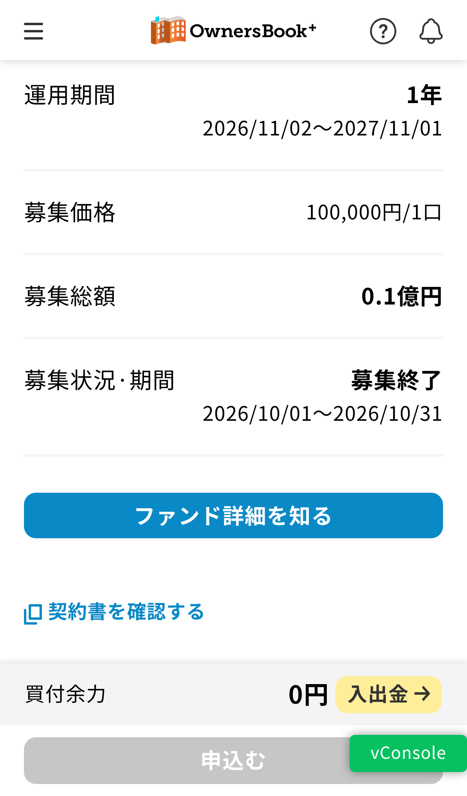

app-vuejs\_募集終了時の文言から「当初」を削除（common.js getInStockStr）

# 詳細

## 現状と背景

ファンドの募集終了時に「当初募集終了」と表示される。「当初」を削除し、「募集終了」と表示する。

文言は `src/utils/common.js:998` の `getInStockStr`（在庫・募集状況の表示文言を作る共通関数）の 1 箇所だけで定義されている。

```js
if(period=='PRIMARY' || period=='PRIENTRY'){
  if(ratio==0 && inStock == 0){
    str='当初募集終了'
```

-   表示される条件：募集区分（`PERIOD`）が `PRIMARY`（当初募集）または `PRIENTRY`（優先エントリー・仮募集）で、残り比率（`IN_STOCK_POSITION_EMPTY`）と残口数（`IN_STOCK_NUM`）がどちらも 0 のとき
-   文言は [HASHST\_DEV-1420](file:///view/HASHST_DEV-1420)（2022-05、`75c2be07`）で追加されてから変わっていない

### 表示される画面

| 画面 | 箇所 | 表示欄 |
| --- | --- | --- |
| f1200 ST詳細：トップ（`PERIOD == 'PRIMARY'` のとき） | `f1200.vue:158` | 募集状況·期間 |
| f1202\_pre 仮募集 ST詳細：トップ（プライマリ） | `f1202_pre.vue:110` | 募集状況・期間 |

-   `f1200.vue:202`（在庫状況）も同じ関数を呼んでいるが、`PRIMARY` 以外のときのブロックのため、この文言は表示されない

### 影響範囲の確認結果

-   app-vuejs の中で「当初募集終了」「募集終了」を含むのは上記の 1 箇所だけ（定数ファイル・`index.html` にはない）
-   st-admin にも「当初募集終了」があるが、いずれも管理画面の項目名「当初募集終了日時」のエラーメッセージ・コメントで、投資家向けの表示ではないため対象外

## 対応内容(期待結果)

1.  [HASHST\_DEV-4541](file:///view/HASHST_DEV-4541) で追加したテストの期待値を `'当初募集終了'` から `'募集終了'` に書き換え、失敗することを確認する（Red）
    -   `test/unit/specs/utils/common.getInStockStr.spec.js` の「当初募集（PRIMARY / PRIENTRY）」の 3 ケース
2.  `src/utils/common.js` の文言を `'募集終了'` に修正し、テストが通ることを確認する（Green）
3.  結合環境で、f1200 / f1202\_pre の完売状態のファンドで「募集終了」と表示されることを確認する

### 確認事項

-   文言は `PRIMARY` と `PRIENTRY` で共通のため、仮募集（f1202\_pre）の表示も「募集終了」になる。仮募集だけ別の文言にする場合は条件の分岐が必要
-   この文言は「募集期間が終わった」ではなく「残口数が 0 になった（完売）」ときに表示されるため、募集期間中でも完売すれば「募集終了」と表示される。この意味で問題ないかを確認する
-   [HASHST\_DEV-4558](file:///view/HASHST_DEV-4558)（同じ `getInStockStr` の null・undefined の扱い）と同じ関数・同じテストファイルを触るため、並行して進める場合は競合に注意する

## 対応根拠となるドキュメント

-   [HASHST\_DEV-4541](file:///view/HASHST_DEV-4541)（`getInStockStr` の単体テスト追加）
-   [HASHST\_DEV-4558](file:///view/HASHST_DEV-4558)

## 改修差分

-   MR：[!1057](https://gitlab.hashdash-group.com/sto_fund/app-vuejs/-/merge_requests/1057)（`backlog/HASHST_DEV-4562` → `js-ph2`）
-   コミット：`cefc6cf2` HASHST\_DEV-4562 募集終了時の文言から「当初」を削除

| ファイル | 変更内容 |
| --- | --- |
| `src/utils/common.js` | `getInStockStr` で、募集区分が `PRIMARY` / `PRIENTRY` かつ残り比率・残口数がどちらも 0 のときの文言を `'当初募集終了'` から `'募集終了'` に変更（1 行） |
| `test/unit/specs/utils/common.getInStockStr.spec.js` | 「当初募集（PRIMARY / PRIENTRY）」の 3 ケースの期待値を `'募集終了'` に変更 |

```diff
       if(period=='PRIMARY' || period=='PRIENTRY'){
         if(ratio==0 && inStock == 0){
-          str='当初募集終了'
+          str='募集終了'
```

-   条件分岐と他の文言（「売切れ間近」「申込受付中」「在庫なし」「在庫あり」）は変更なし
-   先にテストの期待値を書き換えて 3 ケースの失敗を確認し、その後 `common.js` を修正してテストが通ることを確認した
-   単体テスト：対象の spec 21 件、全体 29 スイート・884 件すべて成功

### ローカル環境での確認（2026-10-06）

f1200 ST詳細：トップで、完売状態の当初募集ファンドの「募集状況·期間」に「募集終了」と表示されることを確認した。「当初募集終了」は画面のどこにも表示されていない。

-   環境：local-docker、app-vuejs `backlog/HASHST_DEV-4562` @ `cefc6cf2`、スマートフォン表示（iPhone 13 エミュレーション）
-   対象ファンド：`JP8010124071`（`MAX_FUND_QTY` = 100、申込口数 100）
    -   ローカル DB で当初募集期間を 2026-10-01 10:00～2026-10-31 16:00、運用期間を 2026-11-02 18:00～2027-11-01 16:00 に一時変更して確認し、確認後に元の値へ戻した
-   `/fund/detail` の応答：`PERIOD` = `PRIMARY`、`IN_STOCK_NUM`（残口数）= 0、`IN_STOCK_POSITION_EMPTY`（残り比率）= 0
-   表示：「募集状況·期間」に「募集終了」、その下に「2026/10/01～2026/10/31」。タグは「売切御礼」「任意組合」



## 結合環境確認履歴

【対応後記入】

-   文言は PRIMARY と PRIENTRY で共通のため、仮募集（f1202\_pre）の表示も「募集終了」になる。仮募集だけ別の文言にする場合は条件の分岐が必要 **→ 仮募集は使ってない機能なので分岐は不要**
-   この文言は「募集期間が終わった」ではなく「残口数が 0 になった（完売）」ときに表示されるため、募集期間中でも完売すれば「募集終了」と表示される。この意味で問題ないかを確認する **→ 確認必要 → こちらの意味で問題ない。**

app-vuejs\_募集終了時の文言から「当初」を削除（common.js getInStockStr）
