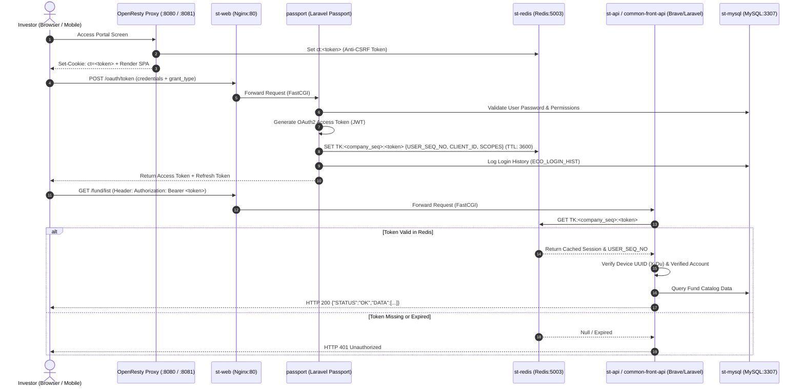

# OwnerBook Plus — Kiến trúc & Tài liệu Codebase (Architecture & Codebase Documentation)

> **Trạng thái**: Tài liệu tham chiếu chuẩn (Authoritative Reference)  
> **Môi trường mục tiêu**: Điều phối cục bộ trên Linux (Ubuntu/Debian) (Linux Local Orchestration)  
> **Bộ điều phối (Orchestrator)**: `ownerbookplus_director`  
> **Các sub-repository được phân tích**: 15 Repository (`sub-repos/*`)  
> **Xác thực nguồn**: 100% Nguồn dữ liệu sơ cấp (`composer.json`, `package.json`, `docker-compose.yml`, `.env`, bảng routing, file kernel/bootstrap, models, controllers)

---

## Mục lục (Table of Contents)

1. [Tóm tắt điều hành & Tổng quan hệ thống](#1-executive-summary--system-overview)
   - [1.1 Phạm vi nền tảng & Sứ mệnh](#11-platform-domain--mission)
   - [1.2 Ranh giới nghiệp vụ & Ranh giới chức năng](#12-business--functional-boundaries)
   - [1.3 Topo hệ thống & Sơ đồ kiến trúc](#13-system-topology--architecture-diagram)
2. [Hạ tầng tổng thể & Điều phối](#2-global-infrastructure--orchestration)
   - [2.1 Framework điều phối (`ownerbookplus_director`)](#21-orchestration-framework-ownerbookplus_director)
   - [2.2 Hạ tầng Docker Compose (`sub-repos/local-docker`)](#22-docker-compose-infrastructure-sub-reposlocal-docker)
   - [2.3 Kiến trúc mạng & Service Discovery (`st_net`)](#23-network-architecture--service-discovery-st_net)
   - [2.4 Bảng phân bổ cổng Master & Ingress Mapping](#24-master-port-assignments--ingress-mapping)
   - [2.5 Kho dữ liệu & Kiến trúc lưu trữ](#25-datastores--storage-architecture)
3. [Phân tích chi tiết: 15 Sub-Repository](#3-deep-dive-the-15-sub-repositories)
   - [3.1 `st-api` — Core API quản lý quỹ](#31-st-api--fund-core-api)
   - [3.2 `st-admin` — Dashboard quản trị quỹ](#32-st-admin--fund-admin-dashboard)
   - [3.3 `st-cli` — CLI xử lý batch & worker chạy ngầm](#33-st-cli--batch--background-worker-cli)
   - [3.4 `st-bc-explorer` — Trình khám phá Blockchain & Xem sổ cái](#34-st-bc-explorer--blockchain-explorer--ledger-viewer)
   - [3.5 `app-vuejs` — Cổng thông tin giao dịch web cho nhà đầu tư](#35-app-vuejs--investor-trading-web-portal)
   - [3.6 `mobile-registration` — SPA tiếp nhận nhà đầu tư trên di động](#36-mobile-registration--mobile-investor-onboarding-spa)
   - [3.7 `common-front-api` — API BFF frontend dùng chung](#37-common-front-api--common-frontend-bff-api)
   - [3.8 `company-admin` — Cổng quản trị doanh nghiệp phát hành](#38-company-admin--corporate--issuer-management-portal)
   - [3.9 `basis-admin` — Cổng quản trị nền tảng cơ sở](#39-basis-admin--platform-base-admin-portal)
   - [3.10 `passport` — Service định danh, OAuth2 & SSO](#310-passport--identity-oauth2--sso-service)
   - [3.11 `migration` — Quản lý migration đa database schema tập trung](#311-migration--central-multi-schema-database-migrations)
   - [3.12 `cash-balance-library` — Engine sổ cái tài chính độ chính xác cao](#312-cash-balance-library--precision-financial-ledger-engine)
   - [3.13 `cash-balance-library-unit-test` — Test harness kiểm thử sổ cái tài chính](#313-cash-balance-library-unit-test--financial-ledger-test-harness)
   - [3.14 `local-docker` — Ngăn xếp mạng & dịch vụ Docker](#314-local-docker--docker-network--service-stacks)
   - [3.15 `phpmyadmin` — Công cụ quản trị cơ sở dữ liệu](#315-phpmyadmin--database-management-administration-tool)
4. [Các cơ chế kiến trúc xuyên suốt (Cross-Cutting Mechanisms)](#4-cross-cutting-architectural-mechanisms)
   - [4.1 Xác thực phân tán & Vòng đời Token (Passport & Redis)](#41-distributed-authentication--token-lifecycle-passport--redis)
   - [4.2 Sổ cái tài chính & Hạch toán kế toán độ chính xác cao (`cash-balance-library`)](#42-financial-ledger--precision-accounting-cash-balance-library)
   - [4.3 Pipeline migration cơ sở dữ liệu Multi-Tenant & Multi-Schema](#43-multi-tenant--multi-schema-database-migration-pipeline)
   - [4.4 Xử lý bất đồng bộ, Batch Pipeline & Lập lịch](#44-asynchronous-processing-batch-pipelines--scheduling)
   - [4.5 Triển khai Smart Contract & Blockchain liên minh](#45-consortium-blockchain--smart-contract-deployment)
5. [Vòng đời phát triển & Vận hành](#5-development--operational-lifecycle)
   - [5.1 Thiết lập môi trường ban đầu (`./local-setup.sh`)](#51-initial-environment-provisioning-local-setupsh)
   - [5.2 Quản lý vận hành hàng ngày (`./env.sh`)](#52-daily-operational-management-envsh)
   - [5.3 Health Probe & Xác thực Endpoint](#53-health-probes--endpoint-verification)
   - [5.4 Quản trị AI, Đồng bộ quy tắc & Code Intelligence](#54-ai-governance-rules-synchronization--code-intelligence)

---

## 1. Tóm tắt điều hành & Tổng quan hệ thống (Executive Summary & System Overview)

### 1.1 Phạm vi nền tảng & Sứ mệnh (Platform Domain & Mission)

**OwnerBook Plus** là một nền tảng tài chính cấp tổ chức (institutional-grade), hỗ trợ đa khách thuê (multi-tenant), được thiết kế chuyên biệt cho hoạt động **Phát hành Token Chứng khoán Bất động sản (Real Estate Security Token Offerings - STO)**, huy động vốn cộng đồng (crowdfunding) nợ/cổ phần bất động sản riêng lẻ, và quản trị quỹ đầu tư tự động theo các quy định tài chính của Nhật Bản.

Nền tảng số hóa toàn bộ vòng đời của mô hình hợp vốn đầu tư bất động sản:
1. **Tiếp nhận Nhà đầu tư & Tuân thủ pháp lý (Investor Onboarding & Compliance)**: Xác thực danh tính điện tử qua thiết bị di động (eKYC), kiểm tra phòng chống rửa tiền (AML), lưu trữ mã hóa mã số định danh cá nhân / mã số thuế (MyNumber / マイナンバー) trong kho bảo mật chuyên dụng, và bàn giao chứng từ/hợp đồng điện tử (*交付書面*).
2. **Phát hành & Huy động vốn trên thị trường sơ cấp (Primary Market Offerings & Syndication)**: Đăng ký góp vốn của nhà đầu tư, cơ chế quay số / phân bổ suất đầu tư ưu tiên (*優先申込 / 当選*), dịch vụ ngân hàng ký quỹ tự động (automated escrow banking), và thu hộ / giải ngân vốn góp.
3. **Giao dịch trên thị trường thứ cấp (Secondary Market & Trading)**: Khớp lệnh mua/bán (*売買約定*), sổ lệnh nhà đầu tư (order books), phòng chống giao dịch nội gián (*インサイダー取引確認*), và theo dõi quyền sở hữu kỹ thuật số.
4. **Dịch vụ quản lý Quỹ & Tài sản (Fund & Asset Servicing)**: Phân phối lợi tức / cổ tức định kỳ (*分配金*), hoàn trả vốn gốc (*償還金*), khấu trừ thuế thu nhập tại nguồn (*源泉所得税*), điều chỉnh số dư tài khoản kế toán, và lập báo cáo thuế hàng năm (*支払調書 / 年間取引報告書*).
5. **Thanh toán / Quyết toán qua Blockchain liên minh nội bộ (Private Consortium Blockchain Settlement)**: Token hóa chứng chỉ quỹ, nhật ký kiểm toán chống giả mạo (tamper-proof audit trails), và cơ chế đồng thuận đa nút kiểm định (multi-validator consensus) vận hành trên mạng GoQuorum cấp doanh nghiệp.

### 1.2 Ranh giới nghiệp vụ & Ranh giới chức năng (Business & Functional Boundaries)

Nền tảng phân tách trải nghiệm người dùng cuối (nhà đầu tư), các giao diện kiểm soát quản trị, sổ cái tài chính cốt lõi, và hạ tầng phân tán thành các phân tầng (tier) được phân vùng nghiêm ngặt:

```
┌────────────────────────────────────────────────────────────────────────────────────────┐
│                                 PRESENTATION TIER                                      │
│   ┌───────────────────────────┐                     ┌──────────────────────────────┐   │
│   │   app-vuejs (:8080)       │                     │  mobile-registration (:8081) │   │
│   │   Investor Trading Web    │                     │  Investor Onboarding SPA     │   │
│   └─────────────┬─────────────┘                     └──────────────┬───────────────┘   │
└─────────────────┼──────────────────────────────────────────────────┼───────────────────┘
                  │ Ingress HTTP / Bearer Auth                       │
┌─────────────────▼──────────────────────────────────────────────────▼───────────────────┐
│                                  GATEWAY / BFF TIER                                    │
│   ┌───────────────────────────────────┐        ┌───────────────────────────────────┐   │
│   │       passport (:80)              │        │      common-front-api (:80)       │   │
│   │  Identity, OAuth2 & SSO (Laravel) │        │  Investor BFF & Profile (Laravel) │   │
│   └─────────────────┬─────────────────┘        └─────────────────┬─────────────────┘   │
└─────────────────────┼────────────────────────────────────────────┼─────────────────────┘
                      │ Token Sync / Session Checks                │
┌─────────────────────▼────────────────────────────────────────────▼─────────────────────┐
│                             CORE DOMAIN & FINANCIAL TIER                               │
│   ┌───────────────────────────────────┐        ┌───────────────────────────────────┐   │
│   │         st-api (:80)              │        │        st-admin (:80)             │   │
│   │   Core Fund API (Brave / PHP 8.3) │        │  Fund Operator Portal (Brave/7.4) │   │
│   └─────────────────┬─────────────────┘        └─────────────────┬─────────────────┘   │
│                     │                                            │                     │
│                     │  ┌──────────────────────────────────────┐  │                     │
│                     └──► cash-balance-library (Pure PHP 7.4+) ◄──┘                     │
│                        │ Double-Entry Bookkeeping & Math      │                        │
│                        └──────────────────▲───────────────────┘                        │
│                                           │                                            │
│   ┌───────────────────────────────────┐   │    ┌───────────────────────────────────┐   │
│   │         st-cli                    │───┘    │   company-admin / basis-admin     │   │
│   │   Batch Settlement Engine (Brave) │        │   Operator Portals (FuelPHP/Larv) │   │
│   └─────────────────┬─────────────────┘        └─────────────────┬─────────────────┘   │
└─────────────────────┼────────────────────────────────────────────┼─────────────────────┘
                      │                                            │
┌─────────────────────▼────────────────────────────────────────────▼─────────────────────┐
│                              DATA & CONSORTIUM LEDGER                                  │
│   ┌──────────────────────────┐  ┌──────────────────────────┐  ┌────────────────────┐   │
│   │ MySQL 8 (st-mysql:3307)  │  │ Redis (st-redis:5003)    │  │ GoQuorum (22000)   │   │
│   │ 5 Isolated Schemas       │  │ Token Cache & Rate Limit │  │ 4 Validator Nodes  │   │
│   └──────────────────────────┘  └──────────────────────────┘  └────────────────────┘   │
└────────────────────────────────────────────────────────────────────────────────────────┘
```

### 1.3 Topo hệ thống & Sơ đồ kiến trúc (System Topology & Architecture Diagram)

```mermaid
flowchart TB
    subgraph Clients["Client Tier (Browsers & Mobile Web)"]
        UI_INVESTOR["Investor Browser\n(app-vuejs)"]
        UI_MOBILE["Mobile Investor\n(mobile-registration)"]
        UI_ADMIN["Operator Browser\n(Admin Portals)"]
    end

    subgraph Ingress["Ingress & Proxy Tier"]
        NG_WEB["st-web (Nginx 1.27)\nPorts: 80, 22000"]
        PROXY_APP["app-vuejs-nginx (OpenResty 1.27)\nPort: 8080"]
        PROXY_REG["front-reg-dev-proxy (OpenResty 1.27)\nPort: 8081"]
    end

    subgraph Frontends["Frontend Development Tier"]
        DEV_APP["front-app-dev (Node 18)\nWebpack Dev Server"]
        DEV_REG["front-reg-dev (Node 18)\nWebpack Dev Server"]
    end

    subgraph ApplicationTier["Application Services (PHP-FPM Pools)"]
        SVC_PASSPORT["passport\n(Laravel 10 / PHP 8.3)\nContainer: st-app"]
        SVC_COMMON["common-front-api\n(Laravel 10 / PHP 8.3)\nContainer: st-app"]
        SVC_ST_API["st-api\n(Brave / PHP 8.3)\nContainer: st-app-pfund"]
        SVC_ST_ADMIN["st-admin\n(Brave / PHP 7.4)\nContainer: st-app-pfundadmin"]
        SVC_CMP_ADMIN["company-admin\n(FuelPHP 1.8 / PHP 7.4)\nContainer: st-app-cmpadmin"]
        SVC_BAS_ADMIN["basis-admin\n(Laravel 7 / PHP 7.4)\nContainer: st-app-basadmin"]
        SVC_BC_EXP["st-bc-explorer\n(PHP 7.4)\nContainer: st-bc-explorer"]
    end

    subgraph BatchTier["Asynchronous & Batch Tier (Apache Airflow 2)"]
        AIRFLOW_WEB["st-airflow2-webserver\n(Airflow 2.5.3)"]
        AIRFLOW_SCHED["st-airflow2-scheduler\n(Airflow 2.5.3)"]
        WORKER_PFUND["st-airflow2-batch-daybatch-pfund\n(st/php-airflow-worker)\nExecutes: st-cli batches"]
        WORKER_BASIS["st-airflow2-batch-basis\n(st/php-airflow-worker)"]
        WORKER_DAY["st-airflow2-batch-daybatch\n(st/php-airflow-worker)"]
        WORKER_NODE["st-node-airflow2\nSmart Contract Deployer"]
    end

    subgraph SharedLibraries["Shared Domain Libraries"]
        LIB_CASH["cash-balance-library\n(netsec/common-balance)\nDouble-Entry Invariant Engine"]
    end

    subgraph Datastores["Datastores & Infrastructure (dc-base & dc-airflow2)"]
        DB_MYSQL[("MySQL 8.0.40 (st-mysql:3307)\nSchemas: basis, hhd, hhd_pfund,\nhhd_stock, hhd_mynumber")]
        DB_REDIS[("Redis (st-redis:5003)\nTokens (TK:*), CSRF (ct:*), RateLimit")]
        STORAGE_MINIO[("MinIO S3 (minio:9000/8900)\nKYC, General, MyNumber Docs")]
        MAIL_POSTFIX["st-postfix (Postfix:25)\nSendGrid SMTP Relay"]
        DB_AIRFLOW_PG[("PostgreSQL 14 (15432)\nAirflow Metadata")]
        DB_AIRFLOW_REDIS[("Redis 7.2 (16379)\nCelery Task Broker")]
    end

    subgraph Blockchain["Private Consortium Blockchain (dc-blockchain)"]
        NODE1["quorum-node1:22001\n(GoQuorum QBFT)"]
        NODE2["quorum-node2:22002"]
        NODE3["quorum-node3:22003"]
        NODE4["quorum-node4:22004"]
    end

    %% Client routing
    UI_INVESTOR -->|HTTP :8080| PROXY_APP --> DEV_APP
    UI_MOBILE -->|HTTP :8081| PROXY_REG --> DEV_REG
    UI_ADMIN -->|HTTP :80| NG_WEB

    %% Ingress to backend
    PROXY_APP -.->|API Calls :80| NG_WEB
    PROXY_REG -.->|API Calls :80| NG_WEB

    NG_WEB -->|FastCGI| SVC_PASSPORT
    NG_WEB -->|FastCGI| SVC_COMMON
    NG_WEB -->|FastCGI| SVC_ST_API
    NG_WEB -->|FastCGI| SVC_ST_ADMIN
    NG_WEB -->|FastCGI| SVC_CMP_ADMIN
    NG_WEB -->|FastCGI| SVC_BAS_ADMIN
    NG_WEB -->|FastCGI| SVC_BC_EXP
    NG_WEB -->|TCP Round-Robin :22000| NODE1 & NODE2 & NODE3 & NODE4

    %% Shared Library usage
    SVC_ST_API -.-> LIB_CASH
    SVC_ST_ADMIN -.-> LIB_CASH
    SVC_COMMON -.-> LIB_CASH
    SVC_CMP_ADMIN -.-> LIB_CASH
    WORKER_PFUND -.-> LIB_CASH

    %% Data Connections
    SVC_PASSPORT --> DB_MYSQL
    SVC_PASSPORT --> DB_REDIS
    SVC_COMMON --> DB_MYSQL
    SVC_COMMON --> DB_REDIS
    SVC_COMMON --> STORAGE_MINIO
    SVC_ST_API --> DB_MYSQL
    SVC_ST_API --> DB_REDIS
    SVC_ST_ADMIN --> DB_MYSQL
    SVC_CMP_ADMIN --> DB_MYSQL
    SVC_BAS_ADMIN --> DB_MYSQL
    WORKER_PFUND --> DB_MYSQL

    %% Airflow dependencies
    AIRFLOW_SCHED --> DB_AIRFLOW_PG
    AIRFLOW_SCHED --> DB_AIRFLOW_REDIS
    DB_AIRFLOW_REDIS --> WORKER_PFUND & WORKER_BASIS & WORKER_DAY & WORKER_NODE
```



---

## 2. Hạ tầng tổng thể & Điều phối (Global Infrastructure & Orchestration)

### 2.1 Framework điều phối (`ownerbookplus_director`) (Orchestration Framework)

Repository gốc `ownerbookplus_director` cung cấp bộ công cụ điều phối (orchestrator) ưu tiên nền tảng Linux, phụ trách khởi tạo (provision), xác minh (verify), kiểm thử (test), và giám sát toàn bộ kiến trúc đa repo (multi-repo) mà không commit các thay đổi vào bên trong `sub-repos/` (*Quy tắc bảo vệ và cô lập Sub-repo - ADR-001 Sub-repo Protection & Isolation Rule* được dẫn chiếu trong [`docs/agents/adrs/DECISIONS_director.md:22-41`](file:///home/lbbduy/Documents/OwnerBooks/ownerbookplus_director/docs/agents/adrs/DECISIONS_director.md#L22-L41)).

Các điểm vào (entry point) điều phối chính bao gồm:
- **`./local-setup.sh`**: Script khởi tạo môi trường toàn diện gồm 14 bước tuần tự (`s00_check` đến `s13_verify`), thực hiện clone các sub-repo, cấu hình các file `.env`, build container image, khởi tạo 5 database schema MySQL, cài đặt dependency bên trong container qua Composer và npm, chạy migration đa schema, và xác minh khả năng kết nối ([`local-setup.sh:59-487`](file:///home/lbbduy/Documents/OwnerBooks/ownerbookplus_director/local-setup.sh#L59-L487)).
- **`./env.sh`**: Công cụ quản lý vòng đời container hàng ngày theo phương thức không phá hủy dữ liệu (non-destructive), hỗ trợ cả menu tương tác trên terminal (TTY) và các lệnh CLI tự động hóa (`start`, `stop`, `restart`, `down`, `status`, `db`, `verify`, `logs`, `shell`) ([`env.sh:70-101`](file:///home/lbbduy/Documents/OwnerBooks/ownerbookplus_director/env.sh#L70-L101)).
- **`./sync-agent-rules.sh`**: Công cụ quản trị đồng bộ các quy tắc phát triển của toàn dự án, yêu cầu về chu trình Red-Green của TDD, và các liên kết trỏ đến ADR vào tất cả các file `sub-repos/*/AGENTS.md` và `CLAUDE.md` đang hoạt động, đồng thời giữ nguyên các phần code intelligence của GitNexus ([`sync-agent-rules.sh:1-50`](file:///home/lbbduy/Documents/OwnerBooks/ownerbookplus_director/sync-agent-rules.sh#L1-L50)).
- **`./gitnexus-index.sh`** & **`./start-all-gitnexus.sh`**: Bộ chỉ mục code intelligence tự động và bộ chạy HTTP server theo giao thức Model Context Protocol (MCP), hoạt động trên các cổng tuần tự bắt đầu từ 4747 ([`start-all-gitnexus.sh:21-27`](file:///home/lbbduy/Documents/OwnerBooks/ownerbookplus_director/start-all-gitnexus.sh#L21-L27)).

### 2.2 Hạ tầng Docker Compose (`sub-repos/local-docker`) (Docker Compose Infrastructure)

Các định nghĩa hạ tầng nằm trong `sub-repos/local-docker`. Các cấu hình Docker Compose được tách bạch thành các stack chức năng riêng biệt và cùng hoạt động đồng thời:

| Thư mục Stack (Stack Directory) | File Compose | Nhiệm vụ chính (Primary Responsibilities) |
|---|---|---|
| `dc-base` | [`sub-repos/local-docker/dc-base/docker-compose.yml`](file:///home/lbbduy/Documents/OwnerBooks/ownerbookplus_director/sub-repos/local-docker/dc-base/docker-compose.yml) | Lưu trữ nền tảng: MySQL 8, Redis, kho lưu trữ đối tượng MinIO S3, container tạo bucket MinIO, SMTP relay Postfix. |
| `dc-web` | [`sub-repos/local-docker/dc-web/docker-compose.yml`](file:///home/lbbduy/Documents/OwnerBooks/ownerbookplus_director/sub-repos/local-docker/dc-web/docker-compose.yml) | Bộ định tuyến Nginx trung tâm (`st-web`), 6 PHP-FPM application pool, worker migration (`st-migration`), và bộ chạy PHPUnit cho thư viện (`lib-phpunit`). |
| `dc-app-vuejs-dev` | [`sub-repos/local-docker/dc-app-vuejs-dev/docker-compose.yml`](file:///home/lbbduy/Documents/OwnerBooks/ownerbookplus_director/sub-repos/local-docker/dc-app-vuejs-dev/docker-compose.yml) | Webpack dev server cho cổng giao dịch (`front-app-dev`) đứng sau OpenResty proxy (`app-vuejs-nginx`). |
| `dc-reg-vuejs-dev` | [`sub-repos/local-docker/dc-reg-vuejs-dev/docker-compose.yml`](file:///home/lbbduy/Documents/OwnerBooks/ownerbookplus_director/sub-repos/local-docker/dc-reg-vuejs-dev/docker-compose.yml) | Webpack dev server cho quy trình onboarding/đăng ký (`front-reg-dev`) đứng sau OpenResty proxy (`front-reg-dev-proxy`). |
| `dc-blockchain` | [`sub-repos/local-docker/dc-blockchain/docker-compose.yml`](file:///home/lbbduy/Documents/OwnerBooks/ownerbookplus_director/sub-repos/local-docker/dc-blockchain/docker-compose.yml) | Mạng blockchain riêng GoQuorum gồm 4 node với cơ chế đồng thuận QBFT. |
| `dc-airflow2` | [`sub-repos/local-docker/dc-airflow2/docker-compose.yml`](file:///home/lbbduy/Documents/OwnerBooks/ownerbookplus_director/sub-repos/local-docker/dc-airflow2/docker-compose.yml) | Động cơ lập lịch quy trình (workflow): Airflow Webserver, Scheduler, Celery Flower, PostgreSQL, Redis broker, và 4 pool Celery worker. |
| `dc-log` | `sub-repos/local-docker/dc-log/docker-compose.yml` | Thu nhận log tập trung: Fluent Bit forwarder, Elasticsearch 7.13.0, và Kibana 7.13.0. |

### 2.3 Kiến trúc mạng & Service Discovery (`st_net`) (Network Architecture & Service Discovery)

Tất cả các container giao tiếp qua một mạng bridge ngoài của Docker có tên là **`st_net`** (*Mạng bridge nội bộ cô lập - ADR-001 Isolated Internal Bridge Network* trong [`docs/agents/adrs/DECISIONS_local-docker.md:22-41`](file:///home/lbbduy/Documents/OwnerBooks/ownerbookplus_director/docs/agents/adrs/DECISIONS_local-docker.md#L22-L41)):
- **Định nghĩa mạng**: Được khai báo là `external: true` trong tất cả các file compose (ví dụ: [`sub-repos/local-docker/dc-base/docker-compose.yml:91-94`](file:///home/lbbduy/Documents/OwnerBooks/ownerbookplus_director/sub-repos/local-docker/dc-base/docker-compose.yml#L91-L94)).
- **Lệnh tạo mạng**: `docker network create st_net` (được xử lý tự động trong [`env.sh:61-68`](file:///home/lbbduy/Documents/OwnerBooks/ownerbookplus_director/env.sh#L61-L68) và [`local-setup.sh:340-348`](file:///home/lbbduy/Documents/OwnerBooks/ownerbookplus_director/local-setup.sh#L340-L348)).
- **Service Discovery nội bộ**: Giao tiếp nội bộ phụ thuộc hoàn toàn vào tên service DNS nội bộ của Docker (`st-mysql:3306`, `st-redis:6379`, `st-app:9000`, `st-app-pfund:9000`). Các cổng binding ra máy host chỉ được sử dụng cho truy cập từ máy lập trình viên và ingress của trình duyệt.

### 2.4 Bảng phân bổ cổng Master & Ingress Mapping (Master Port Assignments & Ingress Mapping)

Bảng dưới đây liệt kê toàn bộ các cổng mạng được map ra hệ điều hành host:

| Tên Service / Container | Stack Compose | Cổng Host (Host Port) | Cổng Container | Giao thức / Mục đích (Protocol / Purpose) | Endpoint xác minh / URL (Verification Endpoint / URL) |
|---|---|:---:|:---:|---|---|
| `st-web` | `dc-web` | **80** | 80 | Central Nginx HTTP Ingress | Virtual hosts on `*.crudist.tech` |
| `st-web` | `dc-web` | **22000** | 22000 | Blockchain RPC Load Balancer | `http://127.0.0.1:22000` (Round-robin to Quorum 1-4) |
| `app-vuejs-nginx` | `dc-app-vuejs-dev` | **8080** | 80 | OpenResty Trading Proxy | `http://local-st-front-hsec.crudist.tech:8080/` |
| `front-reg-dev-proxy` | `dc-reg-vuejs-dev` | **8081** | 8080 | OpenResty Registration Proxy | `http://local-register-hsec.crudist.tech:8081/` |
| `st-mysql` | `dc-base` | **3307** | 3306 | MySQL 8 Database Server | `mysql -h127.0.0.1 -P3307 -uroot -pQampa4jLoxCSoXsG` |
| `st-redis` | `dc-base` | **5003** | 6379 | Redis Application Cache & Session | `redis-cli -h 127.0.0.1 -p 5003` |
| `minio` | `dc-base` | **9000** | 9000 | MinIO S3 API Endpoint | `http://127.0.0.1:9000` |
| `minio` | `dc-base` | **8900** | 8900 | MinIO Web Management Console | `http://localhost:8900` |
| `st-postfix` | `dc-base` | **25** | 25 | Local SMTP Relay (SendGrid) | `127.0.0.1:25` |
| `st-nginx` | `dc-airflow2` | **8787** | 80 | Airflow Web UI & Celery Flower | `http://localhost:8787` (`/flower` for Celery dashboard) |
| `st-airflow2-postgres` | `dc-airflow2` | **15432** | 5432 | Airflow Metadata PostgreSQL | `psql -h 127.0.0.1 -p 15432 -U airflow -d airflow` |
| `st-airflow2-redis` | `dc-airflow2` | **16379** | 6379 | Airflow Celery Task Broker | `redis-cli -h 127.0.0.1 -p 16379` |
| `quorum-node1` | `dc-blockchain` | **22001** | 22001 | GoQuorum Validator Node 1 RPC | `http://127.0.0.1:22001` |
| `quorum-node2` | `dc-blockchain` | **22002** | 22002 | GoQuorum Validator Node 2 RPC | `http://127.0.0.1:22002` |
| `quorum-node3` | `dc-blockchain` | **22003** | 22003 | GoQuorum Validator Node 3 RPC | `http://127.0.0.1:22003` |
| `quorum-node4` | `dc-blockchain` | **22004** | 22004 | GoQuorum Validator Node 4 RPC | `http://127.0.0.1:22004` |
| `st-es` | `dc-log` | **9200** | 9200 | Elasticsearch REST API | `http://127.0.0.1:9200` |
| `st-kibana` | `dc-log` | **5601** | 5601 | Kibana Log Visualizer | `http://127.0.0.1:5601` |

#### Bảng định tuyến Virtual Host của Nginx trung tâm (`st-web`)

Lưu lượng truy cập đến `st-web:80` được điều phối dựa theo HTTP header `Host` được định nghĩa trong [`sub-repos/local-docker/etc/local/nginx/`](file:///home/lbbduy/Documents/OwnerBooks/ownerbookplus_director/sub-repos/local-docker/etc/local/nginx):

| Domain Virtual Host (Header `Host`) | Upstream Pool mục tiêu | Sub-Repository phụ trách | File cấu hình nguồn |
|---|---|---|---|
| `local-passport-api-hsec.crudist.tech` | `st-app:9000` (FastCGI) | `passport` | [`passport.conf:1-35`](file:///home/lbbduy/Documents/OwnerBooks/ownerbookplus_director/sub-repos/local-docker/etc/local/nginx/passport.conf#L1-L35) |
| `local-common-front-api-hsec.crudist.tech` | `st-app:9000` (FastCGI) | `common-front-api` | [`common-front-api.conf:1-36`](file:///home/lbbduy/Documents/OwnerBooks/ownerbookplus_director/sub-repos/local-docker/etc/local/nginx/common-front-api.conf#L1-L36) |
| `local-st-front-api-hsec.crudist.tech` | `st-app-pfund:9000` (FastCGI) | `st-api` | [`pfund-api.conf:1-64`](file:///home/lbbduy/Documents/OwnerBooks/ownerbookplus_director/sub-repos/local-docker/etc/local/nginx/pfund-api.conf#L1-L64) |
| `local-st-admin-hsec.crudist.tech` | `st-app-pfundadmin:9000` (FastCGI) | `st-admin` | [`pfund-admin.conf:1-51`](file:///home/lbbduy/Documents/OwnerBooks/ownerbookplus_director/sub-repos/local-docker/etc/local/nginx/pfund-admin.conf#L1-L51) |
| `local-hhd-admin-hsec.crudist.tech` | `st-app-cmpadmin:9000` (FastCGI) | `company-admin` | [`company-admin.conf:1-50`](file:///home/lbbduy/Documents/OwnerBooks/ownerbookplus_director/sub-repos/local-docker/etc/local/nginx/company-admin.conf#L1-L50) |
| `local-basis-admin-hsec.crudist.tech` | `st-app-basadmin:9000` (FastCGI) | `basis-admin` | [`basis-admin.conf:1-35`](file:///home/lbbduy/Documents/OwnerBooks/ownerbookplus_director/sub-repos/local-docker/etc/local/nginx/basis-admin.conf#L1-L35) |
| `local-st-explorer-hsec.crudist.tech` | `st-bc-explorer:9000` (FastCGI) | `st-bc-explorer` | [`st-bc-explorer.conf:1-33`](file:///home/lbbduy/Documents/OwnerBooks/ownerbookplus_director/sub-repos/local-docker/etc/local/nginx/st-bc-explorer.conf#L1-L33) |
| `local-st-front-hsec.crudist.tech` | Static `/www/app-vuejs` | `app-vuejs/dist` | [`front-app.conf:1-12`](file:///home/lbbduy/Documents/OwnerBooks/ownerbookplus_director/sub-repos/local-docker/etc/local/nginx/front-app.conf#L1-L12) |
| `local-register-hsec.crudist.tech` | Static `/www/mobile-registration` | `mobile-registration/dist` | [`front-reg.conf:1-24`](file:///home/lbbduy/Documents/OwnerBooks/ownerbookplus_director/sub-repos/local-docker/etc/local/nginx/front-reg.conf#L1-L24) |

### 2.5 Kho dữ liệu & Kiến trúc lưu trữ (Datastores & Storage Architecture)

#### 1. Cơ sở dữ liệu quan hệ chính: MySQL 8.0.40 (`st-mysql`)
Hệ thống cô lập các nghiệp vụ domain thành 5 database schema riêng biệt bên trong một instance MySQL duy nhất ([`local-setup.sh:381-394`](file:///home/lbbduy/Documents/OwnerBooks/ownerbookplus_director/local-setup.sh#L381-L394)):

| Database Schema | Collation / Charset | Quyền sở hữu nghiệp vụ & chức năng (Domain & Functional Ownership) | Bảng / Model chính (Primary Tables / Models) |
|---|---|---|---|
| **`basis`** | `utf8mb4_general_ci` | Registry đa tenant của nền tảng, đăng ký công ty, định nghĩa service, tài khoản quản trị viên (operator users), khung bảo trì (maintenance windows), và các cấu hình hệ thống toàn cục. | `BCO_COMPANY`, `BSYS_MAINTENANCE`, `BSYS_TAX`, `admin_users`, `admin_roles`. |
| **`hhd`** | `utf8mb4_general_ci` | Schema của công ty phát hành chính (tenant *HashDash*). Sở hữu định danh nhà đầu tư, tài khoản ngân hàng, sổ cái tiền mặt (cash ledger), lịch sử đăng nhập, liên kết thiết bị, và hồ sơ gửi KYC. | `ECO_USER`, `ECO_DEVICE`, `ECO_CASH_BALANCE`, `ECO_CASH_REAL_BALANCE`, `ECO_TRADE_HIST`, `oauth_*`. |
| **`hhd_pfund`** | `utf8mb4_general_ci` | Engine quản lý Quỹ đầu tư tư nhân & Token chứng khoán (Private Fund & Security Token). Sở hữu định nghĩa quỹ, quay số phân bổ đầu tư (investment lotteries), lệnh mua/bán, lịch phân phối lợi tức (dividend schedules), hoàn trả vốn gốc (redemptions), và liên kết smart contract. | `PST_FUND`, `PST_FUND_SETTING`, `PST_BUY_ORDER`, `PST_BUY_TRADE_HIST`, `PST_DIVIDEND_HIST`, `PST_SMART_CONTRACT`. |
| **`hhd_stock`** | `utf8mb4_general_ci` | Engine phân bổ cổ phần & chứng khoán (Security Token stock & equity allotment). Quản lý bảng cơ cấu sở hữu (cap tables) và bản ghi sổ đăng ký cổ đông (shareholder registry). | `STOCK_MASTER`, `SHAREHOLDER_REGISTRY`, `ALLOTMENT_LEDGER`. |
| **`hhd_mynumber`** | `utf8mb4_general_ci` | Kho bảo mật cấp cao cho Mã số định danh cá nhân Nhật Bản (マイナンバー - MyNumber). Được lưu trữ tách biệt với các khóa mã hóa chuyên dụng nhằm tuân thủ quy định pháp luật. | `MYNUMBER_RECORD`, `IDENTIFICATION_VAULT`. |

#### 2. Bộ nhớ cache & Lưu trữ Session trong RAM: Redis (`st-redis`)
- **Container**: `st-redis` chạy `redis:latest` trên cổng nội bộ 6379, được expose tại host `5003:6379` ([`sub-repos/local-docker/dc-base/docker-compose.yml:36-47`](file:///home/lbbduy/Documents/OwnerBooks/ownerbookplus_director/sub-repos/local-docker/dc-base/docker-compose.yml#L36-L47)).
- **Namespace khóa (Key Namespaces)**:
  - `TK:<company_seq_no>:<access_token>`: Session của OAuth2 Bearer token đã cấp, do `passport` ghi dữ liệu và được `st-api` cùng `common-front-api` xác thực với độ phức tạp O(1) ([`AppController.php:205`](file:///home/lbbduy/Documents/OwnerBooks/ownerbookplus_director/sub-repos/st-api/App/Core/AppController.php#L205), [`SimpleFrontAuth.php:44`](file:///home/lbbduy/Documents/OwnerBooks/ownerbookplus_director/sub-repos/common-front-api/vendor/netsec/common-library/src/Middleware/SimpleFrontAuth.php#L44)).
  - `ct:<token>`: Token xác thực Anti-CSRF được tạo bằng Lua trên các OpenResty edge proxy ([`default.conf.template:75-80`](file:///home/lbbduy/Documents/OwnerBooks/ownerbookplus_director/sub-repos/local-docker/dc-app-vuejs-dev/conf.d/default.conf.template#L75-L80)).
  - `RATE_LIMIT:<user_seq_no>:<window>`: Bộ đếm giới hạn tốc độ gọi API (API rate limiting counters) ([`AppController.php:243`](file:///home/lbbduy/Documents/OwnerBooks/ownerbookplus_director/sub-repos/st-api/App/Core/AppController.php#L243)).

#### 3. Lưu trữ đối tượng (Object Storage): MinIO (`minio`)
- **Container**: `minio` (`RELEASE.2025-02-28T09-55-16Z`) expose S3 API tại `9000:9000` và Web Console tại `8900:8900` ([`sub-repos/local-docker/dc-base/docker-compose.yml:48-62`](file:///home/lbbduy/Documents/OwnerBooks/ownerbookplus_director/sub-repos/local-docker/dc-base/docker-compose.yml#L48-L62)).
- **Khởi tạo (Provisioning)**: Được tự động khởi tạo bởi container `createbuckets` (`minio/mc`) ([`sub-repos/local-docker/dc-base/docker-compose.yml:63-89`](file:///home/lbbduy/Documents/OwnerBooks/ownerbookplus_director/sub-repos/local-docker/dc-base/docker-compose.yml#L63-L89)).
- **Các Bucket**:
  - `hhd-hsec-general`: Tài nguyên công khai, điều khoản dịch vụ, bản cáo bạch của nền tảng (platform prospectuses).
  - `hhd-hsec-kyc`: Ảnh xác thực danh tính được mã hóa, giấy phép lái xe, và thẻ cư trú.
  - `hhd-hsec-mynumber`: Bản scan thẻ MyNumber được mã hóa.
  - `hhd-hsec-s3-for-gcp-bigquery-datatransfer`: Đích xuất dữ liệu data lake phục vụ các pipeline phân tích (analytics).
  - `hhd-st-tax`: Báo cáo thuế hàng năm, chứng từ khấu trừ thuế (withholding certificates), và sao kê số dư tài chính.
  - `local-hhd-st-digital`: File PDF bàn giao hợp đồng điện tử và danh sách chữ ký điện tử (signature manifests).
  - `basis-bucket`: Bản mẫu khách thuê nền tảng (tenant templates) và các file xuất hệ thống.

---

## 3. Phân tích chi tiết: 15 Sub-Repository (Deep Dive: The 15 Sub-Repositories)

---

### 3.1 `st-api` — Core API quản lý quỹ (Fund Core API)

- **Vai trò & Mục đích (Role & Purpose)**: Core API hiệu năng cao cung cấp khả năng chuyển đổi trạng thái vòng đời quỹ (fund lifecycle state transitions), khớp lệnh, thực hiện đầu tư, lịch sử giao dịch, và kế toán phân phối lợi tức/hoàn vốn cho nhà đầu tư.
- **Tech Stack & Dependency chính (Tech Stack & Primary Dependencies)**:
  - **Ngôn ngữ & Runtime**: PHP 8.3 (thực thi trong container `st-app-pfund` dùng image `st/php:8.3-fpm`, [`sub-repos/local-docker/dc-web/docker-compose.yml:76-94`](file:///home/lbbduy/Documents/OwnerBooks/ownerbookplus_director/sub-repos/local-docker/dc-web/docker-compose.yml#L76-L94)).
  - **Framework**: Brave Framework gọn nhẹ tùy biến (`App\Core\AppController` kế thừa `BraveController`, [`sub-repos/st-api/App/Core/AppController.php:16`](file:///home/lbbduy/Documents/OwnerBooks/ownerbookplus_director/sub-repos/st-api/App/Core/AppController.php#L16)).
  - **Trừu tượng hóa Cơ sở dữ liệu (Database Abstraction)**: `adodb/adodb-php: 5.22.7` ([`sub-repos/st-api/composer.json:9`](file:///home/lbbduy/Documents/OwnerBooks/ownerbookplus_director/sub-repos/st-api/composer.json#L9)).
  - **Engine Sổ cái (Ledger Engine)**: `netsec/common-balance: dev-master` / `dev-local` qua VCS repository [`sub-repos/st-api/composer.json:3-6,14`](file:///home/lbbduy/Documents/OwnerBooks/ownerbookplus_director/sub-repos/st-api/composer.json#L3-L6).
  - **Đo lường & Giám sát (Telemetry & Monitoring)**: `sentry/sdk: ^3.1` ([`sub-repos/st-api/composer.json:16`](file:///home/lbbduy/Documents/OwnerBooks/ownerbookplus_director/sub-repos/st-api/composer.json#L16)), `fluent/logger: ^1.0`, `monolog/monolog: ^2.3`.
  - **Cloud & Truyền thông (Cloud & Communications)**: `aws/aws-sdk-php: ^3.175`, `sendgrid/sendgrid: ~7`, `phpmailer/phpmailer: ^6.2`, `s1lentium/iptools: ^1.2`.
  - **Kiểm thử (Testing)**: `phpunit/phpunit: ^9.0` ([`sub-repos/st-api/composer.local.json:19`](file:///home/lbbduy/Documents/OwnerBooks/ownerbookplus_director/sub-repos/st-api/composer.local.json#L19)).
- **Kiến trúc nội bộ & Cấu trúc thư mục (Internal Architecture & Directory Layout)**:
  - `App/Controllers/`: Các REST controller xử lý mỏng:
    - `FundController.php`: Danh mục quỹ, chi tiết quỹ, trạng thái đăng ký quay số ([`App/Controllers/FundController.php`](file:///home/lbbduy/Documents/OwnerBooks/ownerbookplus_director/sub-repos/st-api/App/Controllers/FundController.php)).
    - `OrderController.php`: Đặt lệnh mua/bán, hủy lệnh, xác nhận phòng chống giao dịch nội gián ([`App/Controllers/OrderController.php`](file:///home/lbbduy/Documents/OwnerBooks/ownerbookplus_director/sub-repos/st-api/App/Controllers/OrderController.php)).
    - `HistoryController.php`: Toàn bộ lịch sử khớp lệnh và quyết toán, bản ghi lợi tức, sao kê thuế ([`App/Controllers/HistoryController.php`](file:///home/lbbduy/Documents/OwnerBooks/ownerbookplus_director/sub-repos/st-api/App/Controllers/HistoryController.php)).
    - `AssetController.php`: Tổng hợp và định giá danh mục đầu tư của nhà đầu tư ([`App/Controllers/AssetController.php`](file:///home/lbbduy/Documents/OwnerBooks/ownerbookplus_director/sub-repos/st-api/App/Controllers/AssetController.php)).
    - `PrientryController.php`: Luồng đăng ký góp vốn sơ cấp và phân bổ ưu tiên ([`App/Controllers/PrientryController.php`](file:///home/lbbduy/Documents/OwnerBooks/ownerbookplus_director/sub-repos/st-api/App/Controllers/PrientryController.php)).
    - `NotificationController.php`: Endpoint nhận webhook của SendGrid cho các thông báo giao dịch ([`App/Controllers/NotificationController.php`](file:///home/lbbduy/Documents/OwnerBooks/ownerbookplus_director/sub-repos/st-api/App/Controllers/NotificationController.php)).
    - `UnauthCommonController.php`: Proxy streaming tài nguyên S3 cho icon và asset công khai của quỹ ([`App/Controllers/UnauthCommonController.php`](file:///home/lbbduy/Documents/OwnerBooks/ownerbookplus_director/sub-repos/st-api/App/Controllers/UnauthCommonController.php)).
  - `App/Core/`: Các class nền tảng của framework:
    - `AppController.php`: Bộ chặn request toàn cục (global request interceptor) kiểm tra chế độ bảo trì, xác thực token, giới hạn tốc độ (rate limiting), xác thực thiết bị đáng tin cậy (`X-Du`), và bắt buộc tài khoản doanh nghiệp đã xác thực ([`App/Core/AppController.php:22-33`](file:///home/lbbduy/Documents/OwnerBooks/ownerbookplus_director/sub-repos/st-api/App/Core/AppController.php#L22-L33)).
    - `AppModel.php`: Model ADOdb cơ sở hỗ trợ escape tham số và quản lý transaction.
  - `App/Models/`: Các entity domain được phân vùng:
    - `PST/`: Model Token Chứng khoán Riêng lẻ (Private Security Token) (`FundModel`, `BuyOrderModel`, `BuyTradeHistModel`, `IncomeTaxModel`, `DividendHistModel`, v.v.) trỏ vào `hhd_pfund`.
    - `ECO/`: Model Công ty Doanh nghiệp (Enterprise Company) (`UserModel`, `DeviceModel`, `CashBalanceModel`, `CashRealBalanceModel`) trỏ vào `hhd`.
    - `BSYS/`: Model Hệ thống Cơ sở (Base System) (`MaintenanceModel`, `TaxModel`) trỏ vào `basis`.
- **Tầng dữ liệu & Lưu trữ (Data Layer & Storage)**: Kết nối tới các schema MySQL `hhd_pfund`, `hhd`, và `basis`. Sử dụng Redis để tra cứu session Bearer token (`TK:<company_seq>:<token>`) và giới hạn tốc độ (rate limit).
- **Giao tiếp giữa các service (Inter-service Communications)**:
  - Expose các REST endpoint cho `app-vuejs` qua Nginx URL rewrite trong [`pfund-api.conf:5-37`](file:///home/lbbduy/Documents/OwnerBooks/ownerbookplus_director/sub-repos/local-docker/etc/local/nginx/pfund-api.conf#L5-L37).
  - Xác thực qua cache token trên Redis do `passport` ghi.
- **Cấu hình Docker & Runtime (Docker & Runtime Config)**: Container `st-app-pfund` (`st/php:8.3-fpm`), mount vào `/www/st-api`, phục vụ nội bộ trên cổng 9000, ingress qua `st-web` tại `http://local-st-front-api-hsec.crudist.tech`.

---

### 3.2 `st-admin` — Dashboard quản trị quỹ (Fund Admin Dashboard)

- **Vai trò & Mục đích (Role & Purpose)**: Dashboard quản trị backoffice cho các đơn vị vận hành quỹ (fund operators). Quản lý tạo quỹ, tham số vận hành, quay số phân bổ cho nhà đầu tư, hủy lệnh khớp, chỉ thị chi trả lợi tức, và phê duyệt triển khai smart contract.
- **Tech Stack & Dependency chính (Tech Stack & Primary Dependencies)**:
  - **Ngôn ngữ & Runtime**: PHP 7.4 (`st/php:7.4-fpm` trong container `st-app-pfund-admin`, [`sub-repos/local-docker/dc-web/docker-compose.yml:95-112`](file:///home/lbbduy/Documents/OwnerBooks/ownerbookplus_director/sub-repos/local-docker/dc-web/docker-compose.yml#L95-L112)).
  - **Framework**: Brave Framework tùy biến kết hợp template engine Smarty 3 (`smarty/smarty: ^3.1`, [`sub-repos/st-admin/composer.json:12`](file:///home/lbbduy/Documents/OwnerBooks/ownerbookplus_director/sub-repos/st-admin/composer.json#L12)).
  - **Trừu tượng hóa Cơ sở dữ liệu**: `adodb/adodb-php: ^5.20` ([`sub-repos/st-admin/composer.json:10`](file:///home/lbbduy/Documents/OwnerBooks/ownerbookplus_director/sub-repos/st-admin/composer.json#L10)).
  - **Thư viện dùng chung (Shared Libraries)**: `netsec/common-balance: dev-master` ([`sub-repos/st-admin/composer.json:9`](file:///home/lbbduy/Documents/OwnerBooks/ownerbookplus_director/sub-repos/st-admin/composer.json#L9)).
  - **Dịch vụ (Services)**: `aws/aws-sdk-php: ^3.175`, `monolog/monolog: ^2.3`, `sentry/sdk: ^3.1`.
- **Kiến trúc nội bộ & Cấu trúc thư mục (Internal Architecture & Directory Layout)**:
  - `App/Controllers/`:
    - `FundController.php` (105 KB): Quản lý toàn diện vòng đời quỹ, thông số bất động sản, đính kèm bản cáo bạch, tính toán lợi tức, và lập lịch hoàn trả vốn ([`App/Controllers/FundController.php`](file:///home/lbbduy/Documents/OwnerBooks/ownerbookplus_director/sub-repos/st-admin/App/Controllers/FundController.php)).
    - `OperationController.php` (77 KB): Vận hành giao dịch hàng ngày, soát xét thực hiện lệnh, điều chỉnh giao dịch thủ công, và thực hiện chia cổ tức cho nhà đầu tư ([`App/Controllers/OperationController.php`](file:///home/lbbduy/Documents/OwnerBooks/ownerbookplus_director/sub-repos/st-admin/App/Controllers/OperationController.php)).
    - `SmartContractController.php`: Giao diện xem xét và phê duyệt các smart contract GoQuorum được triển khai bởi các Airflow job chạy ngầm ([`App/Controllers/SmartContractController.php:13-58`](file:///home/lbbduy/Documents/OwnerBooks/ownerbookplus_director/sub-repos/st-admin/App/Controllers/SmartContractController.php#L13-L58)).
    - `CompanyController.php` & `InquiryController.php`: Luồng xử lý hồ sơ công ty phát hành và truy vấn hỗ trợ khách hàng.
  - `Webroot/`: Document root chứa asset tĩnh và điểm vào `index.php`.
- **Tầng dữ liệu & Lưu trữ (Data Layer & Storage)**: Truy vấn trực tiếp các schema MySQL `hhd_pfund`, `hhd`, và `basis`.
- **Giao tiếp giữa các service (Inter-service Communications)**: Expose các đường dẫn web `/report_manage/` và `/report_customer/` được map trực tiếp tới các file PDF artifact do `st-cli` sinh ra trong `/www/st-cli/Report/` ([`pfund-admin.conf:31-44`](file:///home/lbbduy/Documents/OwnerBooks/ownerbookplus_director/sub-repos/local-docker/etc/local/nginx/pfund-admin.conf#L31-L44)).
- **Cấu hình Docker & Runtime (Docker & Runtime Config)**: Container `st-app-pfundadmin` (`st/php:7.4-fpm`), cổng nội bộ 9000, mount tại `/www/st-admin`, phục vụ qua `st-web` tại `http://local-st-admin-hsec.crudist.tech/`.

---

### 3.3 `st-cli` — CLI xử lý batch & worker chạy ngầm (Batch & Background Worker CLI)

- **Vai trò & Mục đích (Role & Purpose)**: Động cơ thực thi bất đồng bộ và xử lý batch. Thực thi các quy trình chốt sổ nghiệp vụ hàng ngày (daily business closure routines), khớp lệnh, quyết toán số dư tiền mặt, trích lập lãi suất/cổ tức, tính thuế thu nhập tại nguồn, và xuất báo cáo PDF theo luật định.
- **Tech Stack & Dependency chính (Tech Stack & Primary Dependencies)**:
  - **Ngôn ngữ & Runtime**: PHP 7.4 CLI (thực thi trong container worker `st-airflow2-batch-daybatch-pfund`, [`sub-repos/local-docker/dc-airflow2/docker-compose.yml:219-248`](file:///home/lbbduy/Documents/OwnerBooks/ownerbookplus_director/sub-repos/local-docker/dc-airflow2/docker-compose.yml#L219-L248)).
  - **Framework**: Brave CLI framework (`classmap: ["Brave"]`, [`sub-repos/st-cli/composer.json:15-17`](file:///home/lbbduy/Documents/OwnerBooks/ownerbookplus_director/sub-repos/st-cli/composer.json#L15-L17)).
  - **Hạch toán độ chính xác cao (Precision Accounting)**: `ext-bcmath: *` ([`sub-repos/st-cli/composer.json:8`](file:///home/lbbduy/Documents/OwnerBooks/ownerbookplus_director/sub-repos/st-cli/composer.json#L8)), `netsec/common-balance: dev-master` ([`sub-repos/st-cli/composer.json:9`](file:///home/lbbduy/Documents/OwnerBooks/ownerbookplus_director/sub-repos/st-cli/composer.json#L9)).
  - **Cơ sở dữ liệu & Dịch vụ**: `adodb/adodb-php: ^5.20`, `sendgrid/sendgrid: ~7`, `aws/aws-sdk-php: ^3.175`, `monolog/monolog: ^2.3`.
- **Kiến trúc nội bộ & Cấu trúc thư mục (Internal Architecture & Directory Layout)**:
  - `Cli/App/Controllers/`: Các bộ xử lý batch được đánh số chuẩn hóa, triển khai các quy trình có tính lũy suy (idempotent routines) (*ADR-001 Tính lũy suy & An toàn khi chạy lại - Idempotency & Rerun Safety* trong [`docs/agents/adrs/DECISIONS_st-cli.md:22-41`](file:///home/lbbduy/Documents/OwnerBooks/ownerbookplus_director/docs/agents/adrs/DECISIONS_st-cli.md#L22-L41)):
    - `Bt005Controller.php`: Thực hiện lệnh & khớp lệnh giao dịch (*約定処理*).
    - `Bt006Controller.php`: Quyết toán số dư tiền mặt và chuyển tiền quỹ.
    - `Bt007Controller.php`: Tính toán cổ tức & lãi suất định kỳ.
    - `Bt008Controller.php`: Xử lý hoàn trả vốn gốc (capital redemption).
    - `Bt009Controller.php`: Đánh giá lại Giá trị tài sản ròng (NAV) và đơn giá chứng chỉ quỹ.
    - `Bt012Controller.php`: Tính thuế thu nhập khấu trừ tại nguồn.
    - `Bt014Controller.php`: Hủy lệnh đang chờ và xử lý hết hạn lệnh.
    - `Bt020Controller.php`: Đối soát số dư sổ cái (balance ledger reconciliation).
  - `Report/App/`: Script tạo báo cáo PDF (`pdf001.php` đến `pdf020.php`) xuất chứng từ giao dịch theo luật định, thông báo xác nhận giao dịch, và bảng tổng hợp thuế hàng năm.
  - `Report/manage/` & `Report/customer/`: Các thư mục lưu trữ file PDF xuất ra.
- **Tầng dữ liệu & Lưu trữ (Data Layer & Storage)**: Trực tiếp sửa đổi MySQL `hhd_pfund` và `hhd`. Ghi lại trạng thái thực thi của từng batch trong `PSYS_BATCH_EXECUTE_LOG` và `ESYS_BATCH_EXECUTE_LOG`.
- **Giao tiếp giữa các service (Inter-service Communications)**: Được điều phối bởi Apache Airflow 2 Celery queue `daybatch-fund` hoặc kích hoạt cục bộ qua `bulk_exec_batch.sh` ([`bulk_exec_batch.sh:226-820`](file:///home/lbbduy/Documents/OwnerBooks/ownerbookplus_director/sub-repos/local-docker/bulk_exec_batch.sh#L226-L820)).
- **Cấu hình Docker & Runtime (Docker & Runtime Config)**: Container `st-airflow2-batch-daybatch-pfund` (`st/php-airflow-worker`), mount vào `/www/st-cli`.

---

### 3.4 `st-bc-explorer` — Trình khám phá Blockchain & Xem sổ cái (Blockchain Explorer & Ledger Viewer)

- **Vai trò & Mục đích (Role & Purpose)**: Trình khám phá blockchain chuyên dụng trên nền web để xem các giao dịch, khối (block), các lệnh gọi smart contract, và biên lai chuyển token trên mạng GoQuorum nội bộ.
- **Tech Stack & Dependency chính (Tech Stack & Primary Dependencies)**:
  - **Runtime**: PHP 7.4 FPM (`st/php:7.4-fpm`, [`sub-repos/local-docker/dc-web/docker-compose.yml:58-74`](file:///home/lbbduy/Documents/OwnerBooks/ownerbookplus_director/sub-repos/local-docker/dc-web/docker-compose.yml#L58-L74)).
  - **Document Root**: `/www/st-bc-explorer/public` ([`st-bc-explorer.conf:7`](file:///home/lbbduy/Documents/OwnerBooks/ownerbookplus_director/sub-repos/local-docker/etc/local/nginx/st-bc-explorer.conf#L7)).
- **Kiến trúc nội bộ (Internal Architecture)**: Giao diện web dạng module giao tiếp qua JSON-RPC tới cụm GoQuorum.
- **Tầng dữ liệu & Lưu trữ (Data Layer & Storage)**: Kết nối qua TCP nội bộ tới bộ cân bằng tải RPC GoQuorum `st-web:22000` (định tuyến đến `quorum-node1..4`, [`sub-repos/local-docker/etc/local/nginx/quorum-lb.conf:1-17`](file:///home/lbbduy/Documents/OwnerBooks/ownerbookplus_director/sub-repos/local-docker/etc/local/nginx/quorum-lb.conf#L1-L17)).
- **Cấu hình Docker & Runtime (Docker & Runtime Config)**: Container `st-bc-explorer` (`st/php:7.4-fpm`), cổng nội bộ 9000, ingress qua `st-web` tại `http://local-st-explorer-hsec.crudist.tech/`.

---

### 3.5 `app-vuejs` — Cổng thông tin giao dịch web cho nhà đầu tư (Investor Trading Web Portal)

- **Vai trò & Mục đích (Role & Purpose)**: Cổng thông tin web chính dành cho nhà đầu tư để xem các quỹ bất động sản đang mở, xem xét bản cáo bạch, nộp đăng ký góp vốn sơ cấp, đặt lệnh mua/bán trên thị trường thứ cấp, xem danh mục đầu tư tài chính, và tải về các báo cáo thuế.
- **Tech Stack & Dependency chính (Tech Stack & Primary Dependencies)**:
  - **Framework**: Vue.js 2.6.12 (`vue-template-compiler: ^2.6.12`, `vue-loader: ^13.3.0`, [`sub-repos/app-vuejs/package.json:97-99`](file:///home/lbbduy/Documents/OwnerBooks/ownerbookplus_director/sub-repos/app-vuejs/package.json#L97-L99)).
  - **Mobile/Web UI Engine**: Framework7 & Framework7Vue (`Framework7.use(Framework7Vue)`, [`sub-repos/app-vuejs/src/main.js:2-3,46`](file:///home/lbbduy/Documents/OwnerBooks/ownerbookplus_director/sub-repos/app-vuejs/src/main.js#L2-L46)).
  - **Quản lý State & Định tuyến (State & Routing)**: Vuex (`src/store/index`), Vue Router (`src/router`).
  - **Công cụ Build (Build Tooling)**: Webpack 3.6.0, Babel 6 (`babel-core: ^6.22.1`, [`package.json:46,100`](file:///home/lbbduy/Documents/OwnerBooks/ownerbookplus_director/sub-repos/app-vuejs/package.json#L46-L100)).
  - **Trực quan hóa dữ liệu & Media**: `chart.js: ^2.9.4`, `vue-chartjs: ^3.5.1`, `vue-pdf: ^4.2.0`, `vue-qr: ^2.5.0` ([`package.json:21,39-42`](file:///home/lbbduy/Documents/OwnerBooks/ownerbookplus_director/sub-repos/app-vuejs/package.json#L21-L42)).
  - **Tính toán chính xác & Bảo mật**: `mathjs: ^10.4.0`, `crypto-js: ^4.2.0`, `sha256: ^0.2.0`, `sanitize-html: ^2.4.0`.
  - **Đo lường (Telemetry)**: `@sentry/vue: ^6.19.2`, `@sentry/tracing: ^6.19.2` ([`package.json:19-20`](file:///home/lbbduy/Documents/OwnerBooks/ownerbookplus_director/sub-repos/app-vuejs/package.json#L19-L20)).
- **Kiến trúc nội bộ & Cấu trúc thư mục (Internal Architecture & Directory Layout)**:
  - `src/main.js`: Bootstrapper cấu hình Sentry tracing, Framework7, HTTP client Axios (`httpRequest`), và đóng băng `window.Vue.prototype.env` ([`src/main.js:23-58`](file:///home/lbbduy/Documents/OwnerBooks/ownerbookplus_director/sub-repos/app-vuejs/src/main.js#L23-L58)).
  - `src/router/`: Định tuyến màn hình tuân thủ theo đặc tả hệ thống tài chính Nhật Bản (`g2200` = Danh mục quỹ, `g2107` = Xác nhận lệnh, `j2200` = Lịch sử giao dịch, `l2200` = Danh mục tài sản).
  - `src/utils/httpRequest.js`: Axios client tự động bổ sung header xác thực Bearer token và kiểm tra chữ ký request.
- **Giao tiếp giữa các service (Inter-service Communications)**:
  - Kết nối tới `st-api` (`VUE_APP_FUND_API`), `common-front-api` (`VUE_APP_COMMON_API`), và `passport` (`VUE_APP_PASSPORT_API`) ([`sub-repos/app-vuejs/.env.local:1-5`](file:///home/lbbduy/Documents/OwnerBooks/ownerbookplus_director/sub-repos/app-vuejs/.env.local#L1-L5)).
- **Cấu hình Docker & Runtime (Docker & Runtime Config)**:
  - Server phát triển (Development Server): Container `front-app-dev` (Node 18, `npm run dev.local`, [`sub-repos/local-docker/dc-app-vuejs-dev/docker-compose.yml:4-24`](file:///home/lbbduy/Documents/OwnerBooks/ownerbookplus_director/sub-repos/local-docker/dc-app-vuejs-dev/docker-compose.yml#L4-L24)).
  - Edge Proxy: Container `app-vuejs-nginx` (OpenResty 1.27.1.1) trên cổng host **8080:80** ([`sub-repos/local-docker/dc-app-vuejs-dev/docker-compose.yml:25-41`](file:///home/lbbduy/Documents/OwnerBooks/ownerbookplus_director/sub-repos/local-docker/dc-app-vuejs-dev/docker-compose.yml#L25-L41)). Bổ sung cookie anti-CSRF `ct` lưu trên Redis bằng Lua ([`sub-repos/local-docker/dc-app-vuejs-dev/conf.d/default.conf.template:42-81`](file:///home/lbbduy/Documents/OwnerBooks/ownerbookplus_director/sub-repos/local-docker/dc-app-vuejs-dev/conf.d/default.conf.template#L42-L81)).

---

### 3.6 `mobile-registration` — SPA tiếp nhận nhà đầu tư trên di động (Mobile Investor Onboarding SPA)

- **Vai trò & Mục đích (Role & Purpose)**: Ứng dụng đơn trang (SPA) tối ưu hóa cho di động, xử lý toàn bộ hành trình đăng ký của nhà đầu tư mới: đồng ý văn bản điện tử, xác thực danh tính điện tử (eKYC), tải lên hình ảnh giấy tờ tùy thân, nộp mã số định danh cá nhân (MyNumber), và ký số trực tiếp trên màn hình cảm ứng.
- **Tech Stack & Dependency chính (Tech Stack & Primary Dependencies)**:
  - **Framework**: Vue.js 2.6.12 (`vue: 2.6.12`, [`sub-repos/mobile-registration/package.json:34`](file:///home/lbbduy/Documents/OwnerBooks/ownerbookplus_director/sub-repos/mobile-registration/package.json#L34)).
  - **Chữ ký số & PDF (Digital Signature & PDF)**: `vue-pdf-signature: ^4.2.6` ([`package.json:37`](file:///home/lbbduy/Documents/OwnerBooks/ownerbookplus_director/sub-repos/mobile-registration/package.json#L37)), `vue-pdf: ^4.2.0`, `vue-qr: ^2.3.0`.
  - **Bảo mật & Tiện ích**: `crypto-js: ^4.2.0`, `sha256: ^0.2.0`, `libphonenumber-js: ^1.9.15`, `dom7: ^2.1.5`.
  - **Đo lường (Telemetry)**: `@sentry/vue: ^6.17.9`, `@sentry/tracing: ^6.19.3` ([`package.json:19-20`](file:///home/lbbduy/Documents/OwnerBooks/ownerbookplus_director/sub-repos/mobile-registration/package.json#L19-L20)).
- **Kiến trúc nội bộ & Cấu trúc thư mục (Internal Architecture & Directory Layout)**:
  - `src/`: Máy trạng thái đăng ký (registration state machine) hướng dẫn nhà đầu tư qua các bước xác nhận email, nhập thông tin cá nhân/doanh nghiệp, đồng ý công bố thông tin điện tử, chuyển hướng eKYC, và thiết lập tài khoản ngân hàng.
  - `build/webpack.local.conf.js`: Pipeline biên dịch Webpack cho môi trường local.
- **Giao tiếp giữa các service (Inter-service Communications)**:
  - Nộp thông tin đăng ký và ảnh chụp KYC tới `common-front-api` (`/register/*`, `/upload/*`).
  - Tạo thông tin đăng nhập thông qua `passport` (`/oauth/token`, `/user/login`).
- **Cấu hình Docker & Runtime (Docker & Runtime Config)**:
  - Server phát triển: Container `front-reg-dev` (Node 18, `npm run local`, [`sub-repos/local-docker/dc-reg-vuejs-dev/docker-compose.yml:5-26`](file:///home/lbbduy/Documents/OwnerBooks/ownerbookplus_director/sub-repos/local-docker/dc-reg-vuejs-dev/docker-compose.yml#L5-L26)).
  - Edge Proxy: Container `front-reg-dev-proxy` (OpenResty 1.27.1.1) trên cổng host **8081:8080** ([`sub-repos/local-docker/dc-reg-vuejs-dev/docker-compose.yml:28-44`](file:///home/lbbduy/Documents/OwnerBooks/ownerbookplus_director/sub-repos/local-docker/dc-reg-vuejs-dev/docker-compose.yml#L28-L44)).

---

### 3.7 `common-front-api` — API BFF frontend dùng chung (Common Frontend BFF API)

- **Vai trò & Mục đích (Role & Purpose)**: API Backend-for-Frontend (BFF) phục vụ các chức năng dùng chung cho người dùng: quản lý hồ sơ cá nhân, xác minh trạng thái KYC, tra cứu tài khoản ngân hàng (phân giải mã ngân hàng Zengin), yêu cầu rút tiền, thông báo giao nhận tài liệu điện tử, liên kết thiết bị, và các thông báo chung cho người dùng.
- **Tech Stack & Dependency chính (Tech Stack & Primary Dependencies)**:
  - **Ngôn ngữ & Framework**: PHP 8.3 (`"php": "^8.3"`, [`sub-repos/common-front-api/composer.json:21`](file:///home/lbbduy/Documents/OwnerBooks/ownerbookplus_director/sub-repos/common-front-api/composer.json#L21)), Laravel 10 (`laravel/framework: ^10.10`, [`sub-repos/common-front-api/composer.json:25`](file:///home/lbbduy/Documents/OwnerBooks/ownerbookplus_director/sub-repos/common-front-api/composer.json#L25)).
  - **Xác thực & Thư viện dùng chung**: `netsec/common-library: dev-master` ([`sub-repos/common-front-api/composer.json:29`](file:///home/lbbduy/Documents/OwnerBooks/ownerbookplus_director/sub-repos/common-front-api/composer.json#L29)), `netsec/common-balance: dev-master` ([`sub-repos/common-front-api/composer.json:30`](file:///home/lbbduy/Documents/OwnerBooks/ownerbookplus_director/sub-repos/common-front-api/composer.json#L30)), `laravel/sanctum: ^3.3`, `firebase/php-jwt: ^5.2`.
  - **Caching & Truyền tải (Caching & Transport)**: `predis/predis: ^1.1`, `guzzlehttp/guzzle: ^7.2`, `rncryptor/rncryptor: ^4.3`, `rybakit/msgpack: ^0.7.2`.
  - **Logging & Sentry**: `sentry/sentry-laravel: ^4.6.1`, `ytake/laravel-fluent-logger: ^7.0`, `monolog/monolog: ^3.0`.
- **Kiến trúc nội bộ & Cấu trúc thư mục (Internal Architecture & Directory Layout)**:
  - `routes/api.php`: Các REST endpoint chi tiết ([`sub-repos/common-front-api/routes/api.php:41-250`](file:///home/lbbduy/Documents/OwnerBooks/ownerbookplus_director/sub-repos/common-front-api/routes/api.php#L41-L250)):
    - `/init`: Cấu hình khởi tạo ứng dụng.
    - `/notices`, `/notice`: Thông báo hệ thống cho nhà đầu tư và xác nhận đã đọc.
    - `/upload`: Upload hình ảnh hồ sơ KYC và giấy tờ chứng minh nơi cư trú.
    - `/search`: Tìm kiếm tên ngân hàng và chi nhánh Nhật Bản (`withdraw_facil_name`, `withdraw_sub_name`).
    - `/register`: Mở tài khoản, điều hướng URL eKYC, kiểm tra đăng ký lại.
    - `/user/password`: Đặt lại mật khẩu và mở khóa tài khoản.
    - `/device`: Xác thực thiết bị đáng tin cậy đã đăng ký.
  - `app/Http/Kernel.php` & `Netsec\Providers\MiddlewareServiceProvider`: Ngăn xếp middleware bảo mật nhiều tầng:
    - `authorized-front-api`: Xác thực Bearer token đối chiếu với Redis `TK:*` qua `SimpleFrontAuth` ([`SimpleFrontAuth.php:41-60`](file:///home/lbbduy/Documents/OwnerBooks/ownerbookplus_director/sub-repos/common-front-api/vendor/netsec/common-library/src/Middleware/SimpleFrontAuth.php#L41-L60)).
    - `check`: Xác minh thiết bị đáng tin cậy qua `CredibleDeviceCheck`.
    - `ratelimit`: Điều tiết tần suất gọi request dựa trên Redis.
    - `security-account-number-check`: Kiểm tra trạng thái xác thực tài khoản chứng khoán của doanh nghiệp.
- **Tầng dữ liệu & Lưu trữ (Data Layer & Storage)**: Kết nối tới các schema MySQL `hhd` (bản ghi nhà đầu tư, tài khoản, thiết bị) và `basis` (quy tắc khách thuê tenant). Lưu và đọc trạng thái token từ Redis.
- **Giao tiếp giữa các service (Inter-service Communications)**: Được sử dụng bởi `app-vuejs` và `mobile-registration`. Phụ thuộc vào session token trên Redis do `passport` phát hành.
- **Cấu hình Docker & Runtime (Docker & Runtime Config)**: Chạy bên trong container `st-app` (`st/php:8.3-fpm`, [`sub-repos/local-docker/dc-web/docker-compose.yml:5-23`](file:///home/lbbduy/Documents/OwnerBooks/ownerbookplus_director/sub-repos/local-docker/dc-web/docker-compose.yml#L5-L23)), phục vụ qua Nginx `st-web` tại `http://local-common-front-api-hsec.crudist.tech`.

---

### 3.8 `company-admin` — Cổng quản trị doanh nghiệp phát hành (Corporate / Issuer Management Portal)

- **Vai trò & Mục đích (Role & Purpose)**: Cổng quản trị chuyên biệt dành cho công ty phát hành quỹ bất động sản (*HashDash* / đơn vị phát hành doanh nghiệp). Cho phép các vận hành viên doanh nghiệp xét duyệt tài liệu KYC của người đăng ký, quản lý khóa trạng thái nhà đầu tư, giám sát bảng cơ cấu sở hữu (cap table) của quỹ, và quản lý thông tin tài khoản ngân hàng.
- **Tech Stack & Dependency chính (Tech Stack & Primary Dependencies)**:
  - **Ngôn ngữ & Runtime**: PHP 7.4 (`st/php:7.4-fpm` trong container `st-app-cmpadmin`, [`sub-repos/local-docker/dc-web/docker-compose.yml:41-57`](file:///home/lbbduy/Documents/OwnerBooks/ownerbookplus_director/sub-repos/local-docker/dc-web/docker-compose.yml#L41-L57)).
  - **Framework**: FuelPHP 1.8 (`fuel/fuel: 1.8.*`, `fuel/auth: 1.8.*`, `fuel/oil: 1.8.*`, `fuel/orm: 1.8.*`, `fuel/parser: 1.8.*`, [`sub-repos/company-admin/composer.json:10-14`](file:///home/lbbduy/Documents/OwnerBooks/ownerbookplus_director/sub-repos/company-admin/composer.json#L10-L14)).
  - **Template Engine**: Smarty 3 (`smarty/smarty: ^3.1`, [`sub-repos/company-admin/composer.json:16`](file:///home/lbbduy/Documents/OwnerBooks/ownerbookplus_director/sub-repos/company-admin/composer.json#L16)).
  - **Thư viện dùng chung**: `netsec/common-balance: dev-master` ([`sub-repos/company-admin/composer.json:26`](file:///home/lbbduy/Documents/OwnerBooks/ownerbookplus_director/sub-repos/company-admin/composer.json#L26)), `rncryptor/rncryptor: ^4.3`, `phpseclib/phpseclib: ^2.0.0`, `aws/aws-sdk-php: ^3.147`, `fluent/logger: v1.0.0`.
- **Kiến trúc nội bộ & Cấu trúc thư mục (Internal Architecture & Directory Layout)**:
  - `fuel/app/`: Kiến trúc FuelPHP HMVC bao gồm controller, model, và task.
  - `fuel/app/views/`: Các template Smarty cho các màn hình xét duyệt quản trị.
  - `oil`: Công cụ dòng lệnh của FuelPHP phục vụ migration cơ sở dữ liệu và sinh mã nguồn.
- **Tầng dữ liệu & Lưu trữ (Data Layer & Storage)**: Truy vấn trực tiếp các schema MySQL `hhd` (bản ghi công ty) và `basis`.
- **Cấu hình Docker & Runtime (Docker & Runtime Config)**: Container `st-app-cmpadmin` (`st/php:7.4-fpm`), cổng nội bộ 9000, ingress qua `st-web` tại `http://local-hhd-admin-hsec.crudist.tech/`.

---

### 3.9 `basis-admin` — Cổng quản trị nền tảng cơ sở (Platform Base Admin Portal)

- **Vai trò & Mục đích (Role & Purpose)**: Dashboard quản trị nền tảng dành cho siêu quản trị viên (super-operator). Quản lý các pháp nhân doanh nghiệp đa tenant, cấu hình dịch vụ nền tảng, lịch bảo trì hệ thống, migration cơ sở dữ liệu, và phân quyền truy cập theo vai trò (RBAC) cho các quản trị viên toàn cục.
- **Tech Stack & Dependency chính (Tech Stack & Primary Dependencies)**:
  - **Ngôn ngữ & Framework**: PHP 7.4 (`"php": "^7.2.5"`, [`sub-repos/basis-admin/composer.json:11`](file:///home/lbbduy/Documents/OwnerBooks/ownerbookplus_director/sub-repos/basis-admin/composer.json#L11)), Laravel 7.24 (`laravel/framework: ^7.24`, [`sub-repos/basis-admin/composer.json:17`](file:///home/lbbduy/Documents/OwnerBooks/ownerbookplus_director/sub-repos/basis-admin/composer.json#L17)).
  - **Giao diện Admin**: `encore/laravel-admin: ^1.8` ([`sub-repos/basis-admin/composer.json:12`](file:///home/lbbduy/Documents/OwnerBooks/ownerbookplus_director/sub-repos/basis-admin/composer.json#L12)).
  - **Thư viện**: `maatwebsite/excel: ~3.1.0`, `greenlion/php-sql-parser: ^4.6`, `pixelvide/laravel-iam-db-auth: ^3.1`, `netsec/common-library: dev-master`.
  - **Đo lường**: `sentry/sentry-laravel: ^2.0.1`, `ytake/laravel-fluent-logger: ^4.1`.
- **Kiến trúc nội bộ & Cấu trúc thư mục (Internal Architecture & Directory Layout)**:
  - `app/Admin/Controllers/`: Định nghĩa controller của Laravel-Admin cho cấu hình nền tảng, tiếp nhận khách thuê tenant, và phân quyền vai trò.
  - `app/Admin/routes.php`: Ràng buộc các route quản trị.
- **Tầng dữ liệu & Lưu trữ (Data Layer & Storage)**: Quản lý schema MySQL trung tâm `basis`.
- **Cấu hình Docker & Runtime (Docker & Runtime Config)**: Container `st-app-basadmin` (`st/php:7.4-fpm`, [`sub-repos/local-docker/dc-web/docker-compose.yml:24-40`](file:///home/lbbduy/Documents/OwnerBooks/ownerbookplus_director/sub-repos/local-docker/dc-web/docker-compose.yml#L24-L40)), phục vụ qua `st-web` tại `http://local-basis-admin-hsec.crudist.tech/`.

---

### 3.10 `passport` — Service định danh, OAuth2 & SSO (Identity, OAuth2 & SSO Service)

- **Vai trò & Mục đích (Role & Purpose)**: Đơn vị cung cấp định danh tập trung (Identity Provider), Đăng nhập một lần (Single Sign-On - SSO), và cơ quan phát hành token OAuth2 cho toàn bộ hệ sinh thái. Phát hành, xác thực và thu hồi JWT Bearer token, đồng thời cache tính hợp lệ của token trên Redis để phục vụ xác thực phân tán tốc độ cao.
- **Tech Stack & Dependency chính (Tech Stack & Primary Dependencies)**:
  - **Ngôn ngữ & Framework**: PHP 8.3 (`"php": "^8.3"`, [`sub-repos/passport/composer.json:11`](file:///home/lbbduy/Documents/OwnerBooks/ownerbookplus_director/sub-repos/passport/composer.json#L11)), Laravel 10 (`laravel/framework: ^10.10`, [`sub-repos/passport/composer.json:13`](file:///home/lbbduy/Documents/OwnerBooks/ownerbookplus_director/sub-repos/passport/composer.json#L13)).
  - **Engine OAuth2**: `laravel/passport: ^12.2.0` (dựa trên League OAuth2 Server, [`sub-repos/passport/composer.json:15`](file:///home/lbbduy/Documents/OwnerBooks/ownerbookplus_director/sub-repos/passport/composer.json#L15)).
  - **Thư viện dùng chung**: `netsec/common-library: dev-master` ([`sub-repos/passport/composer.json:19`](file:///home/lbbduy/Documents/OwnerBooks/ownerbookplus_director/sub-repos/passport/composer.json#L19)), `laravel/sanctum: ^3.3`, `nesbot/carbon: ^2.35`.
  - **Đo lường**: `sentry/sentry-laravel: ^4.6.1`, `ytake/laravel-fluent-logger: ^7.0`, `monolog/monolog: ^3.0`.
- **Kiến trúc nội bộ & Cấu trúc thư mục (Internal Architecture & Directory Layout)**:
  - `routes/web.php`: Các route OAuth2 và xác thực cốt lõi ([`sub-repos/passport/routes/web.php:21-42`](file:///home/lbbduy/Documents/OwnerBooks/ownerbookplus_director/sub-repos/passport/routes/web.php#L21-L42)):
    - `POST /oauth/token`: Phát hành OAuth2 access token qua `CDAccessTokenController::issueToken`.
    - `POST /oauth/token/validate`: Xác thực chữ ký và phạm vi (scope) của token qua `CDAccessTokenController::validateAccessToken`.
    - `POST /oauth/user/token/revoke` & `POST /oauth/token/revoke`: Thu hồi token của người dùng khi đăng xuất.
    - `POST /user/login` & `POST /user/logout`: Các điểm vào đăng nhập/đăng xuất session.
  - `app/Http/Controllers/CDAccessTokenController.php`: Controller access token tùy biến kế thừa controller cơ sở của Laravel Passport. Giải mã claim `jti` của JWT, gọi `UserTokenService`, và ghi trạng thái token vào Redis dưới khóa `TK:<company_seq>:<token>` ([`CDAccessTokenController.php:27-58`](file:///home/lbbduy/Documents/OwnerBooks/ownerbookplus_director/sub-repos/passport/app/Http/Controllers/CDAccessTokenController.php#L27-L58)).
- **Tầng dữ liệu & Lưu trữ (Data Layer & Storage)**: Quản lý các bảng OAuth2 (`oauth_access_tokens`, `oauth_clients`, `oauth_refresh_tokens`, `oauth_auth_codes`) trong MySQL `hhd` và `basis`. Ghi dữ liệu vào khóa Redis `TK:*`.
- **Cấu hình Docker & Runtime (Docker & Runtime Config)**: Chạy bên trong container `st-app` (`st/php:8.3-fpm`), cổng nội bộ 9000, định tuyến qua `st-web` tại `http://local-passport-api-hsec.crudist.tech`.

---

### 3.11 `migration` — Quản lý migration đa database schema tập trung (Central Multi-Schema Database Migrations)

- **Vai trò & Mục đích (Role & Purpose)**: Engine quản lý migration cơ sở dữ liệu tập trung. Đảm nhiệm việc phát triển cấu trúc schema và quản lý phiên bản trên toàn bộ 5 cơ sở dữ liệu MySQL riêng biệt.
- **Tech Stack & Dependency chính (Tech Stack & Primary Dependencies)**:
  - **Ngôn ngữ & Framework**: Runtime PHP 7.4, Laravel 7 (`laravel/framework: ^7.0`, [`sub-repos/migration/composer.json:8`](file:///home/lbbduy/Documents/OwnerBooks/ownerbookplus_director/sub-repos/migration/composer.json#L8)).
  - **Công cụ cơ sở dữ liệu (Database Tools)**: `doctrine/dbal: ^2.10` ([`sub-repos/migration/composer.json:9`](file:///home/lbbduy/Documents/OwnerBooks/ownerbookplus_director/sub-repos/migration/composer.json#L9)), `maatwebsite/excel: ^3.1`, `phpoffice/phpspreadsheet: ^1.12`.
- **Kiến trúc nội bộ & Pipeline Migration (Internal Architecture & Migration Pipeline)**:
  - `database/migrations/`: Phân tách theo schema cơ sở dữ liệu mục tiêu ([`sub-repos/migration/database/migrations/`](file:///home/lbbduy/Documents/OwnerBooks/ownerbookplus_director/sub-repos/migration/database/migrations)):
    - `basis/`: Migration cho cơ sở dữ liệu nền tảng toàn cục `basis`.
    - `company/`: Migration cho cơ sở dữ liệu công ty khách thuê `hhd`.
    - `company_fund/`: Migration cho cơ sở dữ liệu quỹ đầu tư tư nhân `hhd_pfund`.
    - `company_stock/`: Migration cho cơ sở dữ liệu phân bổ cổ phần `hhd_stock`.
    - `company_mynumber/`: Migration cho cơ sở dữ liệu MyNumber được mã hóa `hhd_mynumber`.
  - Các lệnh Artisan tùy biến thực thi cập nhật schema theo mục tiêu qua tham số:
    ```bash
    php artisan migrate --folder <folder> --target-db <schema>
    ```
- **Tầng dữ liệu & Quyền hạn (Data Layer & Privileges)**: Kết nối tới `st-mysql` qua user có đặc quyền `migration_user` (`Qampa4jLoxCSoXsG`, [`local-setup.sh:391-393`](file:///home/lbbduy/Documents/OwnerBooks/ownerbookplus_director/local-setup.sh#L391-L393)).
- **Cấu hình Docker & Runtime (Docker & Runtime Config)**: Container `st-migration` (`st/php:7.4-fpm`, [`sub-repos/local-docker/dc-web/docker-compose.yml:146-158`](file:///home/lbbduy/Documents/OwnerBooks/ownerbookplus_director/sub-repos/local-docker/dc-web/docker-compose.yml#L146-L158)), mount vào `/www/migration`.

---

### 3.12 `cash-balance-library` — Engine sổ cái tài chính độ chính xác cao (Precision Financial Ledger Engine)

- **Vai trò & Mục đích (Role & Purpose)**: Thư viện kế toán toán học thuần túy (pure), độc lập hoàn toàn với framework (framework-agnostic), triển khai nguyên lý **kế toán kép (double-entry bookkeeping)**, cân bằng nợ/có (debit/credit balancing), tính toán ký quỹ (escrow calculations), và các bất biến nạp/rút tiền (deposit/withdrawal invariants) (*được đóng gói dưới dạng `netsec/common-balance`*).
- **Tech Stack & Nguyên tắc chính (Tech Stack & Primary Principles)**:
  - **Ngôn ngữ**: PHP 7.4+, khai báo kiểu nghiêm ngặt (`declare(strict_types=1);`, [`docs/agents/adrs/DECISIONS_cash-balance-library.md:5`](file:///home/lbbduy/Documents/OwnerBooks/ownerbookplus_director/docs/agents/adrs/DECISIONS_cash-balance-library.md#L5)).
  - **Dependency**: KHÔNG có bất kỳ dependency production composer nào (ZERO production composer dependencies). Phụ thuộc hoàn toàn vào các extension cốt lõi của PHP (`ext-bcmath`, `ext-json`) (*ADR-001 Không phụ thuộc framework bên ngoài - Zero External Framework Dependencies* trong [`DECISIONS_cash-balance-library.md:22-41`](file:///home/lbbduy/Documents/OwnerBooks/ownerbookplus_director/docs/agents/adrs/DECISIONS_cash-balance-library.md#L22-L41)).
- **Các bất biến cốt lõi & Quy tắc kiến trúc (Core Invariants & Architectural Rules)**:
  - **Đối tượng giá trị bất biến (Immutable Value Objects)**: Mọi biểu diễn tài chính (`Money`, `Balance`, `LedgerEntry`) đều là bất biến tuyệt đối (*ADR-002 trong [`DECISIONS_cash-balance-library.md:43-62`](file:///home/lbbduy/Documents/OwnerBooks/ownerbookplus_director/docs/agents/adrs/DECISIONS_cash-balance-library.md#L43-L62)*).
  - **Bất biến kế toán kép (Double-Entry Invariant)**: Mọi giao dịch đều bắt buộc `sum(debits) === sum(credits)` ngay khi khởi tạo đối tượng. Bất kỳ bản ghi nào không cân bằng sẽ lập tức ném ra `UnbalancedTransactionException` (*ADR-003 trong [`DECISIONS_cash-balance-library.md:64-82`](file:///home/lbbduy/Documents/OwnerBooks/ownerbookplus_director/docs/agents/adrs/DECISIONS_cash-balance-library.md#L64-L82)*).
- **Sử dụng xuyên suốt các service (Cross-Service Consumption)**: Được nhúng trên toàn bộ hệ thống:
  - Được sử dụng bởi `st-api` ([`sub-repos/st-api/composer.json:14`](file:///home/lbbduy/Documents/OwnerBooks/ownerbookplus_director/sub-repos/st-api/composer.json#L14))
  - Được sử dụng bởi `st-admin` ([`sub-repos/st-admin/composer.json:9`](file:///home/lbbduy/Documents/OwnerBooks/ownerbookplus_director/sub-repos/st-admin/composer.json#L9))
  - Được sử dụng bởi `st-cli` ([`sub-repos/st-cli/composer.json:9`](file:///home/lbbduy/Documents/OwnerBooks/ownerbookplus_director/sub-repos/st-cli/composer.json#L9))
  - Được sử dụng bởi `common-front-api` ([`sub-repos/common-front-api/composer.json:30`](file:///home/lbbduy/Documents/OwnerBooks/ownerbookplus_director/sub-repos/common-front-api/composer.json#L30))
  - Được sử dụng bởi `company-admin` ([`sub-repos/company-admin/composer.json:26`](file:///home/lbbduy/Documents/OwnerBooks/ownerbookplus_director/sub-repos/company-admin/composer.json#L26))

---

### 3.13 `cash-balance-library-unit-test` — Test harness kiểm thử sổ cái tài chính (Financial Ledger Test Harness)

- **Vai trò & Mục đích (Role & Purpose)**: Test harness toàn diện xác minh các bất biến toán học, biên tràn số (overflow boundaries), độ chính xác thập phân của tiền tệ, và tính nhất quán của kế toán kép cho `cash-balance-library`.
- **Tech Stack**: PHPUnit 9 / 10.
- **Cấu hình Docker & Runtime (Docker & Runtime Config)**: Mount vào container `lib-phpunit` (`st/php:8.3-fpm`, [`sub-repos/local-docker/dc-web/docker-compose.yml:159-170`](file:///home/lbbduy/Documents/OwnerBooks/ownerbookplus_director/sub-repos/local-docker/dc-web/docker-compose.yml#L159-L170)) tại `/www/lib-phpunit`.

---

### 3.14 `local-docker` — Ngăn xếp mạng & dịch vụ Docker (Docker Network & Service Stacks)

- **Vai trò & Mục đích (Role & Purpose)**: Các định nghĩa hạ tầng tập trung, Dockerfile, template môi trường, và các script điều phối shell để chạy hơn 18 container phát triển cục bộ.
- **Tech Stack**: Docker Compose v2, Bash, GNU Make (`Makefile`, [`sub-repos/local-docker/Makefile:1-120`](file:///home/lbbduy/Documents/OwnerBooks/ownerbookplus_director/sub-repos/local-docker/Makefile#L1-L120)).
- **Các module chính (Key Modules)**:
  - `etc/local/`: Các cấu hình virtual host Nginx theo từng môi trường, MySQL `my.cnf`, cấu hình PHP (`99-app.ini`), và thiết lập SendGrid Postfix.
  - `data/`: Các mount lưu trữ bền vững trên host cho dữ liệu database (`data/mysql/db`), log (`data/mysql/logs`), Redis (`data/redis`), và MinIO (`data/minio`).
  - `data/faketimerc`: File giả lập ngày/giờ được sử dụng bởi `libfaketime` bên trong các batch container để tịnh tiến hoặc đóng băng ngày nghiệp vụ trong quá trình thực thi batch ([`bulk_exec_batch.sh:110,136`](file:///home/lbbduy/Documents/OwnerBooks/ownerbookplus_director/sub-repos/local-docker/bulk_exec_batch.sh#L110)).

---

### 3.15 `phpmyadmin` — Công cụ quản trị cơ sở dữ liệu (Database Management Administration Tool)

- **Vai trò & Mục đích (Role & Purpose)**: Giao diện đồ họa trên web để quản trị các schema MySQL, kiểm tra index của bảng, xem các bảng migration, và chạy các truy vấn SQL chẩn đoán trong quá trình phát triển.
- **Tech Stack**: PHP / phpMyAdmin.
- **Cấu hình Docker & Runtime (Docker & Runtime Config)**: Mount vào `st-web` tại `/www/phpmyadmin` ([`sub-repos/local-docker/dc-web/docker-compose.yml:134`](file:///home/lbbduy/Documents/OwnerBooks/ownerbookplus_director/sub-repos/local-docker/dc-web/docker-compose.yml#L134)), phục vụ qua virtual host nội bộ `st-pma.crudist.local`.

---

## 4. Các cơ chế kiến trúc xuyên suốt (Cross-Cutting Architectural Mechanisms)

### 4.1 Xác thực phân tán & Vòng đời Token (Passport & Redis) (Distributed Authentication & Token Lifecycle)

OwnerBook Plus áp dụng mô hình xác thực phân tán lai (hybrid distributed authentication), kết hợp tiêu chuẩn OAuth2 JWT với bộ nhớ cache session Redis tốc độ siêu cao:



#### Cơ chế & Quy trình xác thực Token (Token Mechanics & Validation)
1. **Cấp phát (Issuance)**: Khi `passport` nhận được yêu cầu đăng nhập hợp lệ qua `POST /oauth/token`, `CDAccessTokenController::issueToken` gọi `UserTokenService::SetRedisToken`, lưu trữ payload JSON của token vào Redis dưới khóa `TK:<company_seq>:<token>` ([`CDAccessTokenController.php:53`](file:///home/lbbduy/Documents/OwnerBooks/ownerbookplus_director/sub-repos/passport/app/Http/Controllers/CDAccessTokenController.php#L53)).
2. **Xác thực đường tắt phân tán (Distributed Fast-Path Validation)**:
   - Trong `st-api`: `AppController::auth()` trích xuất `Bearer <token>`, định dạng khóa Redis `TK:<company_seq>:<token>`, và lấy trực tiếp session của người dùng từ Redis ([`AppController.php:203-212`](file:///home/lbbduy/Documents/OwnerBooks/ownerbookplus_director/sub-repos/st-api/App/Core/AppController.php#L203-L212)).
   - Trong `common-front-api`: Middleware `SimpleFrontAuth` thực hiện việc kiểm tra tương tự trên Redis ([`SimpleFrontAuth.php:41-50`](file:///home/lbbduy/Documents/OwnerBooks/ownerbookplus_director/sub-repos/common-front-api/vendor/netsec/common-library/src/Middleware/SimpleFrontAuth.php#L41-L50)).
3. **Không tạo điểm nghẽn cơ sở dữ liệu (No Database Choke Point)**: Do cả `st-api` và `common-front-api` đều không cần truy vấn bảng `oauth_access_tokens` trong từng HTTP request, cơ sở dữ liệu được giải phóng khỏi tình trạng nghẽn do tần suất xác thực token cao.

### 4.2 Sổ cái tài chính & Hạch toán kế toán độ chính xác cao (`cash-balance-library`) (Financial Ledger & Precision Accounting)

Trong các giao dịch token chứng khoán bất động sản, lỗi làm tròn hoặc điều chỉnh mất cân đối sổ sách có thể dẫn đến thảm họa. Nền tảng thực thi nghiêm ngặt các bất biến tài chính sau:

1. **Cấm số học dấu phẩy động (Floating-Point Arithmetic Ban)**: Mọi phép tính đều bắt buộc sử dụng chuỗi có độ chính xác tùy ý và các hàm của `ext-bcmath` (`bcadd`, `bcsub`, `bcmul`, `bcdiv` với scale được chỉ định rõ ràng). Kiểu số thực gốc của PHP (`float`, `double`) bị nghiêm cấm tuyệt đối trong các tính toán tài chính (*ADR-002 trong [`DECISIONS_st-api.md:45-64`](file:///home/lbbduy/Documents/OwnerBooks/ownerbookplus_director/docs/agents/adrs/DECISIONS_st-api.md#L45-L64)*).
2. **Bất biến cân đối kế toán kép (Double-Entry Balancing Invariant)**: Các giao dịch luân chuyển tài chính đòi hỏi tổng nợ và tổng có phải cân bằng:
   $$\sum \text{Debits} \equiv \sum \text{Credits}$$
   Nếu một thao tác cố gắng phân bổ tiền mà không có tài khoản đối ứng (ví dụ: tài khoản ký quỹ đối ứng với số dư khả dụng của nhà đầu tư), `UnbalancedTransactionException` sẽ lập tức được kích hoạt (*ADR-003 trong [`DECISIONS_cash-balance-library.md:64-82`](file:///home/lbbduy/Documents/OwnerBooks/ownerbookplus_director/docs/agents/adrs/DECISIONS_cash-balance-library.md#L64-L82)*).

```
                       FINANCIAL TRANSACTION
                     ┌───────────────────────┐
                     │ Total Debit ≡ Credit  │
                     └───────────┬───────────┘
                                 │
                 ┌───────────────┴───────────────┐
                 ▼                               ▼
       DEBIT (+) ACCOUNTS              CREDIT (-) ACCOUNTS
  ┌─────────────────────────────┐ ┌─────────────────────────────┐
  │ Investor Escrow Ledger      │ │ Investor Cash Available     │
  │ Account: ESCROW_PFUND_001   │ │ Account: CASH_AVAIL_USER_42 │
  │ Amount: ¥100,000            │ │ Amount: ¥100,000            │
  └─────────────────────────────┘ └─────────────────────────────┘
```

### 4.3 Pipeline migration cơ sở dữ liệu Multi-Tenant & Multi-Schema (Multi-Tenant & Multi-Schema Database Migration Pipeline)

Thay vì sử dụng một cơ sở dữ liệu nguyên khối (monolithic) duy nhất, OwnerBook Plus áp dụng kiến trúc đa cơ sở dữ liệu (multi-database) hoạt động trên MySQL 8:
- Bộ điều phối trung tâm: `sub-repos/migration` được đóng gói trong container `st-migration`.
- Các lệnh dispatch migration:
  ```bash
  # 1. Platform Master & Tenant Registry
  php artisan migrate --folder basis            --target-db basis
  # 2. Company Identity & Users (Tenant 1)
  php artisan migrate --folder company          --target-db hhd
  # 3. Security Token Fund Offerings
  php artisan migrate --folder company_fund     --target-db hhd_pfund
  # 4. Stock & Allotment Ledgers
  php artisan migrate --folder company_stock    --target-db hhd_stock
  # 5. Encrypted MyNumber Vault
  php artisan migrate --folder company_mynumber --target-db hhd_mynumber
  ```
- Ranh giới đa schema này ngăn ngừa các truy vấn ngoài ý muốn giữa các bảng thông tin người dùng chung và các bản ghi định danh nhạy cảm (MyNumber), đồng thời cho phép nhân bản khách thuê tenant sạch sẽ cho các nhà phát hành mới.

### 4.4 Xử lý bất đồng bộ, Batch Pipeline & Lập lịch (Asynchronous Processing, Batch Pipelines & Scheduling)

Quy trình chốt sổ ngân hàng và quyết toán tài chính hàng ngày không thể chạy trong vòng đời HTTP do giới hạn thời gian (timeout) và các ràng buộc cô lập transaction (transaction isolation constraints):
- **Bộ lập lịch (Scheduler)**: Apache Airflow 2.5.3 (`st-airflow2-scheduler` trong [`sub-repos/local-docker/dc-airflow2/docker-compose.yml:131-137`](file:///home/lbbduy/Documents/OwnerBooks/ownerbookplus_director/sub-repos/local-docker/dc-airflow2/docker-compose.yml#L131-L137)) quản lý việc chạy các DAG theo lịch.
- **Broker & Backend**: Airflow sử dụng CeleryExecutor với Redis (`st-airflow2-redis:16379`) làm broker và PostgreSQL (`st-airflow2-postgres:15432`) làm state backend ([`dc-airflow2/docker-compose.yml:48-51`](file:///home/lbbduy/Documents/OwnerBooks/ownerbookplus_director/sub-repos/local-docker/dc-airflow2/docker-compose.yml#L48-L51)).
- **Các hàng đợi Celery Worker chuyên dụng (Dedicated Celery Worker Queues)**:
  - `basis`: Worker `st-airflow2-batch-basis` xử lý các quy trình hàng ngày cấp nền tảng ([`dc-airflow2/docker-compose.yml:163-190`](file:///home/lbbduy/Documents/OwnerBooks/ownerbookplus_director/sub-repos/local-docker/dc-airflow2/docker-compose.yml#L163-L190)).
  - `daybatch`: Worker `st-airflow2-batch-daybatch` xử lý các quy trình ngân hàng hàng ngày cấp công ty ([`dc-airflow2/docker-compose.yml:191-218`](file:///home/lbbduy/Documents/OwnerBooks/ownerbookplus_director/sub-repos/local-docker/dc-airflow2/docker-compose.yml#L191-L218)).
  - `daybatch-fund`: Worker `st-airflow2-batch-daybatch-pfund` thực thi các batch job `st-cli` từ `Bt001` đến `Bt055` ([`dc-airflow2/docker-compose.yml:219-248`](file:///home/lbbduy/Documents/OwnerBooks/ownerbookplus_director/sub-repos/local-docker/dc-airflow2/docker-compose.yml#L219-L248)).
  - `smart-contract-deployer`: Node.js worker `st-node-airflow2` triển khai các contract Ethereum ([`dc-airflow2/docker-compose.yml:249-270`](file:///home/lbbduy/Documents/OwnerBooks/ownerbookplus_director/sub-repos/local-docker/dc-airflow2/docker-compose.yml#L249-L270)).
- **Engine giả lập ngày tháng (Date Simulation Engine)**: Các trình chạy batch sử dụng `libfaketime` đọc `/data/faketimerc` để thực thi các sao kê tài chính phụ thuộc ngày tháng một cách xác định (deterministically) trong quá trình kiểm thử và chạy thử nghiệm (dry run) ([`bulk_exec_batch.sh:110,136`](file:///home/lbbduy/Documents/OwnerBooks/ownerbookplus_director/sub-repos/local-docker/bulk_exec_batch.sh#L110)).

### 4.5 Triển khai Smart Contract & Blockchain liên minh (Consortium Blockchain & Smart Contract Deployment)

Nhằm đảm bảo tính bất biến và khả năng kiểm toán theo luật định đối với quyền sở hữu cổ phần của quỹ bất động sản:
- **Mạng liên minh (Consortium Network)**: 4 validator node GoQuorum (`quorum-node1` đến `quorum-node4`) sử dụng cơ chế đồng thuận QBFT (`dc-blockchain/docker-compose.yml:5-56`).
- **Nginx RPC Load Balancer**: Nginx `st-web` bind vào cổng **22000**, cân bằng tải theo thuật toán round-robin cho các yêu cầu JSON-RPC qua cả 4 node Quorum ([`sub-repos/local-docker/etc/local/nginx/quorum-lb.conf:1-17`](file:///home/lbbduy/Documents/OwnerBooks/ownerbookplus_director/sub-repos/local-docker/etc/local/nginx/quorum-lb.conf#L1-L17)).
- **Luồng vòng đời (Lifecycle Flow)**:
  1. Operator định nghĩa một quỹ mới trong `st-admin`.
  2. Worker chạy ngầm `st-node-airflow2` biên dịch và triển khai smart contract ERC-20 / security token qua cổng 22000.
  3. Địa chỉ contract và hash triển khai được ghi lại trong `PST_SMART_CONTRACT`.
  4. Operator xem xét và phê duyệt hash của contract đã triển khai trong `st-admin` qua `SmartContractController::approve` ([`SmartContractController.php:13-30`](file:///home/lbbduy/Documents/OwnerBooks/ownerbookplus_director/sub-repos/st-admin/App/Controllers/SmartContractController.php#L13-L30)).
  5. Trình xem sổ cái `st-bc-explorer` cho phép kiểm toán viên kiểm tra các giao dịch đúc token (mint), đốt token (burn), và chuyển nhượng token trên blockchain.

---

## 5. Vòng đời phát triển & Vận hành (Development & Operational Lifecycle)

### 5.1 Thiết lập môi trường ban đầu (`./local-setup.sh`) (Initial Environment Provisioning)

Việc khởi tạo môi trường phát triển mới được điều phối toàn diện từ đầu đến cuối qua `./local-setup.sh`:

```bash
# Execute initial setup
./local-setup.sh
```

Script thực thi 14 bước tuần tự:
1. **`s00_check`**: Xác minh Docker daemon, plugin Docker Compose, xung đột cổng 80 trên host, và access token GitLab ([`local-setup.sh:59-115`](file:///home/lbbduy/Documents/OwnerBooks/ownerbookplus_director/local-setup.sh#L59-L115)).
2. **`s01_clone`**: Clone các repository còn thiếu vào `sub-repos/` trên branch `local` ([`local-setup.sh:120-139`](file:///home/lbbduy/Documents/OwnerBooks/ownerbookplus_director/local-setup.sh#L120-L139)).
3. **`s02_env`**: Copy các cấu hình mẫu sang các file `.env` cấp stack ([`local-setup.sh:144-245`](file:///home/lbbduy/Documents/OwnerBooks/ownerbookplus_director/local-setup.sh#L144-L245)).
4. **`s03_fake`**: Tạo `/data/faketimerc` để phục vụ kiểm thử giả lập thời gian ([`local-setup.sh:250-257`](file:///home/lbbduy/Documents/OwnerBooks/ownerbookplus_director/local-setup.sh#L250-L257)).
5. **`s04_images`**: Build các Docker image PHP cơ sở (`st/php:8.3-fpm`, `st/php:7.4-fpm`) ([`local-setup.sh:262-315`](file:///home/lbbduy/Documents/OwnerBooks/ownerbookplus_director/local-setup.sh#L262-L315)).
6. **`s05_hosts`**: Kiểm tra phân giải tên miền trong `/etc/hosts` cục bộ cho 8 domain virtual host ([`local-setup.sh:320-335`](file:///home/lbbduy/Documents/OwnerBooks/ownerbookplus_director/local-setup.sh#L320-L335)).
7. **`s06_net`**: Tạo mạng bridge dùng chung `st_net` ([`local-setup.sh:340-348`](file:///home/lbbduy/Documents/OwnerBooks/ownerbookplus_director/local-setup.sh#L340-L348)).
8. **`s07_base`**: Khởi động `dc-base` và kiểm tra định kỳ (poll) MySQL cho tới khi ở trạng thái healthy ([`local-setup.sh:353-373`](file:///home/lbbduy/Documents/OwnerBooks/ownerbookplus_director/local-setup.sh#L353-L373)).
9. **`s08_db_init`**: Tạo 5 schema MySQL và cấp quyền cho `migration_user` ([`local-setup.sh:378-399`](file:///home/lbbduy/Documents/OwnerBooks/ownerbookplus_director/local-setup.sh#L378-L399)).
10. **`s09_web`**: Khởi động Nginx (`st-web`) và các PHP-FPM application pool ([`local-setup.sh:404-409`](file:///home/lbbduy/Documents/OwnerBooks/ownerbookplus_director/local-setup.sh#L404-L409)).
11. **`s10_composer`**: Chạy `composer install` bên trong các container đang chạy cho tất cả các service PHP ([`local-setup.sh:414-447`](file:///home/lbbduy/Documents/OwnerBooks/ownerbookplus_director/local-setup.sh#L414-L447)).
12. **`s11_migrate`**: Chạy migration đa schema qua `st-migration` ([`local-setup.sh:452-463`](file:///home/lbbduy/Documents/OwnerBooks/ownerbookplus_director/local-setup.sh#L452-L463)).
13. **`s12_spa`**: Chạy `npm install` và khởi động các frontend dev server trong `dc-app-vuejs-dev` và `dc-reg-vuejs-dev` ([`local-setup.sh:468-480`](file:///home/lbbduy/Documents/OwnerBooks/ownerbookplus_director/local-setup.sh#L468-L480)).
14. **`s13_verify`**: Thăm dò (probe) tất cả 8 HTTP endpoint của ứng dụng và in bảng trạng thái ([`local-setup.sh:485-538`](file:///home/lbbduy/Documents/OwnerBooks/ownerbookplus_director/local-setup.sh#L485-L538)).

### 5.2 Quản lý vận hành hàng ngày (`./env.sh`) (Daily Operational Management)

Các công việc hàng ngày được xử lý một cách an toàn, không phá hủy dữ liệu (non-destructively) qua `./env.sh` (*ADR-002 trong [`DECISIONS_director.md:43-62`](file:///home/lbbduy/Documents/OwnerBooks/ownerbookplus_director/docs/agents/adrs/DECISIONS_director.md#L43-L62)*):

```bash
# Start all core stacks in dependency order
./env.sh start

# Inspect running containers, ports, and stack summary
./env.sh status

# Inspect active datastores, tables, sizes, and credentials
./env.sh db

# Probe HTTP status of all 8 application endpoints
./env.sh verify

# Stream logs from containers
./env.sh logs web
./env.sh logs st-mysql

# Open bash shell in a running container
./env.sh shell st-app-pfund

# Stop all stacks gracefully without removing volumes
./env.sh stop
```

#### Menu tương tác trên Terminal (Interactive Terminal Menu - TUI)
Chạy `./env.sh` không có tham số trong terminal tương tác sẽ mở menu quản trị:
```text
=====================================================
       OwnerBook Plus — Environment Manager
=====================================================
  1) Start All Stacks         (up -d in dependency order)
  2) Stop All Stacks          (docker compose stop)
  3) Shutdown & Teardown      (docker compose down)
  4) Restart All Stacks       (clean restart)
  5) View Environment Status  (containers & health)
  6) Inspect Datastores       (schemas, tables & sizes)
  7) Verify Web Endpoints     (cURL HTTP probes)
  8) View Service Logs        (tail container logs)
  9) Open Container Shell     (exec bash into container)
 10) Exit
-----------------------------------------------------
Select an option [1-10]:
```

### 5.3 Health Probe & Xác thực Endpoint (Health Probes & Endpoint Verification)

Khả năng kết nối có thể được kiểm tra tức thì bằng lệnh `./env.sh verify`. Script thực hiện các lượt thăm dò bằng cURL tới toàn bộ 8 ứng dụng đích và kiểm tra mã phản hồi HTTP ([`env.sh:399-444`](file:///home/lbbduy/Documents/OwnerBooks/ownerbookplus_director/env.sh#L399-L444)):

```bash
$ ./env.sh verify

==> Verifying HTTP endpoints for all 8 target applications:

  [HTTP 200] Fund Management Dashboard (st-admin)         -> http://local-st-admin-hsec.crudist.tech/
  [HTTP 200] Company Management Dashboard (company-admin)  -> http://local-hhd-admin-hsec.crudist.tech/
  [HTTP 200] Common Management Dashboard (basis-admin)    -> http://local-basis-admin-hsec.crudist.tech/
  [HTTP 200] Common API (common-front-api)                -> http://local-common-front-api-hsec.crudist.tech/
  [HTTP 200] Authentication API (passport)                 -> http://local-passport-api-hsec.crudist.tech/
  [HTTP 200] Fund API (st-api)                            -> http://local-st-front-api-hsec.crudist.tech/
  [HTTP 200] Trading Site (app-vuejs)                      -> http://local-st-front-hsec.crudist.tech:8080/
  [HTTP 200] Account Opening Site (mobile-registration)   -> http://local-register-hsec.crudist.tech:8081/

[✓] All 8/8 endpoints are responding successfully!
```

### 5.4 Quản trị AI, Đồng bộ quy tắc & Code Intelligence (AI Governance, Rules Synchronization & Code Intelligence)

Bộ điều phối (director) quản trị quy trình phát triển được hỗ trợ bởi AI trên tất cả các sub-repository thông qua một khung quản trị phân tầng:
1. **Đồng bộ Quy tắc (`./sync-agent-rules.sh`) (Rule Synchronization)**:
   Truyền bá các Nguyên tắc cốt lõi mang tính phổ quát (chu trình TDD red-green, nhiệm vụ nguyên tử (atomic) $\le 7$ bước, tự đánh giá với ngữ cảnh sạch - clean-context self-reviews, cô lập commit trong sub-repo) từ director vào file `AGENTS.md` và `CLAUDE.md` của từng sub-repository đang hoạt động.
2. **Hồ sơ Quyết định Kiến trúc Tập trung (`docs/agents/adrs/`) (Centralized Architectural Decision Records)**:
   Mọi mẫu kiến trúc, lựa chọn công nghệ và mẫu thiết kế bị cấm triển khai đều được ghi lại tập trung trong `docs/agents/adrs/README.md` và các file chuyên biệt:
   - [`DECISIONS_director.md`](file:///home/lbbduy/Documents/OwnerBooks/ownerbookplus_director/docs/agents/adrs/DECISIONS_director.md): Điều phối, vòng đời không phá hủy dữ liệu, cô lập sub-repo.
   - [`DECISIONS_local-docker.md`](file:///home/lbbduy/Documents/OwnerBooks/ownerbookplus_director/docs/agents/adrs/DECISIONS_local-docker.md): Mạng bridge, named volume, tập trung hóa môi trường.
   - [`DECISIONS_st-api.md`](file:///home/lbbduy/Documents/OwnerBooks/ownerbookplus_director/docs/agents/adrs/DECISIONS_st-api.md): Kiến trúc phân tầng, xử lý tiền tệ độ chính xác cao, phong bì lỗi chuẩn (standard error envelopes).
   - [`DECISIONS_st-admin.md`](file:///home/lbbduy/Documents/OwnerBooks/ownerbookplus_director/docs/agents/adrs/DECISIONS_st-admin.md): View Smarty, ranh giới an ninh của người vận hành.
   - [`DECISIONS_st-cli.md`](file:///home/lbbduy/Documents/OwnerBooks/ownerbookplus_director/docs/agents/adrs/DECISIONS_st-cli.md): Tính lũy suy của batch, xử lý bộ nhớ theo chunk, mã thoát Unix.
   - [`DECISIONS_cash-balance-library.md`](file:///home/lbbduy/Documents/OwnerBooks/ownerbookplus_director/docs/agents/adrs/DECISIONS_cash-balance-library.md): Không dependency bên ngoài, đối tượng giá trị bất biến, bất biến kế toán kép.
   - [`DECISIONS_app-vuejs.md`](file:///home/lbbduy/Documents/OwnerBooks/ownerbookplus_director/docs/agents/adrs/DECISIONS_app-vuejs.md): Component đơn trách nhiệm, Vuex mutation, cookie anti-CSRF.
   - [`DECISIONS_passport.md`](file:///home/lbbduy/Documents/OwnerBooks/ownerbookplus_director/docs/agents/adrs/DECISIONS_passport.md): Vòng đời OAuth2 token, caching trên Redis.
   - [`DECISIONS_common-front-api.md`](file:///home/lbbduy/Documents/OwnerBooks/ownerbookplus_director/docs/agents/adrs/DECISIONS_common-front-api.md): Ranh giới BFF, pipeline middleware Netsec.
   - [`DECISIONS_migration.md`](file:///home/lbbduy/Documents/OwnerBooks/ownerbookplus_director/docs/agents/adrs/DECISIONS_migration.md): Cô lập đa schema, migration có thể rollback đảo ngược.
3. **Trí tuệ Đồ thị Mã nguồn (GitNexus & MCP) (Graph Code Intelligence)**:
   Tất cả các codebase đang hoạt động được lập chỉ mục vào một đồ thị thuộc tính mã nguồn (code property graph) thống nhất. Các HTTP server MCP của GitNexus chạy trên các cổng nền (`gitnexus-owb-director:4747`, `gitnexus-owb-app-vuejs:4748`, `gitnexus-owb-common-front-api:4749`, v.v.), cung cấp khả năng phân tích tác động (`impact`), phân tích sai khác đồ thị (`detect_changes`), và truy vết luồng ô nhiễm (taint tracing) trước khi thực hiện bất kỳ sửa đổi nào trên mã nguồn.
