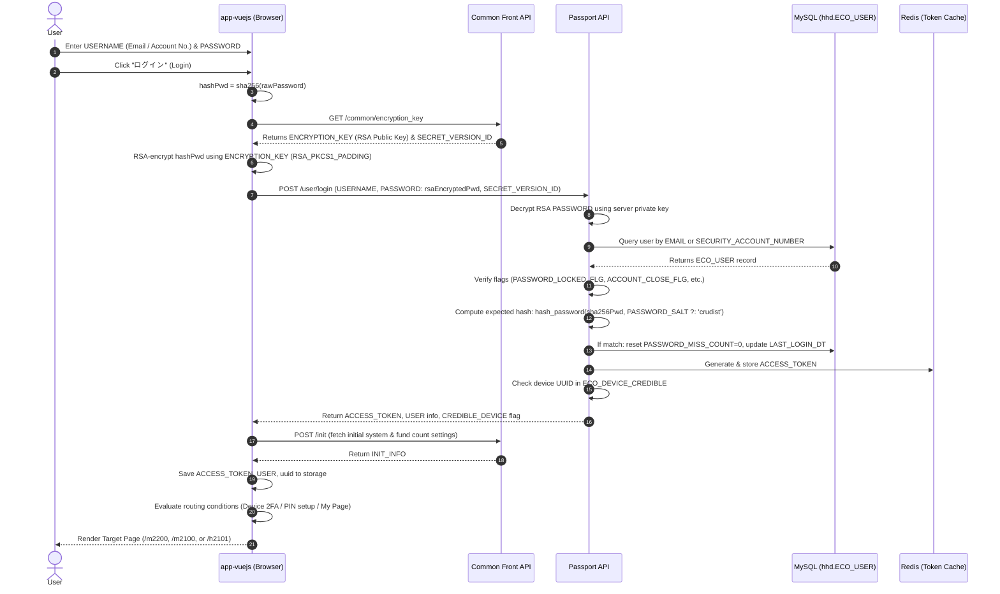
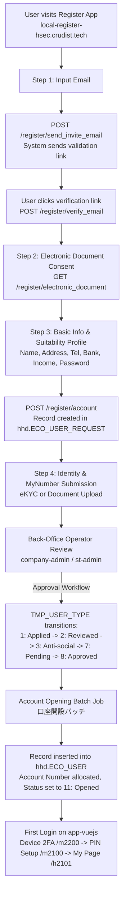

# Project Information
- **Project Name:** `ownersbook+` (`app-vuejs` / Security Token Platform)
- **Frontend Application:** `app-vuejs` (`http://local-st-front-hsec.crudist.tech:8080/`)
- **Backend Services:**
  - Common Front API (`http://local-common-front-api-hsec.crudist.tech`)
  - Passport API (`http://local-passport-api-hsec.crudist.tech`)
  - Security Token API (`http://local-st-front-api-hsec.crudist.tech`)
  - Mobile Registration (`http://local-register-hsec.crudist.tech`)

---

## 1. Login Workflow for `local-st-front-hsec.crudist.tech`

The login process in `app-vuejs` involves client-side pre-hashing, public key retrieval and RSA encryption, backend credential verification in Passport API, session establishment, and conditional routing based on user verification status.

### 1.1 Architecture & Components Involved

| Component | File Path | Role / Description |
| :--- | :--- | :--- |
| **Login View** | [Login/index.vue](/app-vuejs/src/views/Login/index.vue) | Login interface capturing user input, triggering encryption, calling login API, and navigating post-login. |
| **API Configuration** | [baseUrlConfig.js](/app-vuejs/src/utils/baseUrlConfig.js) | Defines endpoints: `commonApiUrl`, `passportApiUrl`, `fundApiUrl`, `registerUrl`. |
| **HTTP Interceptor** | [httpRequest.js](/app-vuejs/src/utils/httpRequest.js) | Axios wrapper managing request headers (`X-CI`, `X-DU`, `Authorization: ACCESS_TOKEN`) and handling errors (redirects network / 500 errors to `/z1200`). |
| **Crypto Utilities** | [common.js](/app-vuejs/src/utils/common.js) | Provides SHA-256 password hashing (`hashPwd`) and RSA public key encryption (`encryptedData`). |
| **Common API Client** | [common-api.js](/app-vuejs/src/utils/common-api.js) | Fetches the RSA public key via `getEncryptionPassword()`. |
| **Passport API Controller** | [UserController.php](/passport/app/Http/Controllers/UserController.php) | Validates credentials, manages lock counts, generates access token, checks device 2FA. |
| **User Service & Repository** | [UserService.php](/passport/app/Services/UserService.php) / [UserRepository.php](/passport/app/Repositories/Eloquent/User/UserRepository.php) | Verifies user status (`PASSWORD_LOCKED_FLG`, `PASSWORD_MISS_COUNT`), checks salted password hash, updates login metadata. |

---

### 1.2 Step-by-Step Processing Flow



1. **User Input & Validation**:
   - The user enters either their Email address or Security Account Number (`USERNAME`) and their plaintext password in [Login/index.vue](/app-vuejs/src/views/Login/index.vue).
2. **Client-Side SHA-256 Pre-Hashing**:
   - When the user submits, `app-vuejs` calls `this.commonJs.hashPwd(pwd.val)`, generating an initial SHA-256 digest:
     $$\text{hashPwd} = \text{SHA256}(\text{rawPassword})$$
3. **Retrieval of RSA Public Key**:
   - `getEncryptionPassword(hashPwd)` sends an HTTP request:
     - `GET http://local-common-front-api-hsec.crudist.tech/common/encryption_key`
   - Common Front API returns:
     - `DATA.ENCRYPTION_KEY`: Base64-encoded RSA public key.
     - `DATA.SECRET_VERSION_ID`: UUID identifier for the key version.
4. **Client-Side RSA Encryption**:
   - In `commonJs.encryptedData`, `hashPwd` is encrypted using the public key with `crypto.constants.RSA_PKCS1_PADDING` and converted to Base64:
     $$\text{encodePassword} = \text{Base64}(\text{RSA\_Encrypt}(\text{hashPwd}))$$
5. **Passport API Login Call**:
   - `app-vuejs` posts credentials to Passport API:
     - `POST http://local-passport-api-hsec.crudist.tech/user/login`
     - Payload:
       ```json
       {
         "USERNAME": "lthdang@ninepoints.vn",
         "PASSWORD": "<base64_rsa_encrypted_string>",
         "SECRET_VERSION_ID": "aa2d5374-466c-447a-9b56-97374b87e567"
       }
       ```
6. **Backend Verification in Passport API**:
   - **RSA Decryption**: `UserPasswordService::decrypt($password, $secretVersionId)` recovers the `hashPwd`.
   - **User Retrieval**: Passport queries `hhd.ECO_USER` where `EMAIL = $username` OR `SECURITY_ACCOUNT_NUMBER = $username`.
   - **Account Status Validation**:
     - `STOP_LOGIN_FLG == 1` -> Throws error `E101-0030`.
     - `PASSWORD_LOCKED_FLG == 1` -> Throws error `E101-0028`.
     - `PASSWORD_EXPIRE_DT < now` -> Throws error `E101-0030`.
   - **Password Hash Matching**:
     - Passport computes the password hash via `hash_password($password, $user['PASSWORD_SALT'])`:
       ```php
       $passwordSalt = $passwordSalt ?: CDConfig::get("user.password_salt"); // 'crudist' in local/dev
       $hashedPassword = hash('sha256', $password . $passwordSalt);
       $last32bytes = substr($hashedPassword, -32);
       ```
     - If `$user['HASHED_PASSWORD'] !== $last32bytes`: increments `PASSWORD_MISS_COUNT` (locks account if $\ge 5$ with `E101-0028`, else returns `E101-0002`).
     - If matched: resets `PASSWORD_MISS_COUNT = 0`, updates `LAST_LOGIN_DT`, updates salt if empty (`checkPasswordSalt`).
   - **Token Generation**: Generates `ACCESS_TOKEN` and stores the session in Redis under key `TK:{COMPANY_SEQ_NO}:{ACCESS_TOKEN}`.
   - **Device Credibility (2FA)**: Validates whether `DEVICE_UUID` exists in `ECO_DEVICE_CREDIBLE`. If not, sets `CREDIBLE_DEVICE = 0` and triggers verification email/SMS.
7. **Post-Login Routing in Frontend**:
   - Calls `POST /init` (`http://local-common-front-api-hsec.crudist.tech/init`) to cache `INIT_INFO`.
   - Stores session state in `sessionStorage` (`ACCESS_TOKEN`, `USER`, `TO_DEVICE`) and `localStorage` (`USERNAME`, `uuid`).
   - Evaluates navigation rules:
     - **If `CREDIBLE_DEVICE == 0` (Untrusted Device)**:
       - Navigates to `/m2200` (First login 2FA verification screen).
     - **If `CREDIBLE_DEVICE == 1` (Trusted Device)**:
       - **Individual User (`PERSON_CORP_TYPE == 1`)**:
         - If `IS_SECRET_CONFIGURED` is false $\rightarrow$ Navigates to `/m2100` (Initial setup of Transaction PIN / 取引暗証番号初回設定).
         - If `IS_SECRET_CONFIGURED` is true $\rightarrow$ Calls `judgePath()`:
           - If `FUND_COUNT.PRI_ENTRY > 0` or `LOTTERY > 0` $\rightarrow$ Navigates to `/p2100` (Priority/Lottery entry screen).
           - Otherwise $\rightarrow$ Navigates to `/h2101` (My Page / マイページ保有).
       - **Corporate User (`PERSON_CORP_TYPE == 2`)**:
         - If `IS_ACCOUNT_NUMBER_VERIFIED` is false $\rightarrow$ Navigates to `/m2102` (Securities account verification / 証券番号初回設定).
         - Else if not `IS_SECRET_CONFIGURED` $\rightarrow$ Navigates to `/m2100`.
         - Else $\rightarrow$ Calls `judgePath()` (`/h2101` or `/p2100`).

---

## 2. New Account Registration Process for `local-st-front-hsec.crudist.tech`

Account registration follows strict Japanese financial compliance rules (Financial Instruments and Exchange Act, eKYC, Act on Prevention of Transfer of Criminal Proceeds).



### 2.1 User-Side Registration Workflow (`mobile-registration` & `common-front-api`)

1. **Email Invitation & Verification**:
   - User inputs email $\rightarrow$ calls `POST /register/send_invite_email`.
   - System validates that the email does not already exist in `hhd.ECO_USER` or pending `ECO_USER_REQUEST`, generates a unique token, and sends an invitation link.
   - User clicks the link $\rightarrow$ validates token via `POST /register/verify_email`.
2. **Electronic Document Consent (電子交付等の同意)**:
   - User reviews and confirms statutory disclosure documents, terms of service, privacy policy, and anti-social exclusion statements fetched via `GET /register/electronic_document`.
3. **Information Input & Suitability Survey (適合性確認 & 口座開設申込)**:
   - **Personal Attributes**: Full name (Kanji and Katakana), Date of Birth, Gender, Residential Address (checked against Japanese postal and character rules).
   - **Phone & 2FA**: Mobile phone number (`TEL_NO_02`) verified via SMS authentication code.
   - **Suitability Information (適合性の原則)**: Occupation, annual income, estimated net financial assets, investment experience (stocks, bonds, real estate funds, crypto assets), investment objective.
   - **Password Creation**: User creates login password (pre-hashed with SHA-256 and encrypted via `/common/encryption_key`).
   - **Withdrawal Bank Account**: Bank name, branch code, account type, account number, account holder name.
   - Submission via `POST /register/account` (for individuals) or `POST /register/company` (for corporations), which records an application in `hhd.ECO_USER_REQUEST` with `TMP_USER_TYPE = 1` (申込).
4. **Identity Verification & My Number Submission (本人確認 & マイナンバー提出)**:
   - **Method A (eKYC)**: Liquid / Polarify eKYC redirection (`/register/ekyc_url`) for automated smartphone selfie and ID card scan.
   - **Method B (Document Upload)**: Upload front/back images of Driver’s License / My Number Card (`/upload/register_company_images` or `/register/identity_submit`). Images are encrypted using AES keys and stored in S3 (`aws.s3_mynumber_upload_folder`).

### 2.2 Operator Review & Account Creation Lifecycle (`company-admin`)

In Japanese securities operations, an application in `ECO_USER_REQUEST` does not immediately become a live user until back-office approval:

| Status Code | Status Name (JA) | Description |
| :---: | :--- | :--- |
| **`1`** | 申込 (Applied) | Application submitted by user; awaiting initial inspection. |
| **`2`** | 審査済 (Reviewed) | Front-office operator verified personal information against identity documents. |
| **`3`** | 反社照会中 (Anti-social Check) | Applicant details checked against anti-social / sanction databases. |
| **`7`** | 承認待 (Pending Approval) | Compliance supervisor review pending. |
| **`8`** | 承認済 (Approved) | Compliance supervisor approved account opening. |
| **`11`** | 開設済 (Account Opened) | System batch generated account and created active record in `ECO_USER`. |
| **`5`** | 不備 (Deficiency) | Documents unreadable or address mismatch; re-upload requested via email. |

- **Account Opening Batch Process (`口座開設バッチ`)**:
  - Automatically processes applications in status `8: 承認済`.
  - Generates securities branch code (`BRANCH_CODE`), account number (`ACCOUNT_NUMBER`), and security account number (`SECURITY_ACCOUNT_NUMBER`).
  - Inserts the finalized user into `hhd.ECO_USER` and initial rows in `hhd.ECO_USER_STATUS`, `hhd.ECO_USER_LOCK`, and `hhd.ECO_COMPANY`.
  - Dispatches an account completion notification email to the user.

---

## 3. Investigation into the Cause of the "Current Issue"

### 3.1 Error Details
When attempting to log in on `http://local-st-front-hsec.crudist.tech:8080/`, the application immediately redirects to `/z1200` (system unexpected error page), with the following browser console error:
```
- Access to XMLHttpRequest at 'http://local-common-front-api-hsec.crudist.tech/common/encryption_key' 
  from origin 'http://local-st-front-hsec.crudist.tech:8080' has been blocked by CORS policy: 
  Response to preflight request doesn't pass access control check: 
  The 'Access-Control-Allow-Origin' header has a value 'http://localhost:8080' that is not equal to the supplied origin.
- GET http://local-common-front-api-hsec.crudist.tech/common/encryption_key net::ERR_FAILED
```

### 3.2 Root Cause Analysis

1. **Origin Mismatch**:
   - The browser is visiting `app-vuejs` on `http://local-st-front-hsec.crudist.tech:8080`.
   - The preflight HTTP `OPTIONS` request sent to `http://local-common-front-api-hsec.crudist.tech/common/encryption_key` carries header:
     `Origin: http://local-st-front-hsec.crudist.tech:8080`
2. **Docker Environment Configuration in `st-app`**:
   - In [docker-compose.yml](/local-docker/dc-web/docker-compose.yml#L5-L23), service `st-app` hosts `common-front-api` and `passport`.
   - `st-app` loads environment variables from [local-docker/dc-web/.env_st-app](/local-docker/dc-web/.env_st-app):
     ```properties
     DOCKER_ENV=local
     ALLOW_ORIGIN_DOMAIN=http://localhost:8080
     ST_FRONT_VUEJS_BASE_URL=http://local-st-front-hsec.crudist.tech:8080
     APP_ENV=local
     ```
   - Notice that while `ST_FRONT_VUEJS_BASE_URL` was updated to `http://local-st-front-hsec.crudist.tech:8080`, `ALLOW_ORIGIN_DOMAIN` was left as `http://localhost:8080`.
3. **Backend CORS Middleware Evaluation**:
   - In [common-front-api/config/cors.php](/common-front-api/config/cors.php):
     ```php
     $rawOrigins = array_filter(array_map('trim', explode(',', env('ALLOW_ORIGIN_DOMAIN', '*'))));
     ```
   - Because `env('ALLOW_ORIGIN_DOMAIN')` resolves to `http://localhost:8080`, Laravel's `HandleCors` middleware allows only `http://localhost:8080`.
   - Since `http://local-st-front-hsec.crudist.tech:8080` does not match, the preflight fails.
4. **Why Redirect to `/z1200` Occurred**:
   - In [httpRequest.js](/app-vuejs/src/utils/httpRequest.js#L232-L236):
     ```javascript
     service.interceptors.response.use(function (response) {
       ...
     }, function (error) {
       window.vm.$f7.preloader.hide()
       if (!error.response) {
         $router.replace('/z1200'); // redirect to 500 error page when any error in response
       }
       ...
     });
     ```
   - A CORS policy rejection aborts the network request without an HTTP status code, leaving `error.response` `undefined`. The interceptor triggers `$router.replace('/z1200')`.

---

## 4. Proposed Remediation Strategies & Trade-offs

### Option 1 (Recommended - Highest Effectiveness): Update `ALLOW_ORIGIN_DOMAIN` in Docker Environment

Update the Docker environment definition for the `st-app` service to permit the custom local domain alongside localhost. Both `common-front-api/config/cors.php` and `passport/config/cors.php` natively parse comma-separated domains.

#### Implementation:
In both [local-docker/dc-web/.env_st-app](/local-docker/dc-web/.env_st-app) and `local-docker/dc-web/.env_st-app.local`:
```diff
-ALLOW_ORIGIN_DOMAIN=http://localhost:8080
+ALLOW_ORIGIN_DOMAIN=http://local-st-front-hsec.crudist.tech:8080,http://localhost:8080
```
Then restart the `st-app` container and clear Laravel config caches:
```bash
docker compose -f /home/haidang/Works/ownersbook+/local-docker/dc-web/docker-compose.yml restart st-app
docker exec st-app php /www/common-front-api/artisan config:clear
docker exec st-app php /www/passport/artisan config:clear
```

#### Trade-offs:
- **Pros:**
  - Addresses the exact root cause in configuration without modifying code.
  - Aligns `st-app` with the existing setup in `st-app-pfund` (`.env_st-app-pfund` already allows `http://local-st-front-hsec.crudist.tech:8080`).
  - Supports accessing the frontend via both `http://local-st-front-hsec.crudist.tech:8080` and `http://localhost:8080`.
  - Zero risk of introducing regression in production or CI environments.
- **Cons:**
  - Requires restarting the local Docker container and clearing configuration cache.

---

### Option 2 (Wildcard / Regex Development Origin Configuration)

Configure `ALLOW_ORIGIN_DOMAIN` with a wildcard pattern in `.env_st-app` or within `common-front-api/.env` and `passport/.env`.

#### Implementation:
In [local-docker/dc-web/.env_st-app](/local-docker/dc-web/.env_st-app):
```diff
-ALLOW_ORIGIN_DOMAIN=http://localhost:8080
+ALLOW_ORIGIN_DOMAIN=http://*.crudist.tech:8080,http://localhost:8080
```
*(The regex parser in `cors.php` converts `*` into `[a-zA-Z0-9\-]+` to match any subdomain).*

#### Trade-offs:
- **Pros:**
  - Highly versatile for developers working across multiple test subdomains (e.g., `local-st-front-hsec`, `test.local-common-front-api-hsec`).
  - Eliminates the need to reconfigure CORS when adding or changing local subdomains.
- **Cons:**
  - Permissive wildcard rules must never be promoted to staging or production environments.
  - Still requires restarting the container and clearing configuration cache.

---

### Option 3 (Access via `localhost:8080` / Port Forwarding)

Directly access the application using `http://localhost:8080` in the browser instead of the custom domain `http://local-st-front-hsec.crudist.tech:8080`.

#### Trade-offs:
- **Pros:**
  - Instant workaround requiring no file edits or Docker container restarts.
- **Cons:**
  - Does not satisfy the user's goal of exploring the project under the configured domain `http://local-st-front-hsec.crudist.tech:8080`.
  - May trigger inconsistencies with cookie domain boundaries, cross-service links, or Zendesk/SSO configurations that rely on `*.crudist.tech`.

---

## 5. Notes: Important Considerations for Successful Login

### 5.1 Password Hashing & Salt Discrepancy in the User's SQL Query

> [!WARNING]
> Fixing the CORS error alone will **not** allow login with the account inserted by the user's SQL query. A secondary credential mismatch will occur.

In the user's query:
```sql
HASHED_PASSWORD = RIGHT(SHA2(SHA2('123456', 256), 256), 32),
PASSWORD_SALT = NULL
```
However, in [passport/app/helpers.php](/passport/app/helpers.php#L54-L61):
```php
function hash_password($password, $passwordSalt = null)
{
    $passwordSalt = $passwordSalt ?: CDConfig::get("user.password_salt");
    $hashedPassword = hash('sha256', $password . $passwordSalt);
    $last32bytes = substr($hashedPassword, -32);
    return $last32bytes;
}
```
1. Frontend calculates: `sha256('123456')`.
2. When `PASSWORD_SALT` is `NULL`, Passport retrieves `user.password_salt` from table `hhd.ESYS_CONFIG` (which defaults to `'crudist'` in development).
3. Passport calculates: `substr(hash('sha256', sha256('123456') . 'crudist'), -32)`.
4. The user's query hashed `sha256('123456')` directly without appending `'crudist'`, causing an authentication failure (`E101-0002`).

**Correct SQL for inserting or updating password:**
```sql
UPDATE hhd.ECO_USER 
SET 
    PASSWORD_SALT = NULL,
    HASHED_PASSWORD = RIGHT(SHA2(CONCAT(SHA2('123456', 256), 'crudist'), 256), 32),
    PASSWORD_MISS_COUNT = 0,
    PASSWORD_LOCKED_FLG = 0
WHERE EMAIL = 'lthdang@ninepoints.vn';
```

---

### 5.2 Device 2FA Verification (`CREDIBLE_DEVICE`)

When logging in from a newly launched browser or a new `X-DU` device UUID, Passport marks `CREDIBLE_DEVICE = 0` because the device UUID does not yet exist in `hhd.ECO_DEVICE_CREDIBLE`.
- `Login/index.vue` will redirect the browser to `/m2200` for SMS/Email 2FA verification.
- To bypass this during local development and jump directly to My Page (`/h2101`), insert a trusted device record into `hhd.ECO_DEVICE_CREDIBLE`:
```sql
INSERT INTO hhd.ECO_DEVICE_CREDIBLE (
    USER_SEQ_NO,
    DEVICE_UUID,
    CREDIBLE_FLG,
    CONFIRM_2FA_FLG,
    CREATED_DT
) VALUES (
    (SELECT SEQ_NO FROM hhd.ECO_USER WHERE EMAIL = 'lthdang@ninepoints.vn'),
    '00000000-0000-0000-0000-000000000000', -- or the uuid in localStorage.getItem('uuid')
    1,
    1,
    NOW()
);
```

---

### 5.3 Transaction Secret PIN Requirement (`IS_SECRET_CONFIGURED`)

- In `app-vuejs`, if `IS_SECRET_CONFIGURED` is false (i.e., `HASHED_SECRET` is NULL or empty in `ECO_USER`), the application will redirect to `/m2100` (Initial setup for transaction PIN).
- The user's SQL set `HASHED_SECRET = RIGHT(SHA2(SHA2('123456', 256), 256), 32)`, so `IS_SECRET_CONFIGURED` will evaluate to `1` (configured). Once CORS and password salt are corrected, the user will transition directly to `/h2101` or `/p2100`.

## 6. Causes of the new issue and proposed remedies:

### 6.1 Investigation into the Cause of the New Issue

#### Error Overview:
During `POST http://local-passport-api-hsec.crudist.tech/user/login`, Passport API returned HTTP 500:
```json
{
    "STATUS": "NG",
    "ERROR": {
        "CODE": 0,
        "FILE": "UserService.php",
        "LINE": 47,
        "MESSAGE": "Attempt to read property \"STOP_LOGIN_FLG\" on null"
    }
}
```

#### Detailed Root Cause:
1. **Missing Companion Record in `hhd.ECO_USER_STATUS`**:
   - In [UserService.php](/passport/app/Services/UserService.php#L45-L49):
     ```php
     $userStatusRepository = new UserStatusRepository();
     $userStatus = $userStatusRepository->getDataByUserSeqNo($userInfo->SEQ_NO, ['STOP_LOGIN_FLG']);
     if ($userStatus->STOP_LOGIN_FLG == 1) {
         throw new ApiException('E101-0030');
     }
     ```
   - When the test user account was manually created with `INSERT INTO hhd.ECO_USER`, only the customer master record was inserted.
   - In the database schema, table `hhd.ECO_USER_STATUS` (commented: *“［共通］顧客ステータス管理 顧客毎のステータスを管理する。顧客マスタ登録時に同時に作成する”*) is a strictly required companion table for every user, keyed by `USER_SEQ_NO`.
   - Because no record existed for `USER_SEQ_NO = 348`, `$userStatusRepository->getDataByUserSeqNo(348, ['STOP_LOGIN_FLG'])` returned `null`.
   - Running on PHP 8.3, evaluating property access `$userStatus->STOP_LOGIN_FLG` on `null` throws an uncaught `TypeError` / fatal Error:
     `Attempt to read property "STOP_LOGIN_FLG" on null`.

2. **Subsequent Hidden Blocker in `UserController.php` (`APPLY_NO`)**:
   - Immediately following successful password validation, [UserController.php](/passport/app/Http/Controllers/UserController.php#L74-L90) executes:
     ```php
     $userRequest = UserRequestRepository::getByUserSeqNo($userInfo->SEQ_NO, ['SEQ_NO']);
     $response = [
         ...
         "APPLY_NO" => netsec_encrypt($userRequest->SEQ_NO),
     ];
     ```
   - Just like `ECO_USER_STATUS`, `hhd.ECO_USER_REQUEST` stores the application record associated with the account (`USER_SEQ_NO`).
   - If `ECO_USER_REQUEST` lacks a record where `USER_SEQ_NO = 348`, `$userRequest` is `null`, which immediately triggers another fatal crash:
     `Attempt to read property "SEQ_NO" on null`.

3. **Active Password Salt (`N7v7mUjnAqux7S5i`)**:
   - When `PASSWORD_SALT` is `NULL` in `ECO_USER`, [helpers.php](/passport/app/helpers.php#L54-L60) reads `CDConfig::get("user.password_salt")` from `hhd.ESYS_CONFIG`.
   - In the local database, `hhd.ESYS_CONFIG` contains `CONFIG_KEY = 'user.password_salt'` with value `'N7v7mUjnAqux7S5i'`.
   - The password hash must therefore match:
     $$\text{HASHED\_PASSWORD} = \text{RIGHT}(\text{SHA2}(\text{CONCAT}(\text{SHA2}('123456', 256), 'N7v7mUjnAqux7S5i'), 256), 32)$$
     which evaluates to `'85212219605dafa2a55ad84d18e4f7b6'`.

---

### 6.2 Proposed Fixes (Ranked by Effectiveness)

#### Proposal 1 (Recommended - Highest Effectiveness): Seed Missing Relational Records for the Account
Insert the required companion records into `hhd.ECO_USER_STATUS` and `hhd.ECO_USER_REQUEST`, and update `ECO_USER` with the active salt hash.

##### Execution SQL:
```sql
-- 1. Insert customer status record (resolves line 47 crash)
INSERT INTO hhd.ECO_USER_STATUS (
    USER_SEQ_NO,
    STOP_LOGIN_FLG,
    STOP_BUY_FLG,
    STOP_SELL_FLG,
    STOP_WITHDRAW_FLG,
    STOP_DIVIDEND_FLG,
    STOP_WITHHOLDING_TAX_FLG,
    CREATED_DT
) VALUES (
    348,
    0, 0, 0, 0, 0, 0,
    NOW()
) ON DUPLICATE KEY UPDATE STOP_LOGIN_FLG = 0;

-- 2. Insert account application record (resolves line 90 APPLY_NO crash)
INSERT INTO hhd.ECO_USER_REQUEST (
    USER_SEQ_NO,
    TMP_USER_TYPE,
    NAME,
    KANA_NAME,
    POSTAL_CD,
    ADDRESS1,
    ADDRESS2,
    ADDRESS3,
    AREA_CD,
    NATIONALTY,
    SEX,
    EMAIL,
    TEL_NO_02,
    BIRTH_D,
    GREEN_CARD_FLG,
    REQUEST_TYPE,
    SERVICE_SEQ_NO,
    CREATED_DT
) VALUES (
    348,
    11, -- 11: 開設済み (Account opened)
    'Đăng',
    'ダン',
    '1000001',
    '東京都',
    '千代田区',
    '千代田１−１',
    '13',
    1,
    1,
    'lthdang@ninepoints.vn',
    '09012345678',
    '1995-01-01',
    0,
    1,
    1,
    NOW()
) ON DUPLICATE KEY UPDATE TMP_USER_TYPE = 11;

-- 3. Synchronize password hash with active salt ('N7v7mUjnAqux7S5i')
UPDATE hhd.ECO_USER 
SET 
    PASSWORD_SALT = NULL,
    HASHED_PASSWORD = RIGHT(SHA2(CONCAT(SHA2('123456', 256), 'N7v7mUjnAqux7S5i'), 256), 32),
    PASSWORD_MISS_COUNT = 0,
    PASSWORD_LOCKED_FLG = 0
WHERE EMAIL = 'lthdang@ninepoints.vn';

-- 4. (Optional) Register trusted browser device to bypass 2FA redirect to /m2200
INSERT INTO hhd.ECO_DEVICE (
    USER_SEQ_NO,
    SERVICE_SEQ_NO,
    DEVICE_UUID,
    CREDIBLE_FLG,
    VERIFIED,
    CREATED_DT
) VALUES (
    348,
    1,
    '00000000-0000-0000-0000-000000000000',
    1,
    1,
    NOW()
) ON DUPLICATE KEY UPDATE CREDIBLE_FLG = 1, VERIFIED = 1;
```

##### Trade-offs:
- **Pros:**
  - Fully aligns the manually created test account with the relational database integrity expectations of the production codebase.
  - Eliminates the 500 error on `STOP_LOGIN_FLG`, avoids the upcoming crash on `APPLY_NO`, and provides valid session tokens.
  - Zero code alterations required in the application repository.
- **Cons:**
  - Requires executing SQL statements directly on the database.

---

#### Proposal 2: Add Defensive Null-Safe Checks in Passport API Code
Update Passport backend code to use PHP 8 null-safe navigation operator (`?->`) to prevent fatal crashes if related tables are missing data.

##### Code Changes:
- In [passport/app/Services/UserService.php](/passport/app/Services/UserService.php#L47):
  ```diff
  -$userStatus = $userStatusRepository->getDataByUserSeqNo($userInfo->SEQ_NO, ['STOP_LOGIN_FLG']);
  -if ($userStatus->STOP_LOGIN_FLG == 1) {
  +$userStatus = $userStatusRepository->getDataByUserSeqNo($userInfo->SEQ_NO, ['STOP_LOGIN_FLG']);
  +if ($userStatus?->STOP_LOGIN_FLG == 1) {
  ```
- In [passport/app/Http/Controllers/UserController.php](/passport/app/Http/Controllers/UserController.php#L90):
  ```diff
  -"APPLY_NO" => netsec_encrypt($userRequest->SEQ_NO),
  +"APPLY_NO" => $userRequest ? netsec_encrypt($userRequest->SEQ_NO) : null,
  ```

##### Trade-offs:
- **Pros:**
  - Enhances application code resilience against corrupted or manually incomplete customer records.
- **Cons:**
  - Changes application source code; still requires fixing the password hash in the database to authenticate; if downstream frontend screens rely on `APPLY_NO`, frontend errors may occur later.

---

#### Proposal 3: Use an Existing Fully Seeded Account or Complete Registration Flow
Instead of manually crafting records across multiple tables, use an existing test account already properly initialized by seeders or the official account opening batch.

##### Examples:
- Existing seeded user: `fujibe_y+reuat3@hashdash-group.com` (which already possesses valid linked records in `ECO_USER_STATUS`, `ECO_USER_REQUEST`, and `ECO_DEVICE`).
- Or run the end-to-end registration flow via `http://local-register-hsec.crudist.tech`.

##### Trade-offs:
- **Pros:**
  - Guarantees 100% compliance with business workflows without manual data crafting.
- **Cons:**
  - Requires looking up or resetting passwords for seeded users, or spending time going through the multi-step registration UI and admin approval.

---

### 6.3 Causes of the Post-Login Alert & Redirect Error (`xdu_credible_error` / `p2100.vue`)

#### Error Overview & Console Evidence:
After authenticating successfully on `http://local-st-front-hsec.crudist.tech:8080/`, the following behavior occurs:
1. **Console location switch**: `[system] Location: http://local-st-front-hsec.crudist.tech:8080/p2100`
2. **Console error**:
   ```
   selector.js?type=script&index=0!./src/views/Resiger/p2100.vue:278 Uncaught (in promise) TypeError: Cannot read properties of undefined (reading 'data')
       at eval (selector.js?type=script&index=0!./src/views/Resiger/p2100.vue:278:17)
       at Promise.then
       at getfundArr (selector.js?type=script&index=0!./src/views/Resiger/p2100.vue:277)
       at created (selector.js?type=script&index=0!./src/views/Resiger/p2100.vue:249)
   ```
3. **UI Dialog**:
   - **Dialog message**: *"An error has occurred. Please contact us if this occurs repeatedly."* (Japanese original: `エラーが発生しました。くり返し発生する場合はお問い合わせください。`) with an **"OK"** button.
   - Clicking the **"OK"** button immediately redirects the browser back to the login page (`/`).

---

#### Detailed Root Cause Analysis:

The issue is caused by a chain of 4 sequential events spanning the frontend router, backend security check, HTTP interceptor, and component Promise handling:

1. **Successful Login & Router Redirection to `/p2100`**:
   - In [Login/index.vue](/app-vuejs/src/views/Login/index.vue), once credentials pass Passport API verification, the app calls `commonJs.judgePath()`.
   - Because `FUND_COUNT.PRI_ENTRY > 0` (priority募集) or `LOTTERY > 0` is set in `INIT_INFO`, `judgePath()` routes the user to `/p2100` (`http://local-st-front-hsec.crudist.tech:8080/p2100`).

2. **Protected API Request from `p2100.vue`**:
   - On component mount, [p2100.vue](/app-vuejs/src/views/Resiger/p2100.vue#L243-L266) calls `getfundArr()` in its `created()` hook:
     ```javascript
     this.axios.get(fundApiUrl + '/prientry/mypage').then((res) => {
       if (res.data.STATUS == 'OK') {
         ...
       }
     });
     ```
   - Axios attaches HTTP headers configured in [httpRequest.js](/app-vuejs/src/utils/httpRequest.js#L197):
     ```javascript
     requestConst['X-DU'] = getUuid();
     ```

3. **Strict Device Credibility Rejection in `st-api` (`AppController::deviceCheck()`)**:
   - In `st-api`, every authenticated request triggers `deviceCheck()` in [AppController.php](/st-api/App/Core/AppController.php#L222-L235):
     ```php
     private function deviceCheck()
     {
         $du = request()->header('X-Du') ?? '';
         // Check 1: Strict RFC 4122 Version 4 UUID regex
         if ($du && is_string($du) && (1 === preg_match('/^[0-9a-f]{8}\-[0-9a-f]{4}\-4[0-9a-f]{3}\-[89ab][0-9a-f]{3}\-[0-9a-f]{12}$/', $du))) {
         } else {
             throw new AppException('xdu_credible_error');
         }

         // Check 2: Database trusted device verification
         $deviceData = DeviceModel::insModel()->getByDu($du);
         if ($deviceData && '1' == $deviceData['CREDIBLE_FLG']) {
         } else {
             throw new AppException('xdu_credible_error');
         }
     }
     ```
   - **Trigger A (Hardcoded Nil UUID format)**: In [httpRequest.js](/app-vuejs/src/utils/httpRequest.js#L59), `getUuid()` currently hardcodes a nil UUID fallback:
     ```javascript
     let localDu = '00000000-0000-0000-0000-000000000000';
     localStorage.setItem('uuid', localDu);
     ```
     This nil UUID fails the regex check because position 13 is `0` (not `4`) and position 17 is `0` (not `[89ab]`).
   - **Trigger B (Untrusted Device in Database)**: In [DeviceModel.php](/st-api/App/Models/ECO/DeviceModel.php#L14-L19), `getByDu($du)` queries:
     ```sql
     SELECT * FROM ECO_DEVICE D WHERE D.DEVICE_UUID = '{$du}' AND D.USER_SEQ_NO = '{$this->client->USER_SEQ_NO}'
     ```
     If the user does not have an active record with `CREDIBLE_FLG = 1`, `deviceCheck()` also throws `AppException('xdu_credible_error')`.
   - **Response Payload**: `st-api` catches this exception and returns HTTP 200 with the error mapped from [Lang.inc.php](/st-api/App/Configs/Lang.inc.php#L12):
     ```json
     {
       "STATUS": "NG",
       "ERROR": {
         "CODE": "xdu_credible_error",
         "MESSAGE": "エラーが発生しました。くり返し発生する場合はお問い合わせください。"
       }
     }
     ```

4. **Why the Alert Appears, Redirects to Login, and Throws Console `TypeError`**:
   - In [httpRequest.js](/app-vuejs/src/utils/httpRequest.js#L220-L229):
     ```javascript
     if (response.data.ERROR) {
         let errorCode = ['E100-0011', 'E100-0013', 'no_account_number_verified_error', 'xdu_credible_error']
         if (errorCode.includes(response.data.ERROR.CODE)) {
             commonJs.showAlert(response.data.ERROR.MESSAGE, 'OK', 'prompt', null, () => {
                 location.href = '/';
             })
             return ;
         }
     }
     ```
   - **The Dialog & Redirect**: `xdu_credible_error` is caught by this block. It opens `commonJs.showAlert()` with message `"エラーが発生しました。くり返し発生する場合はお問い合わせください。"` and button `"OK"`. Clicking `"OK"` invokes the callback `location.href = '/'`, which redirects the browser back to the login page.
   - **The Console `TypeError`**: Notice line 227: `return ;` without returning `response`. In JavaScript/Axios interceptors, returning `undefined` resolves the promise with `undefined`. When [p2100.vue:266](/app-vuejs/src/views/Resiger/p2100.vue#L266) runs `.then((res) => { if (res.data.STATUS == 'OK') ... })`, `res` is `undefined`. Accessing `res.data` throws:
     `Uncaught (in promise) TypeError: Cannot read properties of undefined (reading 'data')`.

---

#### Proposed Fixes (Ranked by Effectiveness)

##### Proposal 1 (Recommended - Highest Effectiveness): Restore RFC 4122 v4 UUID in Frontend & Trust the Device in Database
Restore standard UUID v4 generation in `app-vuejs`, mark the device as trusted in `hhd.ECO_DEVICE`, and fix the response interceptor so it cleanly rejects error promises instead of resolving `undefined`.

###### 1. Restore UUID v4 Generation in [httpRequest.js](/app-vuejs/src/utils/httpRequest.js#L39-L64):
Uncomment and use the `creatud()` function to generate a valid RFC 4122 v4 UUID:
```javascript
function creatud() {
  var s = [];
  var hexDigits = '0123456789abcdef';
  for (var i = 0; i < 36; i++) {
    s[i] = hexDigits.substr(Math.floor(Math.random() * 0x10), 1);
  }
  s[14] = '4'; // RFC 4122 v4
  s[19] = hexDigits.substr((s[19] & 0x3) | 0x8, 1);
  s[8] = s[13] = s[18] = s[23] = '-';
  var uuid = s.join('');
  return uuid;
}

function getUuid() {
  var DU = localStorage.getItem('uuid');
  if (!DU || DU === '00000000-0000-0000-0000-000000000000') {
    let localDu = creatud();
    localStorage.setItem('uuid', localDu);
    return localDu;
  }
  return DU;
}
```

###### 2. Clean Up Interceptor Return in [httpRequest.js](/app-vuejs/src/utils/httpRequest.js#L224-L228):
Instead of bare `return ;` (which passes `undefined` to subsequent `.then()` callbacks), return a rejected Promise:
```javascript
if (errorCode.includes(response.data.ERROR.CODE)) {
    commonJs.showAlert(response.data.ERROR.MESSAGE, 'OK', 'prompt', null, () => {
        location.href = '/';
    })
    return Promise.reject(response.data.ERROR);
}
```

###### 3. Trust the Device in `hhd.ECO_DEVICE`:
Register the current user device (or update existing ones) with `CREDIBLE_FLG = 1` and `VERIFIED = 1`:
```sql
-- Query the newly generated UUID from localStorage (or set for all user devices):
UPDATE hhd.ECO_DEVICE 
SET CREDIBLE_FLG = 1, VERIFIED = 1 
WHERE USER_SEQ_NO = 348;
```
If inserting a specific UUID directly:
```sql
INSERT INTO hhd.ECO_DEVICE (
    USER_SEQ_NO,
    SERVICE_SEQ_NO,
    DEVICE_UUID,
    CREDIBLE_FLG,
    VERIFIED,
    CREATED_DT
) VALUES (
    348,
    1,
    '<your-browser-uuid-from-localStorage>',
    1,
    1,
    NOW()
) ON DUPLICATE KEY UPDATE CREDIBLE_FLG = 1, VERIFIED = 1;
```

###### 4. Reset Local Storage in Browser:
In DevTools Console on `http://local-st-front-hsec.crudist.tech:8080/`:
```javascript
localStorage.removeItem('uuid');
```
Then refresh and log in again.

###### Trade-offs:
- **Pros:**
  - Fully compliant with the production architecture across `app-vuejs`, `passport`, and `st-api`.
  - Satisfies the strict RFC 4122 v4 regex in `st-api` permanently.
  - Fixes the secondary `TypeError: Cannot read properties of undefined` in the console.
- **Cons:**
  - Requires updating frontend code and clearing invalid cached UUID in `localStorage`.

---

##### Proposal 2: Relax UUID Validation in `st-api` Backend ([AppController.php](/st-api/App/Core/AppController.php#L225))
Modify `deviceCheck()` in `st-api` to accept the hardcoded nil UUID `00000000-0000-0000-0000-000000000000` (or any generic 36-character hexadecimal UUID format) in development environments.

###### 1. Backend Code Adjustment in [AppController.php](/st-api/App/Core/AppController.php#L225):
```diff
-if ($du && is_string($du) && (1 === preg_match('/^[0-9a-f]{8}\-[0-9a-f]{4}\-4[0-9a-f]{3}\-[89ab][0-9a-f]{3}\-[0-9a-f]{12}$/', $du))) {
+if ($du && is_string($du) && (1 === preg_match('/^[0-9a-f]{8}\-[0-9a-f]{4}\-[0-9a-f]{4}\-[0-9a-f]{4}\-[0-9a-f]{12}$/i', $du))) {
```

###### 2. Trust the Nil UUID in Database:
```sql
INSERT INTO hhd.ECO_DEVICE (
    USER_SEQ_NO,
    SERVICE_SEQ_NO,
    DEVICE_UUID,
    CREDIBLE_FLG,
    VERIFIED,
    CREATED_DT
) VALUES (
    348,
    1,
    '00000000-0000-0000-0000-000000000000',
    1,
    1,
    NOW()
) ON DUPLICATE KEY UPDATE CREDIBLE_FLG = 1, VERIFIED = 1;
```

###### Trade-offs:
- **Pros:**
  - Requires zero frontend modifications or clearing of browser `localStorage`.
  - Immediate fix for local development environments where the nil UUID is already widely present.
- **Cons:**
  - Relaxes UUID v4 specification checks in `st-api`.
  - Changes backend core logic; must not be deployed to staging/production without environment guards.

---

##### Proposal 3: Complete 2FA Verification on the `/m2200` Screen
Use the native application verification journey when logging in from an untrusted device:
1. Ensure the device UUID complies with regex (as in Proposal 1).
2. When logging in with `CREDIBLE_DEVICE == 0`, `app-vuejs` automatically navigates to `/m2200` (2FA verification screen).
3. Retrieve the verification code sent to `hhd.ECO_DEVICE`:
   ```sql
   SELECT VERIFY_CODE FROM hhd.ECO_DEVICE 
   WHERE USER_SEQ_NO = 348 
   ORDER BY SEQ_NO DESC LIMIT 1;
   ```
4. Enter the `VERIFY_CODE`, check the checkbox *"信頼できる端末として登録する"* (Register as trusted device), and submit.
5. `POST /device/verify_device` automatically updates `CREDIBLE_FLG = 1`, and subsequent calls to `/p2100` or `/h2101` succeed without error.

###### Trade-offs:
- **Pros:**
  - Validates the official user flow and automated device registration mechanism without manually toggling database flags.
- **Cons:**
  - Still requires the device UUID to pass regex (Proposal 1 or Proposal 2); requires manual intervention to query the verification code from the database in local environment.

---

## 7. Fix the bug can't send email code

### 7.1 Investigation into Why the Verification Code Email Was Not Sent

#### 1. End-to-End Email Dispatch Path:
1. **Trigger during Login**:
   - In [UserController.php](/passport/app/Http/Controllers/UserController.php#L61-L70), if the device is not yet verified (`$uuidData['VERIFIED'] == 0`), Passport API calls:
     ```php
     $deviceService->sendMailCredibleCode($deviceResponse, $userInfo->EMAIL, null, $uuidData['DEVICE_UUID']);
     ```
   - In [DeviceService.php](/passport/app/Services/DeviceService.php#L209-L214), Passport generates a 6-digit verification code (`generateCode()`) and dispatches an email:
     ```php
     Mail::send(['text' => 'emails/credibleCodeMail'], $sendParams, function (Message $mailable) use ($email, $title, $company) {
         $mailable->from($company->NO_REPLY_EMAIL, $company->NO_REPLY_EMAIL_FROM_NAME)
             ->replyTo($company->INQUIRY_EMAIL, $company->INQUIRY_EMAIL_FROM_NAME)
             ->to($email)
             ->subject($title); // [local] 認証番号送付のお知らせ
     });
     ```
2. **Handoff to Local Postfix**:
   - In [passport/.env](/passport/.env#L46-L51), Laravel is configured to send mail via local SMTP:
     ```properties
     MAIL_MAILER=smtp
     MAIL_HOST=st-postfix
     MAIL_PORT=25
     ```
   - Laravel successfully established a connection with container `st-postfix:25` and handed off the messages. No PHP exceptions were thrown.

#### 2. Root Cause in Postfix Relay (`st-postfix`):
1. **Outbound Relay Failure to SendGrid (`smtp.sendgrid.net:587`)**:
   - The container `st-postfix` uses SendGrid as its relay host (`relayhost = [smtp.sendgrid.net]:587`).
   - Postfix system logs (`docker logs st-postfix`) revealed repeated network connection failures:
     ```
     postfix/smtp[147]: connect to smtp.sendgrid.net[52.198.181.98]:587: Connection refused
     postfix/smtp[148]: connect to smtp.sendgrid.net[46.137.211.255]:587: Connection refused
     postfix/smtp[147]: DC038105E35: to=<lthdang@ninepoints.vn>, relay=none, delay=108, dsn=4.4.1, status=deferred
     ```
2. **Postfix "Delivery Temporarily Suspended" Exponential Backoff**:
   - When Postfix encounters repeated TCP connection drops or timeouts to an upstream relayhost, it marks the destination as unreachable:
     ```
     postfix/error[154]: B489C14574A: to=<lthdang@ninepoints.vn>, status=deferred (delivery temporarily suspended: connect to smtp.sendgrid.net[52.221.176.56]:587: Connection refused)
     ```
   - While delivery is suspended, **any subsequent incoming email is immediately placed into the `deferred` queue without an active network transmission attempt**.
   - Postfix’s default queue manager (`qmgr`) uses an exponential backoff retry interval (waiting 15 minutes, 30 minutes, or over an hour before attempting to reconnect to SendGrid).
3. **Queue Inspection & Proof**:
   - Running `mailq` inside `st-postfix` revealed 7 deferred emails addressed to `lthdang@ninepoints.vn`, containing the verification code message:
     ```
     Subject: [local] 認証番号送付のお知らせ
     認証番号： 141277
     【有効期限: 2026-09-14 11:41 まで】
     ```
   - Once a manual queue flush was executed (`docker exec st-postfix postqueue -f`), Postfix immediately re-attempted the connection, successfully connected to SendGrid, and SendGrid accepted the messages:
     ```
     status=sent (250 Ok: queued as eXmEXUiCQAymrLURYWrXEg)
     status=sent (250 Ok: queued as aXDzayFOSg2peQiOrE77Ww)
     ```

---

### 7.2 Proposed Fixes (Ranked by Effectiveness)

#### Proposal 1 (Recommended - Highest Effectiveness): Switch SendGrid Relay to Port 2525 & Optimize Postfix Retry Timers
Port 587 is frequently throttled, rate-limited, or blocked by local ISPs and cloud firewalls. SendGrid officially provides port `2525` as a resilient alternative specifically designed for environments where port 587 experiences connection drops. In addition, reducing Postfix backoff timers prevents emails from being stuck for long periods if a momentary network glitch occurs.

##### 1. Update SendGrid Configuration to Port 2525:
In [local-docker/etc/local/postfix/env_for_sendgrid](/local-docker/etc/local/postfix/env_for_sendgrid#L1-L6):
```diff
-SMTP_SERVER="smtp.sendgrid.net"
-#SMTP_PORT=
+SMTP_SERVER="smtp.sendgrid.net"
+SMTP_PORT=2525
```
*(Also update `/etc/testing5/postfix/env_for_sendgrid` if testing under the testing5 environment).*

##### 2. Optimize Postfix Queue Retry Timers:
Add aggressive retry settings to Postfix so deferred emails are retried within seconds instead of hours:
In `st-postfix`, configure:
```bash
docker exec st-postfix postconf -e "minimal_backoff_time = 15s"
docker exec st-postfix postconf -e "maximal_backoff_time = 120s"
docker exec st-postfix postconf -e "queue_run_delay = 15s"
docker exec st-postfix postfix reload
```

##### 3. Immediate Queue Flush Command (Whenever Deferred):
If an email is ever delayed, trigger an instant delivery attempt:
```bash
docker exec st-postfix postqueue -f
```

##### Trade-offs:
- **Pros:**
  - Preserves the authentic email delivery pipeline to real external inboxes (`lthdang@ninepoints.vn`).
  - Port 2525 dramatically reduces ISP/firewall connection refusal issues.
  - Reduced backoff ensures instant retry if the network reconnects.
- **Cons:**
  - Still requires an active outbound internet connection from the host to SendGrid servers.

---

#### Proposal 2: Use Mailpit / MailHog for 100% Reliable Local Development Email Capture
For local development, redirect all outgoing email to a local mock SMTP server (such as Mailpit or MailHog) instead of sending through SendGrid.

##### 1. Add Mailpit Service in `local-docker/dc-base/docker-compose.yml`:
```yaml
  st-mailpit:
    container_name: st-mailpit
    image: axllent/mailpit:latest
    ports:
      - "1025:1025" # SMTP
      - "8025:8025" # Web UI
    networks:
      st_base_net:
```

##### 2. Point Passport to Mailpit:
In [passport/.env](/passport/.env#L47-L48):
```diff
-MAIL_HOST=st-postfix
-MAIL_PORT=25
+MAIL_HOST=st-mailpit
+MAIL_PORT=1025
```

##### 3. View Emails Instantly:
Navigate to `http://localhost:8025` in your browser. All 2FA verification codes, login alerts, and notification emails appear instantly with zero delay, zero internet dependency, and zero spam folder issues.

##### Trade-offs:
- **Pros:**
  - 100% reliable, zero network latency, works completely offline.
  - Eliminates external SendGrid dependency, API key expiration, and spam filtering.
  - Industry best practice for local development and QA testing.
- **Cons:**
  - Emails are viewed via the Mailpit web UI at `http://localhost:8025` rather than arriving at the physical Gmail/Outlook inbox.

---

#### Proposal 3: Output 2FA Verification Codes Directly to Laravel Log
Add a local development log entry in Passport API so developers can immediately read the plaintext 2FA verification code from the terminal or log file without needing to open email at all.

##### 1. Code Edit in [passport/app/Services/DeviceService.php](/passport/app/Services/DeviceService.php#L62):
```php
if (is_null($verifyCode)) $verifyCode = $this->generateCode();

// Add developer log in non-production environments
if (\App::environment() !== 'prod') {
    \Log::info("[DEV 2FA VERIFICATION CODE] User: {$email} | Code: {$verifyCode} | Expire: {$verifyCodeDtObject->format('Y-m-d H:i:s')}");
}
```

##### 2. Retrieve the Code from Terminal:
```bash
docker logs --tail 20 st-app | grep "DEV 2FA VERIFICATION CODE"
# or
tail -n 20 passport/storage/logs/laravel.log
```

##### Trade-offs:
- **Pros:**
  - Instant access to the verification code directly in developer logs.
  - Completely unaffected by network drops, Postfix queue state, or email server configuration.
- **Cons:**
  - Requires modifying application source code (`DeviceService.php`).
  - Developers must check logs rather than testing the real user inbox experience.

---

## 8. Fix the bug redirect to home after entering the email code

### 8.1 Investigation and Root Cause Analysis

#### 1. What was the brief pop-up before the redirect?
- During login (`Login/index.vue`), `sessionStorage.setItem('PRI_ENTRY_POPUP', 'SPECIAL_FUND_POPUP')` is stored.
- After successful 2FA verification (`/m2200`), `commonJs.judgePath()` navigates the user to `/p2100` (Fund List / Priority Entry).
- In [p2100.vue:289-298](file:///home/haidang/Works/ownersbook+/app-vuejs/src/views/Resiger/p2100.vue#L289-L298), upon receiving the fund data, the code triggers a marketing modal dialog `#modal`:
  ```javascript
  if (sessionStorage.getItem('PRI_ENTRY_POPUP') == 'SPECIAL_FUND_POPUP') {
    $('#modal').show();
  }
  ```
  The popup displayed is the **Shizuoka Priority Entry Campaign dialog** (`entry_popup_shizuoka.jpg`).

#### 2. Root Cause of the Redirect & Console Error (`httpRequest.js:232`):
1. **Cross-Origin / Invalid Request from `getFundIcon`**:
   - In [p2100.vue:280](file:///home/haidang/Works/ownersbook+/app-vuejs/src/views/Resiger/p2100.vue#L280), the fund list iteration executes `getFundIcon(item.ICON, index)`.
   - The test fund returned from `st-api` has:
     ```json
     "ICON": "https://stg-st-front-api-hsec.crudist.tech/s3/sgDj8sHr/public/pfund/icon/66ecfb4315af3.トレーディング商品勘定元帳ファンドA.png"
     ```
   - In [common-api.js:103-116](file:///home/haidang/Works/ownersbook+/app-vuejs/src/utils/common-api.js#L103-L116), `getFundIcon` uses `httpRequest.get(iconPath)` (Axios XHR) instead of standard HTML ``:
     ```javascript
     const getFundIcon = (iconPath, key) => {
       ...
       httpRequest.get(iconPath).then((res) => { ... })
     }
     ```
   - Because `iconPath` points to the external staging domain `https://stg-st-front-api-hsec.crudist.tech` which lacks CORS headers allowing `http://local-st-front-hsec.crudist.tech:8080`, the browser rejects the network request due to CORS policy.

2. **Flaw in `httpRequest.js` Response Interceptor ([httpRequest.js:227-234](file:///home/haidang/Works/ownersbook+/app-vuejs/src/utils/httpRequest.js#L227-L234))**:
   - When a network or CORS error occurs, `error.response` is `undefined`.
   - The response error interceptor does:
     ```javascript
     if (!error.response) {
       $router.replace('/z1200'); // redirect to 500 error page when any error in response
     }
     if (error.response.status == 401) { // <-- LINE 232: CRASHES HERE!
     ```
   - Because there is no `return` statement inside `if (!error.response)`, execution immediately falls through to line 232: `error.response.status == 401`. Since `error.response` is `undefined`, JavaScript throws:
     ```
     Uncaught (in promise) TypeError: Cannot read properties of undefined (reading 'status')
     ```
   - At the exact same time, `$router.replace('/z1200')` was already executed, tearing down `/p2100` (closing the pop-up) and routing to `/z1200` (system error page), which in turn triggers a redirect back to `/` (login).

---

### 8.2 Proposed Solutions (Ranked by Effectiveness)

#### Proposal 1 (Recommended - Highest Effectiveness): Fix `getFundIcon` in `common-api.js` & Guard `httpRequest.js` Interceptor

##### Description:
Address both bugs directly in the frontend code:
1. Make `getFundIcon` directly resolve absolute HTTP/HTTPS image URLs or return the image URL directly without making an unnecessary Axios HTTP call.
2. Add a `return Promise.reject(error)` inside `if (!error.response)` in `httpRequest.js` to prevent unhandled fall-through and crashes on `undefined.status`.

##### Implementation:
1. In [app-vuejs/src/utils/common-api.js](file:///home/haidang/Works/ownersbook+/app-vuejs/src/utils/common-api.js#L103-L116):
   ```javascript
   const getFundIcon = (iconPath, key) => {
     return new Promise((resolve) => {
       if (!iconPath) {
         resolve({ path: '', key });
         return;
       }
       // If iconPath is already a full URL or blob, resolve it directly
       if (/^https?:\/\//.test(iconPath) || /^data:image/.test(iconPath)) {
         resolve({ path: iconPath, key });
         return;
       }
       httpRequest.get(iconPath).then((res) => {
         resolve({ path: res.data, key });
       }).catch(() => {
         resolve({ path: '', key });
       });
     });
   };
   ```
2. In [app-vuejs/src/utils/httpRequest.js](file:///home/haidang/Works/ownersbook+/app-vuejs/src/utils/httpRequest.js#L227-L232):
   ```javascript
   if (!error.response) {
     $router.replace('/z1200');
     return Promise.reject(error);
   }
   ```

##### Trade-offs:
- **Pros:**
  - Completely eliminates the `Uncaught TypeError` crash across the entire application.
  - Eliminates unnecessary and problematic XHR requests to external S3 image URLs.
  - Fixes the root cause on both the network request level and the error-handling level.
- **Cons:**
  - Modifies two frontend utility files (`common-api.js` and `httpRequest.js`).

---

#### Proposal 2: Update `PST_FUND.ICON` in Local Database (`st-mysql`)

##### Description:
In the local MySQL database, update existing fund records so that `ICON` does not point to external staging S3 URLs (`https://stg-st-front-api-hsec.crudist.tech/...`), either by setting them to `NULL` or pointing them to local mock assets.

##### Implementation:
Run in MySQL (`st-mysql`):
```sql
UPDATE hhd_pfund.PST_FUND
SET ICON = NULL
WHERE ICON LIKE 'https://stg-st-front-api-hsec%';
```

##### Trade-offs:
- **Pros:**
  - Quick database fix without touching application code.
  - Prevents the CORS error from being triggered in local development.
- **Cons:**
  - Only treats the symptom for existing local database records; does not fix the underlying fall-through bug in `httpRequest.js` if any other network error occurs in the future.
  - Fund icons will not display on the UI.

---

#### Proposal 3: Configure OpenResty / Nginx Proxy for `/s3/` Endpoints with CORS Headers

##### Description:
Configure the local OpenResty container (`st-openresty`) to proxy `/s3/` requests or attach CORS response headers (`Access-Control-Allow-Origin: *`) to avoid browser CORS rejections on image requests.

##### Implementation:
In OpenResty Nginx configuration:
```nginx
location /s3/ {
    add_header 'Access-Control-Allow-Origin' '*' always;
    add_header 'Access-Control-Allow-Methods' 'GET, OPTIONS' always;
    proxy_pass https://stg-st-front-api-hsec.crudist.tech;
}
```

##### Trade-offs:
- **Pros:**
  - Solves the CORS blocking issue at the gateway level.
  - Allows actual staging fund icon images to load in local environment.
- **Cons:**
  - Requires altering OpenResty server configuration and restart.
  - Does not fix the crash bug in `httpRequest.js` when network errors or server downtime occur.

