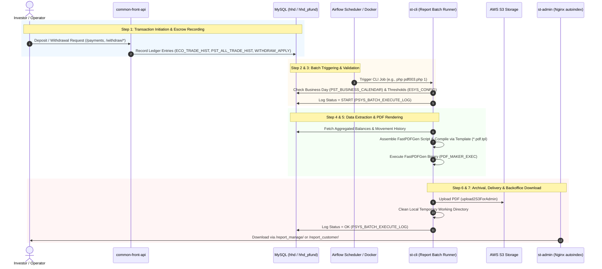

# Quy trình tạo Ledger OwnersBook+ và các API liên quan (Hướng dẫn kỹ thuật)

## Mục lục
1. [Giới thiệu: Kiến trúc Dual Ledger (Loại A và Loại B)](#1-introduction-dual-ledger-architecture-type-a-vs-type-b)
2. [Tổng quan Pipeline End-to-End](#2-end-to-end-pipeline-overview)
3. [Loại A — Quy trình tạo Statutory Ledger](#3-type-a--statutory-ledger-creation-flow)
   - [Bước 1: Khởi tạo giao dịch và ghi nhận Escrow (`common-front-api`)](#step-1-transaction-initiation--escrow-recording-common-front-api)
   - [Bước 2: Lên lịch Batch và kích hoạt chạy (`st-cli` / Airflow)](#step-2-batch-scheduling--invocation-trigger-st-cli--airflow)
   - [Bước 3: Validation trước khi chạy và kiểm tra Calendar (`st-cli`)](#step-3-pre-execution-validation--calendar-check-st-cli)
   - [Bước 4: Lấy dữ liệu và xử lý Statutory (`st-cli`)](#step-4-data-retrieval--statutory-processing-st-cli)
   - [Bước 5: Tạo và định dạng PDF/Report (`st-cli`)](#step-5-pdfreport-generation--formatting-st-cli)
   - [Bước 6: Lưu trữ S3, publish thư mục và Cleanup (`st-cli`)](#step-6-s3-archival-directory-publishing--cleanup-st-cli)
   - [Bước 7: Truy cập Backoffice và phân phối điện tử (`st-admin` / `common-front-api`)](#step-7-backoffice-access--electronic-delivery-st-admin--common-front-api)
4. [Phân loại Ledger: RT003 so với RT004 so với RT005](#4-ledger-type-breakdown-rt003-vs-rt004-vs-rt005)
5. [Loại B — Tổng quan Distributed Ledger (GoQuorum)](#5-type-b--distributed-ledger-overview-goquorum)
6. [Bảng tham chiếu API đầy đủ](#6-comprehensive-api-reference-table)
7. [Điểm cần lưu ý và các lỗi thường gặp](#7-points-to-note--common-pitfalls)

---

## 1. Giới thiệu: Kiến trúc Dual Ledger (Loại A và Loại B)

Trên nền tảng OwnersBook+, thuật ngữ **"ledger"** chỉ hai khái niệm kiến trúc hoàn toàn tách biệt, phục vụ các mục đích khác nhau và hoạt động qua các technical workflow hoàn toàn độc lập:

```mermaid
graph TD
    subgraph TypeA["Type A: Statutory Accounting Ledger (Primary Focus)"]
        A1["Front Transactions<br/>(common-front-api)"] --> A2[("Relational DB<br/>MySQL hhd/hhd_pfund")]
        A2 --> A3["Scheduled Batch Engine<br/>(st-cli / Airflow)"]
        A3 --> A4["PDF/CSV Reports<br/>(FastPDFGen Engine)"]
        A4 --> A5["Storage & Delivery<br/>(AWS S3 / st-admin / Electronic Delivery)"]
    end

    subgraph TypeB["Type B: Distributed Ledger (Secondary Component)"]
        B1["Smart Contract Execution<br/>(ERC-1400 Security Tokens)"] --> B2[("GoQuorum Network<br/>Private EVM Consensus")]
        B2 --> B3["Sync Indexer Worker"]
        B3 --> B4[("Explorer Cache DB<br/>bc_* tables")]
        B4 --> B5["Web Explorer Interface<br/>(st-bc-explorer)"]
    end
```



### Các nguyên tắc Tách biệt Nghiêm ngặt
1. **Loại A — Statutory Ledger (法廷帳簿)**:
   - **Bản chất**: Các bản ghi kế toán và quy định định kỳ, được tạo thành tài liệu PDF tĩnh theo các quy định của Luật Công cụ Tài chính và Giao dịch Nhật Bản.
   - **Vòng đời**: Chạy batch theo schedule, offline (`st-cli`), đọc các entry giao dịch từ MySQL (`ECO_TRADE_HIST`, `PST_ALL_TRADE_HIST`, `PST_BUY_TRADE_HIST`), tạo các PDF report bất biến, lưu trữ trên AWS S3 và publish cho Backoffice admin.
2. **Loại B — Distributed Ledger (分散型台帳)**:
   - **Bản chất**: Distributed ledger on-chain được xây dựng trên private blockchain network GoQuorum tương thích với Ethereum.
   - **Vòng đời**: Settlement giao dịch peer-to-peer theo thời gian thực, triển khai ERC-1400 Security Token Standard (mint token partition, transfer và burn). Các state change được index vào cached database table (`bc_blocks`, `bc_tokens`, `block_tnx`) và được query qua `st-bc-explorer`.
3. **Không Trộn lẫn Trực tiếp**:
   - Loại A và Loại B duy trì data store và consensus boundary riêng biệt. Việc tạo statutory ledger PDF (Loại A) không trigger blockchain transaction và cũng không đọc trực tiếp từ GoQuorum RPC node.

---

## 2. Tổng quan Pipeline End-to-End



---

## 3. Loại A — Quy trình tạo Statutory Ledger

Vòng đời hoàn chỉnh gồm **7 bước liên tiếp**:

### Bước 1: Khởi tạo giao dịch và ghi nhận Escrow (`common-front-api`)
- **Hành động**: Customer khởi tạo việc nạp tiền, order mua/bán security token hoặc yêu cầu rút tiền mặt thông qua các BFF API endpoint.
- **File và xử lý chính**:
  - [WithdrawController.php:32-37](/common-front-api/app/Http/Controllers/WithdrawController.php#L32-L37) (`getWithdraw`): Kiểm tra thông tin thiết lập ngân hàng của customer và số dư khả dụng.
  - [WithdrawController.php:43-85](/common-front-api/app/Http/Controllers/WithdrawController.php#L43-L85) (`confirmWithdraw`): Validation số tiền request so với funds và limits khả dụng; phát hành token có thời hạn ngắn (`WITHDRAW_EXECUTE_FLG`).
  - [WithdrawController.php:91-112](/common-front-api/app/Http/Controllers/WithdrawController.php#L91-L112) (`executeWithdraw`): Hoàn tất withdrawal application.
  - [WithdrawService.php](/common-front-api/app/Services/WithdrawService.php): Lock số dư cash ledger và tạo pending transfer record trong `WITHDRAW_APPLY`.
  - [UserPaymentController.php:26-41](/common-front-api/app/Http/Controllers/UserPaymentController.php#L26-L41) (`PayinBankAccount`): Trả về dedicated escrow virtual bank account cho wire transfer của investor.
  - [UserPaymentController.php:98-120](/common-front-api/app/Http/Controllers/UserPaymentController.php#L98-L120) (`PaymentContractCallback`): Nhận webhook notification từ banking gateway (NTT Data / Anserbiz) để ghi có fiat escrow balance.
- **Database Table được Populate**:
  - `ECO_TRADE_HIST`: Cash movement journal nền tảng (deposit, withdrawal, commission, tax, trade settlement).
  - `PST_ALL_TRADE_HIST`: Master settlement log liên kết buy/sell trade number với trade ID.
  - `PST_BUY_TRADE_HIST`: Chi tiết execution cấp fund (unit, unit price, contract timestamp).

### Bước 2: Lên lịch Batch và kích hoạt chạy (`st-cli` / Airflow)
- **Hành động**: Batch chạy định kỳ (hàng đêm hoặc hàng tháng), được schedule qua Apache Airflow 2 Celery queue `daybatch-fund` hoặc container runner script.
- **File và xử lý chính**:
  - [local-docker/bulk_exec_batch.sh:694-729](/local-docker/bulk_exec_batch.sh#L694-L729): Điều phối việc thực thi container command bên trong `st-airflow2-batch-daybatch-pfund`:
    ```bash
    # RT003 Customer Portion
    php /www/st-cli/Report/run/pdf003.php 1
    # RT003 Operator/General Partner Portion
    php /www/st-cli/Report/run/pdf003.php 2
    # RT005 Daily Trading Ledger
    php /www/st-cli/Report/run/pdf005.php 1
    # RT005 Monthly Trading Ledger
    php /www/st-cli/Report/run/pdf005.php 2
    ```
  - [st-cli/Report/run/pdfstart.php:9-35](/st-cli/Report/run/pdfstart.php#L9-L35): CLI pipeline runner thực thi tuần tự `pdf001.php` đến `pdf014.php`.
  - [st-cli/Cli/crontab_setting:31-45](/st-cli/Cli/crontab_setting#L31-L45): Lịch cron tham chiếu mặc định (chạy hàng ngày lúc 19:00 từ thứ Hai đến thứ Sáu).
- **CLI Argument**:
  - `$argv[1]` (`processType` / `p_process_kbn`):
    - Trong RT003: `1` = 顧客分 (Customer portion), `2` = 営業者分 (Operator/GP portion).
    - Trong RT005: `1` = 日次 (Daily), `2` = 月次 (Monthly).
  - `$argv[2]` (`p_base_date`): Ngày tham chiếu cơ sở tùy chọn (`YYYY-MM-DD`). Nếu bỏ qua, giá trị được lấy từ `PST_BASE_DATE`.

### Bước 3: Validation trước khi chạy và kiểm tra Calendar (`st-cli`)
- **Hành động**: Kiểm tra điều kiện được phép thực thi trước khi chạy query.
- **File và xử lý chính**:
  - [pdf003.php:20-48](/st-cli/Report/run/pdf003.php#L20-L48) & [pdf005.php:20-49](/st-cli/Report/run/pdf005.php#L20-L49):
    1. Parse và validation argument (`get_arguments()`).
    2. Lấy base date mục tiêu: `['CURRENT_D' => $currentD, 'PREV_D' => $prevD] = $model->getBaseD($p_base_date);`.
    3. Ghi state `START` vào database: `$model->saveLogData($batch_cd, BATCH_NAME, 'START');`.
    4. Validation business calendar: Gọi `$model->getCalendarCnt()` ([Pdf003Model.php:15-26](/st-cli/Report/App/Models/Pdf003Model.php#L15-L26)). Nếu count bằng 0 (`MONTH_END_TYPE NOT IN (1,2,3,4)`), bỏ qua việc thực thi với log `OK(CLOSING)` và trả về exit code 0.
    5. Kiểm tra monthly constraint (trong RT005): Nếu ở chế độ monthly (`$p_process_kbn == 2`), kiểm tra `$currentD` có phải ngày cuối tháng theo lịch thông qua `$model->checkDateByType($currentD, 1)` hay không. Nếu không phải, kết thúc sớm với `OK(CLOSING)`.
    6. Lấy system threshold: Load pagination threshold từ `ESYS_CONFIG` qua `ConfigModel::get()` ([pdf003.php:51-59](/st-cli/Report/run/pdf003.php#L51-L59)).

### Bước 4: Lấy dữ liệu và xử lý Statutory (`st-cli`)
- **Hành động**: Query các relational table để trích xuất balance, trade movement, tax và commission.
- **File và xử lý chính**:
  - **RT003 ([Pdf003Model.php:53-160](/st-cli/Report/App/Models/Pdf003Model.php#L53-L160))**:
    - Chia nhỏ active customer qua `getEcoUsers($processType, $security_account_number_last, $maxClientCount)`.
    - Lấy opening cash balance qua `getLastMonthCashBalance()` và closing balance qua `getThisMonthCaseBalance()`.
    - Trích xuất transaction movement chi tiết qua `getData()`, join `ECO_TRADE_HIST`, `PST_ALL_TRADE_HIST`, `PST_FUND` và `ECO_USER`.
    - Với operator portion (`processType == 2`), đảo debit/credit flag (`BUYSELL == 2 ? 1 : 2`) và map fund redemption subtotal (`SUMMARY_TYPE == 306`).
  - **RT004 ([Pdf004Model.php:52-100](/st-cli/Report/App/Models/Pdf004Model.php#L52-L100))**:
    - Query active account holder qua `getUserArray()` (`ECO_USER.USER_TYPE = '1'`).
    - Lấy product unit balance qua `getLastMonthFundBalance()` và `getThisMonthFundBalance()`.
    - Group execution history theo `CLIENT_ID` và `FUND_CD` từ `PST_BUY_TRADE_HIST`.
  - **RT005 ([Pdf005Model.php:18-100](/st-cli/Report/App/Models/Pdf005Model.php#L18-L100))**:
    - Query active fund record (`getFundRefundResults()`) và base price (`getBasePrice()`).
    - Thu thập trade contract qua `getBuyTradeHistList()`, join `PST_BUY_TRADE_HIST` với account transfer linkage trong `PST_TRANSFER_BETWEEN_ACCOUNTS`.
    - Tích hợp dividend distribution (`getDividendListWithExtraDividendAmount()`) và capital redemption (`getRefundList()`).

### Bước 5: Tạo và định dạng PDF/Report (`st-cli`)
- **Hành động**: Render các trang đã định dạng qua proprietary C-based FastPDFGen rendering engine.
- **File và xử lý chính**:
  - Mapping coordinate trực tiếp vào template:
    - RT003: [pdf003.php:392-507](/st-cli/Report/run/pdf003.php#L392-L507) ghi các text command (`setCryptMode`, `startPage RT003.pdf.tpl`, `drawBox`, `drawLine`, `drawStr`) vào control script tạm (`.txt`).
    - RT004: [pdf004.php:66-180](/st-cli/Report/run/pdf004.php#L66-L180) map line bằng `RT004.pdf.tpl` với 30 row/page.
    - RT005: [pdf005.php:470-624](/st-cli/Report/run/pdf005.php#L470-L624) compile trading movement bằng `RT005.pdf.tpl` với 30 row/page.
  - PDF Compilation Command:
    - [pdf003.php:620](/st-cli/Report/run/pdf003.php#L620): `exec(PDF_MAKER_EXEC . ' ' . $pdfExeFile . ' ' . $local_file_path_error);`
    - Kiểm tra output file của error log: nếu error size > 0 hoặc thiếu file `.pdf`, đánh dấu execution là failure.
  - Pagination và Chunking:
    - Nếu customer count đạt `$maxClientCount` (mặc định: 1.000) hoặc tổng page vượt `$maxPagePerPdf`, file được tách thành các part theo thứ tự (`_001.pdf`, `_002.pdf`, v.v.).

### Bước 6: Lưu trữ S3, publish thư mục và Cleanup (`st-cli`)
- **Hành động**: Di chuyển hoặc upload các PDF file kết quả, archive lên AWS S3, dọn scratch file local và cập nhật execution log.
- **File và xử lý chính**:
  - [pdf.php:819-835](/st-cli/Report/run/pdf.php#L819-L835) (`upload2S3ForAdmin`):
    - Kết nối S3 client: `\Brave::getS3('company')`.
    - Target Key: `CDConfig::get('aws.s3_pdf_path') . $clientBase . '/' . $fileName`.
    - Upload file với ACL `authenticated-read`.
  - Vị trí Local Directory:
    - RT004 chuyển file đến `APP_ROOT . 'manage/' . date('ymd') . '/'` ([pdf004.php:327-331](/st-cli/Report/run/pdf004.php#L327-L331)).
  - Cleanup Directory:
    - [pdf003.php:639](/st-cli/Report/run/pdf003.php#L639) & [pdf005.php:657](/st-cli/Report/run/pdf005.php#L657): Gọi `remove_directory($local_output_dir)` để xóa temporary text command và unencrypted scratch PDF.
  - Audit logging:
    - Gọi `$model->saveLogData($batch_cd, BATCH_NAME, 'OK')` hoặc `'NG'`.

### Bước 7: Truy cập Backoffice và phân phối điện tử (`st-admin` / `common-front-api`)
- **Hành động**: Administrator và investor kiểm tra, download các file đã tạo.
- **File và xử lý chính**:
  - Truy cập Backoffice:
    - [local-docker/etc/local/nginx/pfund-admin.conf:31-43](/local-docker/etc/local/nginx/pfund-admin.conf#L31-L43): Nginx map trực tiếp web route tới batch output folder với directory indexing được bật:
      - `/report_manage/` &rarr; `/www/st-cli/Report/manage/`
      - `/report_customer/` &rarr; `/www/st-cli/Report/customer/`
  - Phân phối điện tử cho Customer:
    - [ElectronicController.php:24-39](/common-front-api/app/Http/Controllers/ElectronicController.php#L24-L39) (`electronicDelivery`): Trả về statutory PDF và transaction report theo customer có sẵn để download.
    - [ElectronicController.php:41-61](/common-front-api/app/Http/Controllers/ElectronicController.php#L41-L61) (`electronicDeliveryConfirm`): Validation và lưu customer acknowledgment cho electronic document.

---

## 4. Phân loại Ledger: RT003 so với RT004 so với RT005

| Thuộc tính | RT003: Cash Customer Ledger (金銭顧客勘定元帳) | RT004: Merchandise Customer Ledger (商品顧客勘定元帳) | RT005: Trading Product Ledger (トレーディング商品勘定元帳) |
| :--- | :--- | :--- | :--- |
| **Batch Code / ID** | `RT003` / `003` | `RT004` / `004` | `RT005` / `005` |
| **Japanese Title** | 顧客勘定元帳 (金銭) | 商品顧客勘定元帳 (持分・口数) | トレーディング商品勘定元帳 (商品別) |
| **Core Batch Script** | [pdf003.php](/st-cli/Report/run/pdf003.php) | [pdf004.php](/st-cli/Report/run/pdf004.php) | [pdf005.php](/st-cli/Report/run/pdf005.php) |
| **Model Class** | [Pdf003Model.php](/st-cli/Report/App/Models/Pdf003Model.php) | [Pdf004Model.php](/st-cli/Report/App/Models/Pdf004Model.php) | [Pdf005Model.php](/st-cli/Report/App/Models/Pdf005Model.php) |
| **Execution Subject / Grain**| Aggregate theo Customer (`ECO_USER`) | Group theo Customer và Fund (`CLIENT_ID`, `FUND_CD`) | Aggregate theo Fund (`PST_FUND.FUND_CD`) |
| **Execution Variants (`argv[1]`)** | `1` = 顧客分 (Customer portion), `2` = 営業者分 (Operator/GP portion) | Single flow (tất cả qualified user) | `1` = 日次 (Daily position), `2` = 月次 (Monthly position) |
| **Tracked Quantity Units** | JPY Currency Amount (cash balance, deposit, withdrawal, fee) | Security Token Holding Unit (口数) & Acquisition Value | Aggregate Token Volume, Acquisition Price, Dividend & Redemption |
| **Primary Tables Read** | `ECO_USER`, `ECO_TRADE_HIST`, `PST_ALL_TRADE_HIST`, `PST_FUND` | `ECO_USER`, `PST_BUY_TRADE_HIST`, `PST_ALL_TRADE_HIST`, `PST_FUND`, `PST_CLIENT` | `PST_FUND`, `PST_BUY_TRADE_HIST`, `PST_TRANSFER_BETWEEN_ACCOUNTS`, `PST_DIVIDEND_HIST` |
| **Output Naming Pattern** | Customer: `YYYY-MM-DD_顧客勘定元帳_001.pdf`<br/>GP: `YYYY-MM-DD_顧客勘定元帳（営業者分）_{ACCOUNT}_001.pdf` | `YYYY-MM-DD_商品顧客勘定元帳.pdf` (local: `TRADE_REPORT_YYYYMMDD.pdf`) | Daily: `YYYY-MM-DD_トレーディング商品勘定元帳.pdf`<br/>Monthly: `YYYY-MM-DD_トレーディング商品勘定元帳（月次）.pdf` |
| **Pagination & Chunking** | Tách theo `$maxPagePerPdf` và `$maxClientCount` | 30 line mỗi page (`$perPage = 30`), một consolidated document | 30 line mỗi page (`$pageSize = 30`), group theo fund |

---

## 5. Loại B — Tổng quan Distributed Ledger (GoQuorum)

Loại B đại diện cho distributed state được duy trì trên private, permissioned **GoQuorum** network.

### Luồng Kiến trúc
1. **On-Chain Transaction**:
   - Smart contract triển khai standard **ERC-1400** (kết hợp tính fungibility của ERC-20 với operator của ERC-777 và security transfer bị giới hạn theo partition).
   - Các token function cốt lõi: `issueByPartition` (mint trong primary offering), `transferByPartition` (secondary transfer) và `redeemByPartition` (redeem token khi fund maturity).
2. **Lớp Synchronization và Indexing**:
   - Off-chain sync worker query GoQuorum RPC interface (HTTP/WS port `22000`) để lấy mined block và event log (`TransferByPartition`, `IssuedByPartition`, `RedeemedByPartition`).
   - Mined transaction và balance được ghi vào các caching table: `bc_blocks`, `bc_tokens`, `block_tnx`, `wallet_balance` và `bc_timeseries_daily`.
3. **Màn hình Query và Viewer (`st-bc-explorer`)**:
   - Application là một Laravel web portal được cấu hình trong [st-bc-explorer/routes/web.php](/st-bc-explorer/routes/web.php):
     - `/home`: Metric cấp cao (tổng transaction, block gần đây, tổng quan token đã deploy).
     - `/token/{token_contract_address}/erc1400_tnx_list`: Lịch sử token transaction.
     - `/token/{token_contract_address}/owner_list`: Phân tích token holder theo partition.
     - `/block/{block_number}/tnx_list`: Chi tiết transaction của block.
     - `/wallet/{wallet_address}/...`: Token balance của portfolio wallet.
     - `/tnx/{tnx_hash}`: Kiểm tra raw cryptographic receipt (gas đã dùng, sender, receiver, block hash).
4. **Mối quan hệ với Loại A**:
   - **Loại A** là legal, regulatory book of record cho cơ quan Nhật Bản (bằng fiat currency và tên beneficial owner có giá trị pháp lý).
   - **Loại B** là technical record về các token state transition trên GoQuorum.
   - Các reconciliation batch nằm ngoài phạm vi tạo ledger (ví dụ `Bt020`) so sánh ledger balance off-chain với token distribution của wallet on-chain để đảm bảo tương đương 100%.

---

## 6. Bảng tham chiếu API đầy đủ

Bảng dưới đây ghi lại tất cả endpoint trực tiếp tương tác với quy trình tạo ledger, data ingestion, download từ backoffice và workflow blockchain explorer:

| Method | Endpoint | Repo | Mục đích | Request chính | Response chính | Auth | Mã lỗi chính |
| :--- | :--- | :--- | :--- | :--- | :--- | :--- | :--- |
| `GET` | `/withdraw` | `common-front-api` | Lấy thông tin account của withdrawal applicant và cash balance hiện tại | None (Header: Bearer Token) | `JSON: { WITHDRAW_ACCOUNT_INF, CASH_BALANCE }` | Token (`authorized-front-api`) | `E103-0001` (Unauthorized) |
| `POST` | `/withdraw/confirm` | `common-front-api` | Validation withdrawal request và tính transfer commission | `JSON: { WITHDRAW_AMOUNT, COMMISSION, PASSWORD, UUID, PF }` | `JSON: { WITHDRAW_ACNT_INF, TO_DEVICE, SECRET_TOKEN }` | Token (`authorized-front-api`) | `E103-0504` (Missing required), `E103-0002` (Password invalid) |
| `POST` | `/withdraw/execute` | `common-front-api` | Xác nhận và schedule cash withdrawal application | `JSON: { WITHDRAW_AMOUNT, COMMISSION, PASSWORD, WITHDRAW_SCHEDDULED_DATE, DEVICE_VERIFY_CODE }` | `JSON: { status: "success" }` | Token (`authorized-front-api`) | `E103-0504` (Param missing), `E103-0003` (Balance insufficient) |
| `POST` | `/withdraw/cancel` | `common-front-api` | Hủy pending withdrawal request | `JSON: { SEQ_NO, PASSWORD }` | `JSON: { status: "success" }` | Token (`authorized-front-api`) | `E103-0002` (Password invalid) |
| `GET` | `/payment/payin_bank_account` | `common-front-api` | Lấy dedicated virtual bank account để wire deposit tiền mặt | None (Header: Bearer Token) | `JSON: { PERFECT_FACIL_CD, PERFECT_ACNT_NUM, KANA_NAME }` | Token (`authorized-front-api`) | `E103-0001` (Unauthorized) |
| `GET` | `/payments` | `common-front-api` | Lấy danh sách linked payment institution được hỗ trợ | None | `JSON: [ { PAYMENT_ID, PAYMENT_NAME, AVAILABLE } ]` | Token (`authorized-front-api`) | `undetermined` |
| `GET` | `/payment/{PAYMENT_ID}` | `common-front-api` | Lấy payment institution connection config data | Path: `PAYMENT_ID` | `JSON: { CONTRACT_DATA }` | Token (`authorized-front-api`) | `undetermined` |
| `POST` | `/payment/nttd/bind` | `common-front-api` | NTT Data account transfer callback để ghi có investor cash escrow | `JSON: { CIF_NO, CUSTOMER_ID, RESULT_CODE }` | `JSON: { status: "success" }` | Signature / IP Whitelist | `undetermined` |
| `GET` | `/payment/activities` | `common-front-api` | Lấy user deposit và cash activity log | None | `JSON: [ { ACTIVITY_TYPE, AMOUNT, DATE } ]` | Token (`authorized-front-api`) | `undetermined` |
| `GET` | `/electronic_delivery` | `common-front-api` | Query electronic delivery report (bao gồm bản sao statutory PDF) | Query: `FROM_DATE, TO_DATE, READ_FLG, CONFIRM_FLG` | `JSON: { LIST: [ { ELE_SEQ_NO, DOCUMENT_NAME, S3_URL } ] }` | Token (`authorized-front-api`) | `E103-0001` (Unauthorized) |
| `POST` | `/electronic_delivery/confirm` | `common-front-api` | Ghi nhận consent của investor cho electronic delivery | `JSON: { DOCUMENT_SEQ_NO, DOCUMENT_VERSION }` | `JSON: { status: "success" }` | Token (`authorized-front-api`) | `E103-0504`, `E103-0278` |
| `POST` | `/electronic_delivery/read` | `common-front-api` | Đánh dấu electronic statutory document là đã đọc | `JSON: { ELE_SEQ_NO, DOCUMENT_SEQ_NO, DOCUMENT_VERSION }` | `JSON: { DOCUMENT_INFO, S3_PATH }` | Token (`authorized-front-api`) | `E103-0539` |
| `GET` | `/electronic_delivery/required_electronic` | `common-front-api` | Kiểm tra có statutory disclosure chưa confirm nào hay không | None | `JSON: { REQUIRED_FLG, DOCUMENTS }` | Token (`authorized-front-api`) | `undetermined` |
| `GET` | `/report_manage/` | `st-admin` | Liệt kê directory và download statutory ledger nội bộ (RT004, RT005) | Query: directory traversal | `HTML directory list / Binary PDF/CSV stream` | Basic Auth / Session (`pfund-admin.conf`) | `403 Forbidden`, `404 Not Found` |
| `GET` | `/report_customer/` | `st-admin` | Liệt kê directory và download statutory report hướng tới customer (RT003) | Query: directory traversal | `HTML directory list / Binary PDF/CSV stream` | Basic Auth / Session (`pfund-admin.conf`) | `403 Forbidden`, `404 Not Found` |
| `GET` | `/home` | `st-bc-explorer` | Tổng quan blockchain explorer dashboard | None | `HTML Blade View (Total blocks, token count, tx stats)` | Session (`checklogin`) | `undetermined` |
| `GET` | `/token/{address}/erc1400_tnx_list` | `st-bc-explorer` | Liệt kê mọi ERC-1400 security token operation của contract | Path: `token_contract_address` | `HTML Blade View (Token partitions, issuance, transfers)` | Session (`checklogin`) | `undetermined` |
| `GET` | `/token/{address}/owner_list` | `st-bc-explorer` | Liệt kê mọi wallet address đang giữ token unit | Path: `token_contract_address` | `HTML Blade View (Holders, token balances)` | Session (`checklogin`) | `undetermined` |
| `GET` | `/block/{block_number}/tnx_list` | `st-bc-explorer` | Query block summary và các transaction bên trong | Path: `block_number` | `HTML Blade View (Block hash, timestamp, miner, txs)` | Session (`checklogin`) | `undetermined` |
| `GET` | `/wallet/{wallet_address}/...` | `st-bc-explorer` | Query wallet holding và transaction history | Path: `wallet_address`, optional `token_contract_address` | `HTML Blade View (Balances, ERC-1400 history)` | Session (`checklogin`) | `undetermined` |
| `GET` | `/tnx/{tnx_hash}` | `st-bc-explorer` | Kiểm tra raw cryptographic transaction receipt | Path: `tnx_hash` | `HTML Blade View (Gas, payload, partition data)` | Session (`checklogin`) | `undetermined` |
| `POST` | `/search` | `st-bc-explorer` | Global blockchain search trên block, transaction và address | `Form POST: { keyword }` | `302 Redirect to entity detail page` | Session (`checklogin`) | `undetermined` |

---

## 7. Điểm cần lưu ý và các lỗi thường gặp

1. **Ngày không làm việc sẽ Bỏ qua yên lặng (Return Code 0)**:
   - Trong `pdf003.php`, `pdf004.php` và `pdf005.php`, nếu `PST_BUSINESS_CALENDAR` cho biết đó là ngày nghỉ của ngân hàng/sàn giao dịch (`$restDate == 0`), script ghi log `OK(CLOSING)` và thoát ngay với code `0`. Exit code thành công không có nghĩa là PDF file đã được tạo.
2. **Ledger hàng tháng bị Bỏ qua vào ngày không phải cuối tháng**:
   - Khi chạy RT005 với argument `2` (Monthly), nếu execution reference date không phải chính xác ngày cuối tháng theo lịch, batch kết thúc với `OK(CLOSING)` mà không ghi report.
3. **Phụ thuộc vào Threshold Config (`ESYS_CONFIG`)**:
   - `pdf003.php` sẽ fail ngay với uncaught exception (`帳票出力制御の顧客数或はページ数の閾値がDBに定義されていません。`) nếu thiếu `pdf_output_customers_control_threshold_rt003` hoặc `pdf_output_pages_control_threshold_rt003` trong `ESYS_CONFIG`.
4. **Kiến trúc FastPDFGen Binary và File Permission**:
   - FastPDFGen phụ thuộc vào compiled binary độc quyền (`PDF_MAKER_EXEC`). Nếu thiếu quyền ghi directory (`777` bắt buộc cho output directory) hoặc quyền execution bit (`chmod 777 PDF_MAKER_EXEC`) trong Docker worker container, việc tạo PDF sẽ fail yên lặng với file zero-byte.
5. **Cleanup Temporary Directory**:
   - `pdf003.php` và `pdf005.php` xóa local working directory (`remove_directory($local_output_dir)`) sau khi upload lên S3 hoàn tất. Local file chỉ được giữ lại nếu một lỗi chưa được xử lý làm dừng chương trình trước giai đoạn cleanup.
