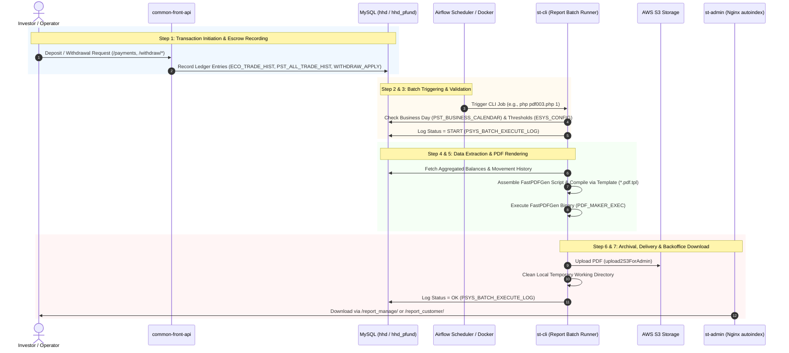

# OwnersBook+ Ledger Creation Flow & Related APIs (Technical Guide)

## Table of Contents
1. [Introduction: Dual Ledger Architecture (Type A vs. Type B)](#1-introduction-dual-ledger-architecture-type-a-vs-type-b)
2. [End-to-End Pipeline Overview](#2-end-to-end-pipeline-overview)
3. [Type A — Statutory Ledger Creation Flow](#3-type-a--statutory-ledger-creation-flow)
   - [Step 1: Transaction Initiation & Escrow Recording (`common-front-api`)](#step-1-transaction-initiation--escrow-recording-common-front-api)
   - [Step 2: Batch Scheduling & Invocation Trigger (`st-cli` / Airflow)](#step-2-batch-scheduling--invocation-trigger-st-cli--airflow)
   - [Step 3: Pre-Execution Validation & Calendar Check (`st-cli`)](#step-3-pre-execution-validation--calendar-check-st-cli)
   - [Step 4: Data Retrieval & Statutory Processing (`st-cli`)](#step-4-data-retrieval--statutory-processing-st-cli)
   - [Step 5: PDF/Report Generation & Formatting (`st-cli`)](#step-5-pdfreport-generation--formatting-st-cli)
   - [Step 6: S3 Archival, Directory Publishing & Cleanup (`st-cli`)](#step-6-s3-archival-directory-publishing--cleanup-st-cli)
   - [Step 7: Backoffice Access & Electronic Delivery (`st-admin` / `common-front-api`)](#step-7-backoffice-access--electronic-delivery-st-admin--common-front-api)
4. [Ledger Type Breakdown: RT003 vs. RT004 vs. RT005](#4-ledger-type-breakdown-rt003-vs-rt004-vs-rt005)
5. [Type B — Distributed Ledger Overview (GoQuorum)](#5-type-b--distributed-ledger-overview-goquorum)
6. [Comprehensive API Reference Table](#6-comprehensive-api-reference-table)
7. [Points to Note & Common Pitfalls](#7-points-to-note--common-pitfalls)

---

## 1. Introduction: Dual Ledger Architecture (Type A vs. Type B)

In the OwnersBook+ platform, the term **"ledger"** refers to two fundamentally separate architectural concepts that serve distinct purposes and operate through completely isolated technical workflows:

```mermaid
graph TD
    subgraph TypeA["Type A: Statutory Accounting Ledger (Primary Focus)"]
        A1["Front Transactions<br/>(common-front-api)"] --> A2[("Relational DB<br/>MySQL hhd/hhd_pfund")]
        A2 --> A3["Scheduled Batch Engine<br/>(st-cli / Airflow)"]
        A3 --> A4["PDF/CSV Reports<br/>(FastPDFGen Engine)"]
        A4 --> A5["Storage & Delivery<br/>(AWS S3 / st-admin / Electronic Delivery)"]
    end

    subgraph TypeB["Type B: Distributed Ledger (Secondary Component)"]
        B1["Smart Contract Execution<br/>(ERC-1400 Security Tokens)"] --> B2[("GoQuorum Network<br/>Private EVM Consensus")]
        B2 --> B3["Sync Indexer Worker"]
        B3 --> B4[("Explorer Cache DB<br/>bc_* tables")]
        B4 --> B5["Web Explorer Interface<br/>(st-bc-explorer)"]
    end
```



### Strict Separation Principles
1. **Type A — Statutory Ledger (法廷帳簿)**:
   - **Nature**: Periodic accounting and regulatory records generated as static PDF documents according to Japanese Financial Instruments and Exchange Act regulations.
   - **Lifecycle**: Offline, scheduled batch execution (`st-cli`), reading transactional entries from MySQL (`ECO_TRADE_HIST`, `PST_ALL_TRADE_HIST`, `PST_BUY_TRADE_HIST`), producing immutable PDF reports archived to AWS S3 and published to Backoffice admins.
2. **Type B — Distributed Ledger (分散型台帳)**:
   - **Nature**: An on-chain distributed ledger built on an Ethereum-compatible GoQuorum private blockchain network.
   - **Lifecycle**: Real-time peer-to-peer transaction settlement implementing the ERC-1400 Security Token Standard (minting token partitions, transfers, and burning). State changes are indexed into cached database tables (`bc_blocks`, `bc_tokens`, `block_tnx`) and queried via `st-bc-explorer`.
3. **No Direct Intermingling**:
   - Type A and Type B maintain distinct data stores and consensus boundaries. The generation of a PDF statutory ledger (Type A) does not trigger blockchain transactions, nor does it read directly from the GoQuorum RPC node.

---

## 2. End-to-End Pipeline Overview



---

## 3. Type A — Statutory Ledger Creation Flow

The complete lifecycle consists of **7 sequential steps**:

### Step 1: Transaction Initiation & Escrow Recording (`common-front-api`)
- **Action**: Customers initiate monetary deposits, buy/sell security token orders, or request cash withdrawals via BFF API endpoints.
- **Key Files & Processing**:
  - [WithdrawController.php:32-37](common-front-api/app/Http/Controllers/WithdrawController.php#L32-L37) (`getWithdraw`): Inspects customer bank setup and available balance.
  - [WithdrawController.php:43-85](common-front-api/app/Http/Controllers/WithdrawController.php#L43-L85) (`confirmWithdraw`): Validates requested amount against available funds and limits; issues a short-lived token (`WITHDRAW_EXECUTE_FLG`).
  - [WithdrawController.php:91-112](common-front-api/app/Http/Controllers/WithdrawController.php#L91-L112) (`executeWithdraw`): Finalizes the withdrawal application.
  - [WithdrawService.php](common-front-api/app/Services/WithdrawService.php): Locks cash ledger balances and creates pending transfer records in `WITHDRAW_APPLY`.
  - [UserPaymentController.php:26-41](common-front-api/app/Http/Controllers/UserPaymentController.php#L26-L41) (`PayinBankAccount`): Returns dedicated escrow virtual bank accounts for investor wire transfers.
  - [UserPaymentController.php:98-120](common-front-api/app/Http/Controllers/UserPaymentController.php#L98-L120) (`PaymentContractCallback`): Receives webhook notifications from banking gateway (NTT Data / Anserbiz) to credit fiat escrow balances.
- **Database Tables Populated**:
  - `ECO_TRADE_HIST`: Fundamental cash movement journal (deposit, withdrawal, commission, tax, trade settlement).
  - `PST_ALL_TRADE_HIST`: Master settlement log linking buy/sell trade numbers with trade IDs.
  - `PST_BUY_TRADE_HIST`: Fund-level execution details (units, unit price, contract timestamp).

### Step 2: Batch Scheduling & Invocation Trigger (`st-cli` / Airflow)
- **Action**: Batches run periodically (nightly or monthly) scheduled via Apache Airflow 2 Celery queue `daybatch-fund` or container runner scripts.
- **Key Files & Processing**:
  - [local-docker/bulk_exec_batch.sh:694-729](local-docker/bulk_exec_batch.sh#L694-L729): Orchestrates container command execution within `st-airflow2-batch-daybatch-pfund`:
    ```bash
    # RT003 Customer Portion
    php /www/st-cli/Report/run/pdf003.php 1
    # RT003 Operator/General Partner Portion
    php /www/st-cli/Report/run/pdf003.php 2
    # RT005 Daily Trading Ledger
    php /www/st-cli/Report/run/pdf005.php 1
    # RT005 Monthly Trading Ledger
    php /www/st-cli/Report/run/pdf005.php 2
    ```
  - [st-cli/Report/run/pdfstart.php:9-35](st-cli/Report/run/pdfstart.php#L9-L35): CLI pipeline runner executing sequentially `pdf001.php` through `pdf014.php`.
  - [st-cli/Cli/crontab_setting:31-45](st-cli/Cli/crontab_setting#L31-L45): Default cron reference timetable (executing daily at 19:00 Mon–Fri).
- **CLI Arguments**:
  - `$argv[1]` (`processType` / `p_process_kbn`):
    - In RT003: `1` = 顧客分 (Customer portion), `2` = 営業者分 (Operator/GP portion).
    - In RT005: `1` = 日次 (Daily), `2` = 月次 (Monthly).
  - `$argv[2]` (`p_base_date`): Optional base reference date (`YYYY-MM-DD`). If omitted, extracted from `PST_BASE_DATE`.

### Step 3: Pre-Execution Validation & Calendar Check (`st-cli`)
- **Action**: Verifies execution eligibility before running queries.
- **Key Files & Processing**:
  - [pdf003.php:20-48](st-cli/Report/run/pdf003.php#L20-L48) & [pdf005.php:20-49](st-cli/Report/run/pdf005.php#L20-L49):
    1. Parse and validate arguments (`get_arguments()`).
    2. Retrieve target base date: `['CURRENT_D' => $currentD, 'PREV_D' => $prevD] = $model->getBaseD($p_base_date);`.
    3. Log `START` state to database: `$model->saveLogData($batch_cd, BATCH_NAME, 'START');`.
    4. Business calendar validation: Calls `$model->getCalendarCnt()` ([Pdf003Model.php:15-26](st-cli/Report/App/Models/Pdf003Model.php#L15-L26)). If count is 0 (`MONTH_END_TYPE NOT IN (1,2,3,4)`), skips execution with log `OK(CLOSING)` and returns exit code 0.
    5. Monthly constraint check (in RT005): If monthly mode (`$p_process_kbn == 2`), checks whether `$currentD` is the last calendar day of the month via `$model->checkDateByType($currentD, 1)`. If not, exits early with `OK(CLOSING)`.
    6. System threshold retrieval: Loads pagination thresholds from `ESYS_CONFIG` via `ConfigModel::get()` ([pdf003.php:51-59](st-cli/Report/run/pdf003.php#L51-L59)).

### Step 4: Data Retrieval & Statutory Processing (`st-cli`)
- **Action**: Queries relational tables to extract balances, trade movements, tax, and commissions.
- **Key Files & Processing**:
  - **RT003 ([Pdf003Model.php:53-160](st-cli/Report/App/Models/Pdf003Model.php#L53-L160))**:
    - Chunks active customers via `getEcoUsers($processType, $security_account_number_last, $maxClientCount)`.
    - Retrieves opening cash balances via `getLastMonthCashBalance()` and closing balances via `getThisMonthCaseBalance()`.
    - Extracts detailed transaction movements via `getData()`, joining `ECO_TRADE_HIST`, `PST_ALL_TRADE_HIST`, `PST_FUND`, and `ECO_USER`.
    - For operator portion (`processType == 2`), inverts debit/credit flags (`BUYSELL == 2 ? 1 : 2`) and maps fund redemption subtotals (`SUMMARY_TYPE == 306`).
  - **RT004 ([Pdf004Model.php:52-100](st-cli/Report/App/Models/Pdf004Model.php#L52-L100))**:
    - Queries active account holders via `getUserArray()` (`ECO_USER.USER_TYPE = '1'`).
    - Retrieves product unit balances via `getLastMonthFundBalance()` and `getThisMonthFundBalance()`.
    - Groups execution history by `CLIENT_ID` and `FUND_CD` from `PST_BUY_TRADE_HIST`.
  - **RT005 ([Pdf005Model.php:18-100](st-cli/Report/App/Models/Pdf005Model.php#L18-L100))**:
    - Queries active fund records (`getFundRefundResults()`) and base prices (`getBasePrice()`).
    - Gathers trade contracts via `getBuyTradeHistList()`, joining `PST_BUY_TRADE_HIST` with account transfer linkages in `PST_TRANSFER_BETWEEN_ACCOUNTS`.
    - Integrates dividend distributions (`getDividendListWithExtraDividendAmount()`) and capital redemptions (`getRefundList()`).

### Step 5: PDF/Report Generation & Formatting (`st-cli`)
- **Action**: Renders formatted pages through the proprietary C-based FastPDFGen rendering engine.
- **Key Files & Processing**:
  - Direct template coordinate mapping:
    - RT003: [pdf003.php:392-507](st-cli/Report/run/pdf003.php#L392-L507) writes text commands (`setCryptMode`, `startPage RT003.pdf.tpl`, `drawBox`, `drawLine`, `drawStr`) into a temporary control script (`.txt`).
    - RT004: [pdf004.php:66-180](st-cli/Report/run/pdf004.php#L66-L180) maps lines using `RT004.pdf.tpl` at 30 rows/page.
    - RT005: [pdf005.php:470-624](st-cli/Report/run/pdf005.php#L470-L624) compiles trading movements using `RT005.pdf.tpl` at 30 rows/page.
  - PDF Compilation Command:
    - [pdf003.php:620](st-cli/Report/run/pdf003.php#L620): `exec(PDF_MAKER_EXEC . ' ' . $pdfExeFile . ' ' . $local_file_path_error);`
    - Checks error log output file: if error size > 0 or `.pdf` file is missing, marks execution as failure.
  - Pagination & Chunking:
    - If customer count reaches `$maxClientCount` (default: 1,000) or total pages exceed `$maxPagePerPdf`, the file splits into sequenced parts (`_001.pdf`, `_002.pdf`, etc.).

### Step 6: S3 Archival, Directory Publishing & Cleanup (`st-cli`)
- **Action**: Moves or uploads the resulting PDF files, archives to AWS S3, cleans local scratch files, and updates execution logs.
- **Key Files & Processing**:
  - [pdf.php:819-835](st-cli/Report/run/pdf.php#L819-L835) (`upload2S3ForAdmin`):
    - Connects to S3 client: `\Brave::getS3('company')`.
    - Target Key: `CDConfig::get('aws.s3_pdf_path') . $clientBase . '/' . $fileName`.
    - Uploads file with ACL `authenticated-read`.
  - Local Directory Placement:
    - RT004 moves file to `APP_ROOT . 'manage/' . date('ymd') . '/'` ([pdf004.php:327-331](st-cli/Report/run/pdf004.php#L327-L331)).
  - Directory cleanup:
    - [pdf003.php:639](st-cli/Report/run/pdf003.php#L639) & [pdf005.php:657](st-cli/Report/run/pdf005.php#L657): Calls `remove_directory($local_output_dir)` to erase temporary text commands and unencrypted scratch PDFs.
  - Audit logging:
    - Calls `$model->saveLogData($batch_cd, BATCH_NAME, 'OK')` or `'NG'`.

### Step 7: Backoffice Access & Electronic Delivery (`st-admin` / `common-front-api`)
- **Action**: Administrators and investors inspect and download generated files.
- **Key Files & Processing**:
  - Backoffice Access:
    - [local-docker/etc/local/nginx/pfund-admin.conf:31-43](local-docker/etc/local/nginx/pfund-admin.conf#L31-L43): Nginx maps web routes directly to the batch output folders with directory indexing enabled:
      - `/report_manage/` &rarr; `/www/st-cli/Report/manage/`
      - `/report_customer/` &rarr; `/www/st-cli/Report/customer/`
  - Customer Electronic Delivery:
    - [ElectronicController.php:24-39](common-front-api/app/Http/Controllers/ElectronicController.php#L24-L39) (`electronicDelivery`): Returns customer-specific statutory PDFs and transaction reports available for download.
    - [ElectronicController.php:41-61](common-front-api/app/Http/Controllers/ElectronicController.php#L41-L61) (`electronicDeliveryConfirm`): Validates and persists customer electronic document acknowledgment.

---

## 4. Ledger Type Breakdown: RT003 vs. RT004 vs. RT005

| Attribute | RT003: Cash Customer Ledger (金銭顧客勘定元帳) | RT004: Merchandise Customer Ledger (商品顧客勘定元帳) | RT005: Trading Product Ledger (トレーディング商品勘定元帳) |
| :--- | :--- | :--- | :--- |
| **Batch Code / ID** | `RT003` / `003` | `RT004` / `004` | `RT005` / `005` |
| **Japanese Title** | 顧客勘定元帳 (金銭) | 商品顧客勘定元帳 (持分・口数) | トレーディング商品勘定元帳 (商品別) |
| **Core Batch Script** | [pdf003.php](st-cli/Report/run/pdf003.php) | [pdf004.php](st-cli/Report/run/pdf004.php) | [pdf005.php](st-cli/Report/run/pdf005.php) |
| **Model Class** | [Pdf003Model.php](st-cli/Report/App/Models/Pdf003Model.php) | [Pdf004Model.php](st-cli/Report/App/Models/Pdf004Model.php) | [Pdf005Model.php](st-cli/Report/App/Models/Pdf005Model.php) |
| **Execution Subject / Grain**| Aggregated per Customer (`ECO_USER`) | Grouped per Customer and Fund (`CLIENT_ID`, `FUND_CD`) | Aggregated per Fund (`PST_FUND.FUND_CD`) |
| **Execution Variants (`argv[1]`)** | `1` = 顧客分 (Customer)<br/>`2` = 営業者分 (Operator/GP) | Single flow (all qualified users) | `1` = 日次 (Daily position)<br/>`2` = 月次 (Monthly position) |
| **Tracked Quantity Units** | JPY Currency Amounts (Cash balance, deposits, withdrawals, fees) | Security Token Holding Units (口数) & Acquisition Value | Aggregate Token Volume, Acquisition Price, Dividends & Redemptions |
| **Primary Tables Read** | `ECO_USER`, `ECO_TRADE_HIST`, `PST_ALL_TRADE_HIST`, `PST_FUND` | `ECO_USER`, `PST_BUY_TRADE_HIST`, `PST_ALL_TRADE_HIST`, `PST_FUND`, `PST_CLIENT` | `PST_FUND`, `PST_BUY_TRADE_HIST`, `PST_TRANSFER_BETWEEN_ACCOUNTS`, `PST_DIVIDEND_HIST` |
| **Output Naming Pattern** | Customer: `YYYY-MM-DD_顧客勘定元帳_001.pdf`<br/>GP: `YYYY-MM-DD_顧客勘定元帳（営業者分）_{ACCOUNT}_001.pdf` | `YYYY-MM-DD_商品顧客勘定元帳.pdf` (local: `TRADE_REPORT_YYYYMMDD.pdf`) | Daily: `YYYY-MM-DD_トレーディング商品勘定元帳.pdf`<br/>Monthly: `YYYY-MM-DD_トレーディング商品勘定元帳（月次）.pdf` |
| **Pagination & Chunking** | Splits per `$maxPagePerPdf` and `$maxClientCount` | 30 lines per page (`$perPage = 30`), single consolidated document | 30 lines per page (`$pageSize = 30`), grouped per fund |

---

## 5. Type B — Distributed Ledger Overview (GoQuorum)

Type B represents the distributed state maintained on a private, permissioned **GoQuorum** network.

### Architectural Flow
1. **On-Chain Transactions**:
   - Smart contracts implement the **ERC-1400** standard (combining ERC-20 fungibility with ERC-777 operators and partition-restricted securities transfers).
   - Core token functions: `issueByPartition` (minting primary offerings), `transferByPartition` (secondary transfers), and `redeemByPartition` (token redemption upon fund maturity).
2. **Synchronization & Indexing Layer**:
   - An off-chain sync worker queries the GoQuorum RPC interface (HTTP/WS port `22000`) for mined blocks and event logs (`TransferByPartition`, `IssuedByPartition`, `RedeemedByPartition`).
   - Mined transactions and balances are written into caching tables: `bc_blocks`, `bc_tokens`, `block_tnx`, `wallet_balance`, and `bc_timeseries_daily`.
3. **Query & Viewer Screens (`st-bc-explorer`)**:
   - The application is a Laravel web portal configured in [st-bc-explorer/routes/web.php](st-bc-explorer/routes/web.php):
     - `/home`: High-level metrics (total transactions, recent blocks, deployed token overview).
     - `/token/{token_contract_address}/erc1400_tnx_list`: Token transaction history.
     - `/token/{token_contract_address}/owner_list`: Token partition holder breakdown.
     - `/block/{block_number}/tnx_list`: Block transaction details.
     - `/wallet/{wallet_address}/...`: Portfolio wallet token balances.
     - `/tnx/{tnx_hash}`: Raw cryptographic receipt inspection (gas used, sender, receiver, block hash).
4. **Relationship to Type A**:
   - **Type A** is the legal, regulatory book of record for Japanese authorities (in fiat currency and legally binding beneficial owner names).
   - **Type B** is the technological record of token state transitions on GoQuorum.
   - Reconciliation batches outside the ledger generation scope (e.g., `Bt020`) compare off-chain ledger balances against on-chain wallet token distributions to ensure 100% equivalence.

---

## 6. Comprehensive API Reference Table

The following table documents all endpoints directly interacting with the ledger generation, data ingestion, backoffice downloading, and blockchain explorer workflows:

| Method | Endpoint | Repo | Purpose | Main Request | Main Response | Auth | Main Error Codes |
| :--- | :--- | :--- | :--- | :--- | :--- | :--- | :--- |
| `GET` | `/withdraw` | `common-front-api` | Fetch withdrawal applicant account info and current cash balance | None (Header: Bearer Token) | `JSON: { WITHDRAW_ACCOUNT_INF, CASH_BALANCE }` | Token (`authorized-front-api`) | `E103-0001` (Unauthorized) |
| `POST` | `/withdraw/confirm` | `common-front-api` | Validate withdrawal request and compute transfer commissions | `JSON: { WITHDRAW_AMOUNT, COMMISSION, PASSWORD, UUID, PF }` | `JSON: { WITHDRAW_ACNT_INF, TO_DEVICE, SECRET_TOKEN }` | Token (`authorized-front-api`) | `E103-0504` (Missing required), `E103-0002` (Password invalid) |
| `POST` | `/withdraw/execute` | `common-front-api` | Confirm and schedule cash withdrawal application | `JSON: { WITHDRAW_AMOUNT, COMMISSION, PASSWORD, WITHDRAW_SCHEDDULED_DATE, DEVICE_VERIFY_CODE }` | `JSON: { status: "success" }` | Token (`authorized-front-api`) | `E103-0504` (Param missing), `E103-0003` (Balance insufficient) |
| `POST` | `/withdraw/cancel` | `common-front-api` | Cancel a pending withdrawal request | `JSON: { SEQ_NO, PASSWORD }` | `JSON: { status: "success" }` | Token (`authorized-front-api`) | `E103-0002` (Password invalid) |
| `GET` | `/payment/payin_bank_account` | `common-front-api` | Retrieve dedicated virtual bank account for cash deposit wire | None (Header: Bearer Token) | `JSON: { PERFECT_FACIL_CD, PERFECT_ACNT_NUM, KANA_NAME }` | Token (`authorized-front-api`) | `E103-0001` (Unauthorized) |
| `GET` | `/payments` | `common-front-api` | Retrieve list of supported linked payment institutions | None | `JSON: [ { PAYMENT_ID, PAYMENT_NAME, AVAILABLE } ]` | Token (`authorized-front-api`) | `undetermined` |
| `GET` | `/payment/{PAYMENT_ID}` | `common-front-api` | Get payment institution connection config data | Path: `PAYMENT_ID` | `JSON: { CONTRACT_DATA }` | Token (`authorized-front-api`) | `undetermined` |
| `POST` | `/payment/nttd/bind` | `common-front-api` | NTT Data account transfer callback to credit investor cash escrow | `JSON: { CIF_NO, CUSTOMER_ID, RESULT_CODE }` | `JSON: { status: "success" }` | Signature / IP Whitelist | `undetermined` |
| `GET` | `/payment/activities` | `common-front-api` | Fetch user deposit and cash activity log | None | `JSON: [ { ACTIVITY_TYPE, AMOUNT, DATE } ]` | Token (`authorized-front-api`) | `undetermined` |
| `GET` | `/electronic_delivery` | `common-front-api` | Query electronic delivery reports (including statutory PDF copies) | Query: `FROM_DATE, TO_DATE, READ_FLG, CONFIRM_FLG` | `JSON: { LIST: [ { ELE_SEQ_NO, DOCUMENT_NAME, S3_URL } ] }` | Token (`authorized-front-api`) | `E103-0001` (Unauthorized) |
| `POST` | `/electronic_delivery/confirm` | `common-front-api` | Record investor consent for electronic delivery | `JSON: { DOCUMENT_SEQ_NO, DOCUMENT_VERSION }` | `JSON: { status: "success" }` | Token (`authorized-front-api`) | `E103-0504`, `E103-0278` |
| `POST` | `/electronic_delivery/read` | `common-front-api` | Mark an electronic statutory document as read | `JSON: { ELE_SEQ_NO, DOCUMENT_SEQ_NO, DOCUMENT_VERSION }` | `JSON: { DOCUMENT_INFO, S3_PATH }` | Token (`authorized-front-api`) | `E103-0539` |
| `GET` | `/electronic_delivery/required_electronic` | `common-front-api` | Check whether unconfirmed statutory disclosures exist | None | `JSON: { REQUIRED_FLG, DOCUMENTS }` | Token (`authorized-front-api`) | `undetermined` |
| `GET` | `/report_manage/` | `st-admin` | Directory listing & download of internal statutory ledgers (RT004, RT005) | Query: directory traversal | `HTML directory list / Binary PDF/CSV stream` | Basic Auth / Session (`pfund-admin.conf`) | `403 Forbidden`, `404 Not Found` |
| `GET` | `/report_customer/` | `st-admin` | Directory listing & download of customer-facing statutory reports (RT003) | Query: directory traversal | `HTML directory list / Binary PDF/CSV stream` | Basic Auth / Session (`pfund-admin.conf`) | `403 Forbidden`, `404 Not Found` |
| `GET` | `/home` | `st-bc-explorer` | Blockchain explorer dashboard overview | None | `HTML Blade View (Total blocks, token count, tx stats)` | Session (`checklogin`) | `undetermined` |
| `GET` | `/token/{address}/erc1400_tnx_list` | `st-bc-explorer` | List all ERC-1400 security token operations for contract | Path: `token_contract_address` | `HTML Blade View (Token partitions, issuance, transfers)` | Session (`checklogin`) | `undetermined` |
| `GET` | `/token/{address}/owner_list` | `st-bc-explorer` | List all wallet addresses holding token units | Path: `token_contract_address` | `HTML Blade View (Holders, token balances)` | Session (`checklogin`) | `undetermined` |
| `GET` | `/block/{block_number}/tnx_list` | `st-bc-explorer` | Query block summary and included transactions | Path: `block_number` | `HTML Blade View (Block hash, timestamp, miner, txs)` | Session (`checklogin`) | `undetermined` |
| `GET` | `/wallet/{wallet_address}/...` | `st-bc-explorer` | Query wallet holdings and transaction history | Path: `wallet_address`, optional `token_contract_address` | `HTML Blade View (Balances, ERC-1400 history)` | Session (`checklogin`) | `undetermined` |
| `GET` | `/tnx/{tnx_hash}` | `st-bc-explorer` | Inspect raw cryptographic transaction receipt | Path: `tnx_hash` | `HTML Blade View (Gas, payload, partition data)` | Session (`checklogin`) | `undetermined` |
| `POST` | `/search` | `st-bc-explorer` | Global blockchain search across blocks, transactions, and addresses | `Form POST: { keyword }` | `302 Redirect to entity detail page` | Session (`checklogin`) | `undetermined` |

---

## 7. Points to Note & Common Pitfalls

1. **Non-Business Day Silently Skips (Return Code 0)**:
   - In `pdf003.php`, `pdf004.php`, and `pdf005.php`, if `PST_BUSINESS_CALENDAR` indicates a bank/exchange holiday (`$restDate == 0`), the script logs `OK(CLOSING)` and exits immediately with code `0`. A successful exit code does not mean PDF files were generated.
2. **Monthly Ledger Skipped on Non-Month-End Days**:
   - When running RT005 with argument `2` (Monthly), if the execution reference date is not the exact calendar month-end day, the batch terminates with `OK(CLOSING)` without writing reports.
3. **Threshold Config Dependency (`ESYS_CONFIG`)**:
   - `pdf003.php` will fail immediately with an uncaught exception (`帳票出力制御の顧客数或はページ数の閾値がDBに定義されていません。`) if `pdf_output_customers_control_threshold_rt003` or `pdf_output_pages_control_threshold_rt003` are missing from `ESYS_CONFIG`.
4. **FastPDFGen Binary Architecture & File Permissions**:
   - FastPDFGen relies on a proprietary compiled binary (`PDF_MAKER_EXEC`). If directory write permissions (`777` required for output directories) or execution bit permissions (`chmod 777 PDF_MAKER_EXEC`) are missing in Docker worker containers, PDF generation fails silently with zero-byte files.
5. **Temporary Directory Cleanup**:
   - `pdf003.php` and `pdf005.php` delete their local working directory (`remove_directory($local_output_dir)`) upon finishing upload to S3. Local files are only retained if an unhandled error aborts before the cleanup phase.
