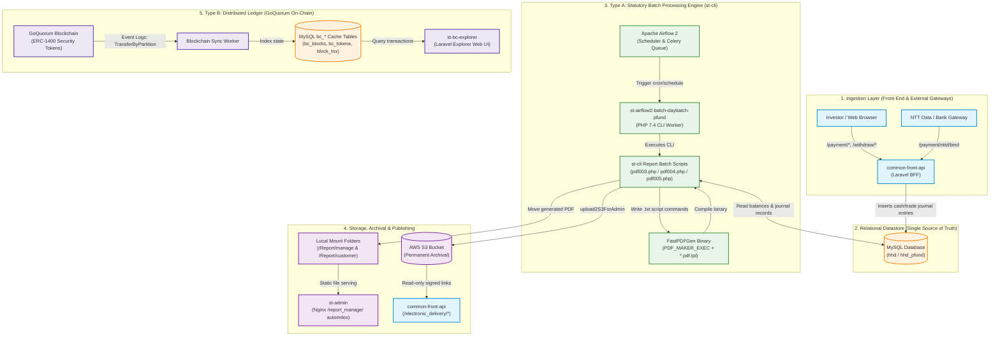
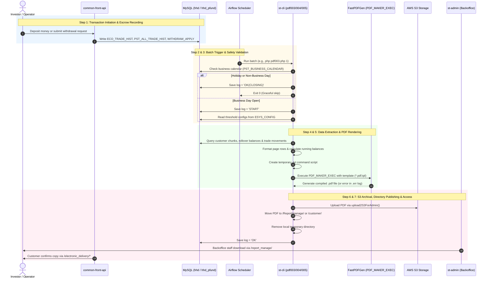
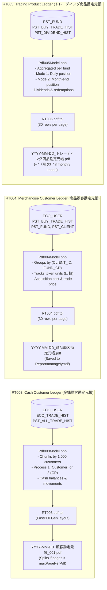
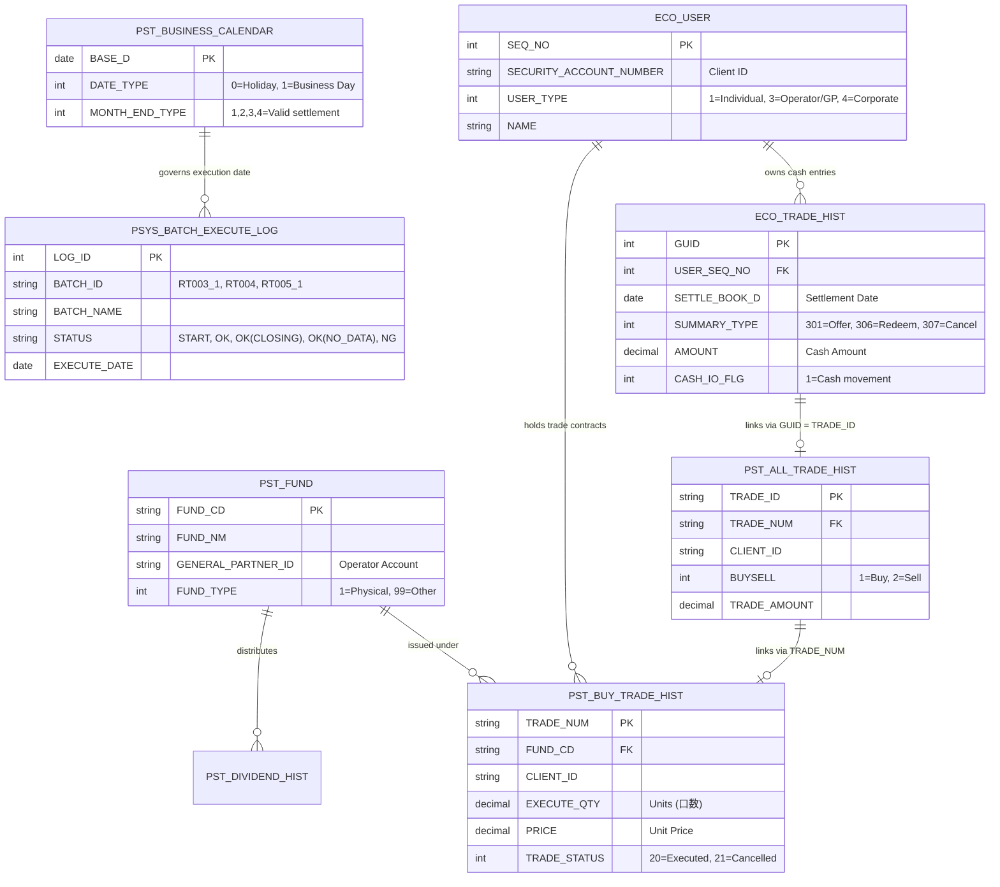
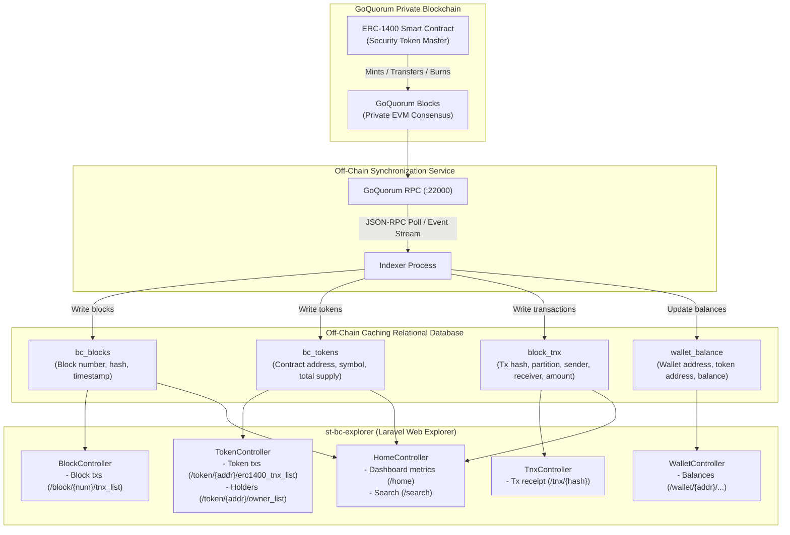

# OwnersBook+ Ledger Creation Flow — Visual Guide

This document provides visual diagrams and architectural flowcharts for the ledger creation process in the OwnersBook+ project.

---

## 1. System Architecture Map (Dual Ledger System)



---

## 2. End-to-End Sequence Diagram (Type A Statutory Ledger)



---

## 3. Step-by-Step Batch Execution Logic & Decision Tree

```mermaid
flowchart TD
    Start([1. Airflow / CLI Invocation]) --> ParseArgs[Parse CLI Arguments: processType, baseDate]
    ParseArgs --> FetchBaseDate[Get base date: getBaseD]
    FetchBaseDate --> LogStart[Write DB Log: 'START']
    LogStart --> CheckCal{Is today a business day?<br/>getCalendarCnt > 0}

    CheckCal -- No (Holiday) --> LogClosing[Write DB Log: 'OK(CLOSING)']
    LogClosing --> Exit0([Exit 0 - Skip without error])

    CheckCal -- Yes --> CheckMonthly{Is batch Monthly mode?<br/>(RT005 kbn=2)}
    CheckMonthly -- Yes --> CheckMonthEnd{Is base date month-end?<br/>checkDateByType == true}
    CheckMonthEnd -- No --> LogClosing
    CheckMonthEnd -- Yes --> LoadConfig[Fetch threshold configs from ESYS_CONFIG]
    CheckMonthly -- No (Daily) --> LoadConfig

    LoadConfig --> ValidateThreshold{Thresholds defined in DB?}
    ValidateThreshold -- Missing --> ThrowErr[Throw Exception: Threshold missing]
    ThrowErr --> LogNG[Write DB Log: 'NG']
    LogNG --> Exit1([Exit 1 - Abort])

    ValidateThreshold -- Valid --> InitDirs[Create temp output directory: makePdfDir]
    InitDirs --> FetchChunk[Fetch customer / fund chunk from DB]

    FetchChunk --> CheckData{Records found?}
    CheckData -- No (0 records) --> LogNoData[Write DB Log: 'OK(NO_DATA)']
    LogNoData --> CleanDir[Remove temporary directory]
    CleanDir --> Exit0

    CheckData -- Yes --> CalcBalances[Compute rollover balance, debits, credits & running totals]
    CalcBalances --> BuildTxt[Build FastPDFGen commands: startPage, drawBox, drawStr]
    BuildTxt --> CheckSplit{Customer count >= limit OR<br/>Pages >= maxPagePerPdf?}
    CheckSplit -- Yes --> CutFile[Append 'finish' & start new chunk _002.pdf]
    CheckSplit -- No --> LoopRows{More records in chunk?}
    LoopRows -- Yes --> CalcBalances
    LoopRows -- No --> SaveTxt[Write commands to .txt file]

    CutFile --> SaveTxt
    SaveTxt --> RunPDFGen[Execute PDF_MAKER_EXEC binary]
    RunPDFGen --> VerifyGen{PDF exists AND<br/>errlog size == 0?}

    VerifyGen -- Failed --> RecordErr[Collect error message from .err log]
    RecordErr --> LogNG

    VerifyGen -- Succeeded --> UploadS3[Upload to S3: upload2S3ForAdmin]
    UploadS3 --> MoveLocal[Move file to Report/manage or Report/customer]
    MoveLocal --> CleanTemp[Remove temporary working folder]
    CleanTemp --> LogOK[Write DB Log: 'OK']
    LogOK --> ExitSuccess([Exit 0 - Completed])
```

---

## 4. Ledger Type Pipeline Comparison (RT003 vs. RT004 vs. RT005)



---

## 5. Database Journal Entity-Relationship Diagram



---

## 6. Type B Distributed Ledger & Explorer Data Flow



---

## 7. Component Responsibility Matrix

| Stage | Responsibility | Primary Repository | Key Files & Classes | Output Artifact |
| :--- | :--- | :--- | :--- | :--- |
| **1. Ingestion** | Accept fiat deposit / withdrawal requests and record ledger entries | `common-front-api` | `WithdrawController.php`<br/>`UserPaymentController.php` | Rows in `ECO_TRADE_HIST` & `WITHDRAW_APPLY` |
| **2. Orchestration** | Trigger batch containers according to trading calendar | `local-docker`<br/>`dc-airflow2` | `bulk_exec_batch.sh`<br/>`st-airflow2-scheduler` | Container command: `php pdf003.php 1` |
| **3. Safety Check** | Confirm business open status and load page limits | `st-cli` | `Pdf003Model::getCalendarCnt()`<br/>`ConfigModel::get()` | `PSYS_BATCH_EXECUTE_LOG` (Status = `START`) |
| **4. Calculation** | Fetch customer records, rollover balances & calculate net changes | `st-cli` | `Pdf003Model.php`<br/>`Pdf004Model.php`<br/>`Pdf005Model.php` | Structured memory arrays of balanced transactions |
| **5. PDF Assembly** | Render page frames, fonts, and box coordinates | `st-cli` | `FastPDFGen` binary (`PDF_MAKER_EXEC`)<br/>`RT003.pdf.tpl`, `RT004.pdf.tpl`, `RT005.pdf.tpl` | Compiled PDF file (e.g. `YYYY-MM-DD_顧客勘定元帳_001.pdf`) |
| **6. Archival** | Upload to cloud and delete local temp working directories | `st-cli` | `pdf.php` (`upload2S3ForAdmin`)<br/>`remove_directory()` | Permanent S3 object + published local directory |
| **7. Distribution** | Provide secure downloads to backoffice and investors | `st-admin`<br/>`common-front-api` | `pfund-admin.conf` (`/report_manage/`)<br/>`ElectronicController.php` | Admin browser download & Investor app disclosure |
| **Type B Viewer** | Inspect on-chain security token balances and blocks | `st-bc-explorer` | `HomeController.php`<br/>`TokenController.php`<br/>`routes/web.php` | HTML web view of distributed ledger transactions |
