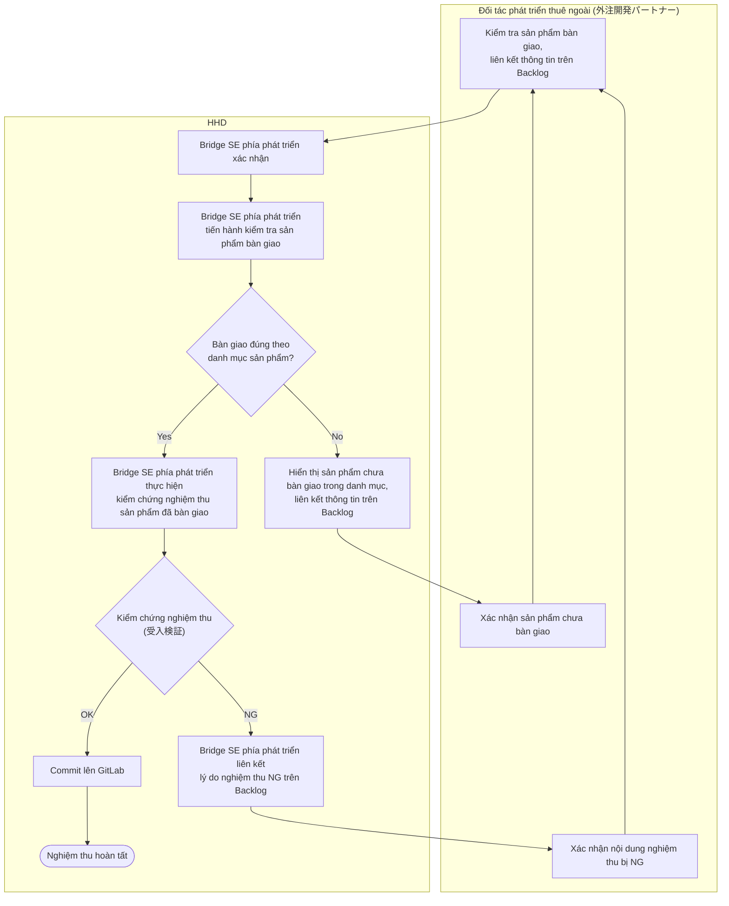
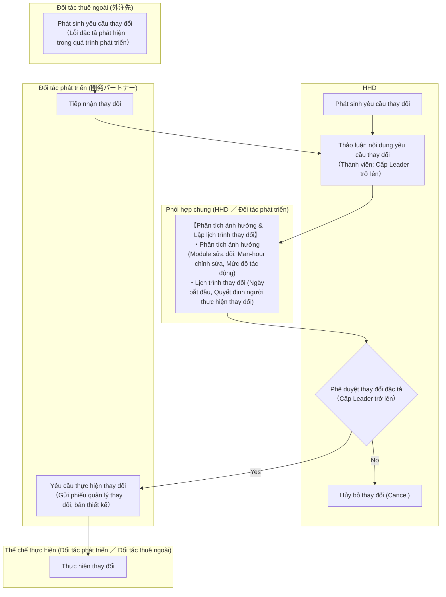
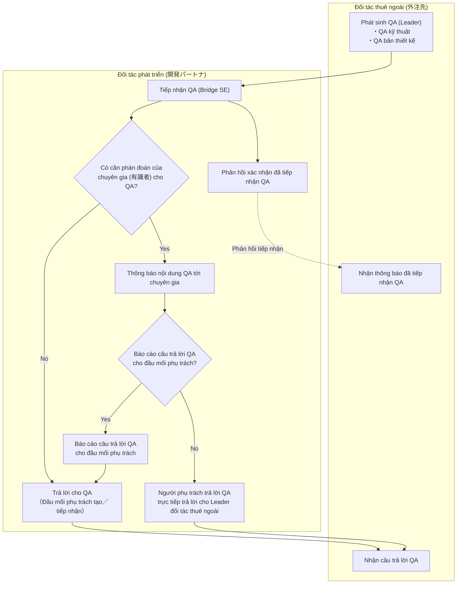
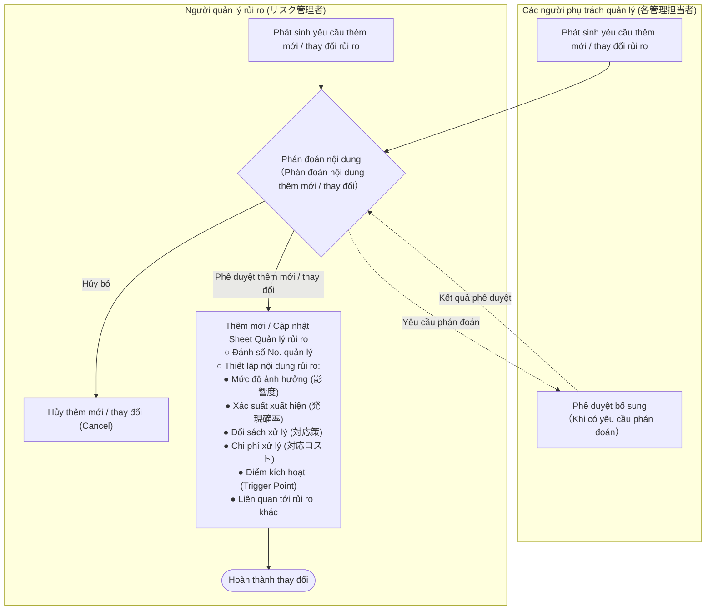
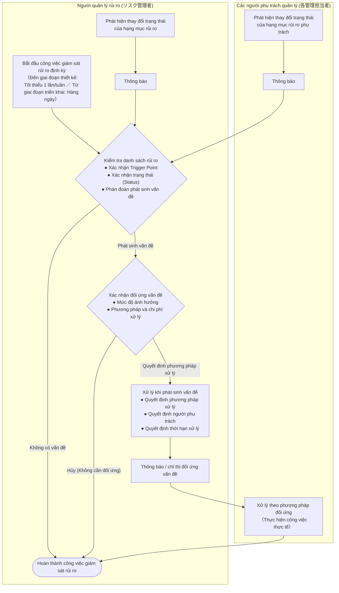

# Tiêu chuẩn làm việc dự án (プロジェクト作業標準)

**Phòng Phát triển Hệ thống (システム開発部)**  
**Tháng 12 năm 2025**  
**Hash DasH Holdings株式会社**

---

# Tiến độ quản lý (進捗管理)

## Phương châm (方針)

1. Thực hiện quản lý tiến độ đối với lịch trình phát triển của dự án, nhằm quản lý tình trạng công việc trong team, tình trạng chậm trễ (delay) và tình hình phát sinh sự cố/vấn đề.
2. Việc quản lý tiến độ được thực hiện hàng tuần (weekly) thông qua báo cáo tới PM hoặc người phụ trách từng vụ việc/hạng mục được PM chỉ định (dưới đây gọi là "Người phụ trách quản lý" - 管理責任者) cùng PMO, kết hợp xác nhận tiến độ nội bộ trong team.  
   Tùy thuộc vào quy mô dự án, giai đoạn kiểm thử, tình trạng chậm tiến độ công việc v.v., có trường hợp sẽ tiến hành nhiều lần trong một tuần.
3. Tình trạng tiến độ được đo lường và quản lý dựa trên các chỉ số tiến độ khách quan đã được định nghĩa trước.

## Cuộc họp tiến độ (進捗会議)

### Họp tiến độ dự án (プロジェクト進捗会議)

Cuộc họp tiến độ dự án được tổ chức hàng tuần với các thành viên tham dự dưới đây.  
Hình thức họp (họp trực tiếp, hoặc họp online qua các công cụ giao tiếp như Meet/Slack/Zoom/Microsoft Teams) do nội bộ dự án quyết định.  
Thành viên tham dự gồm: Người phụ trách quản lý (管理責任者), PMO, cấp Leader phụ trách chính (dưới đây gọi là "Leader") và người phụ trách chính về thiết kế/kiểm thử (test) tùy theo tình hình thực tế.

| Phân loại (分類) | Cách thức vận hành (運営方法) | Tài liệu phân phát (配布資料) |
| :--- | :--- | :--- |
| **Tiến độ hàng tuần (週次進捗)** | <ul><li>Nội dung báo cáo gồm 5 hạng mục: "Kế hoạch/Kết quả thực tế công việc theo từng công đoạn (工程別作業予定/実績)", "Tình trạng tiến độ (進捗状況)", "Vấn đề/Tồn đọng (課題/問題点)", "Yêu cầu/Kế hoạch review (レビュー依頼/予定)", "Rủi ro có khả năng hiện hữu hóa (顕在化する可能性があるリスク)". - **Báo cáo công việc đã thực hiện**: "Kết quả thực tế (作業実績)", "Tình trạng tiến độ (進捗状況)", "Vấn đề/Tồn đọng (課題/問題点)" - **Báo cáo công việc dự kiến thực hiện**: "Kế hoạch công việc (作業予定)", "Yêu cầu/Kế hoạch review (レビュー依頼/予定)" - **Rủi ro có khả năng hiện hữu hóa phát sinh từ các báo cáo trên (※)**</li><li>Tài liệu báo cáo theo cột bên phải.</li></ul> | ・Tài liệu báo cáo tiến độ (進捗報告資料) ・Danh sách Issue Backlog (Backlog課題一覧) |

> （※）Dựa trên kết quả công việc, hiện trạng, vấn đề/tồn đọng trong báo cáo tiến độ, tại thời điểm xuất hiện khả năng rủi ro bị hiện hữu hóa, rủi ro đó sẽ được đưa vào đối tượng báo cáo để theo dõi sát sao tình hình.  
> Các rủi ro được báo cáo sẽ được xử lý theo đúng phương châm đối ứng quản lý rủi ro trong Kế hoạch dự án (Project Plan).

### Họp tiến độ team (チーム進捗会議)

Tổ chức họp tiến độ do Leader làm trung tâm cùng các thành viên trực thuộc Leader.  
Cuộc họp tiến độ có thể khác nhau tùy theo quy mô công việc trong team, số lượng người tham gia và công đoạn đang triển khai. Do đó, phương thức họp (định kỳ hàng tuần, họp đầu ngày (朝会) / cuối ngày (夕会) hàng ngày, xác nhận trực tiếp với từng người phụ trách qua các công cụ giao tiếp Meet/Slack/Zoom/Microsoft Teams, v.v.) sẽ do Leader quyết định.  
Ngoài ra, đối với phát triển thuê ngoài (Offshore / Nearshore), Leader phía đối tác thuê ngoài sẽ chủ trì cuộc họp báo cáo hàng tuần và họp đầu ngày hàng ngày.

## Chỉ số tiến độ (進捗指標)

Chỉ số quản lý tiến độ thể hiện tình trạng tiến độ của từng task.  
Chỉ số quản lý tiến độ được định nghĩa theo các tiêu chuẩn dưới đây. Giá trị nhập vào theo tiêu chuẩn này sẽ được tổng hợp cho toàn bộ các task để tính toán ra tỷ lệ tiến độ tổng thể. Đối với những nội dung hoặc tình huống không thể quản lý theo tiêu chuẩn dưới đây, giá trị tiêu chuẩn sẽ được định nghĩa riêng biệt trong kế hoạch của từng công đoạn cụ thể.

| Chỉ số tiến độ (進捗指標) | Công đoạn tạo tài liệu (Design / Plan / Report v.v.) (設計書/計画書/結果報告書等ドキュメント作成工程) | Công đoạn lập trình/chế tạo (Áp dụng tương tự cho chỉnh sửa/fix bug) (製造工程（改修/不具合対応時も同様）) | Công đoạn tiêu hao test case kiểm thử tích hợp / kiểm thử hệ thống (結合/総合テストケース消化工程) |
| :---: | :--- | :--- | :--- |
| **0%** | Chưa bắt đầu (未着手) | Chưa bắt đầu (未着手) | Chưa bắt đầu (未着手) |
| **25%** | Bắt đầu làm việc (作業着手) | Đang viết/sửa source code (ソース作成/修正中) | ― |
| **50%** | Đang làm việc (作業中) | Hoàn thành viết/sửa source code (bao gồm cả source review) (ソース作成/修正終了（ソースレビュー含む）) | Đang xử lý (Chờ kiểm tra lại/NG) (仕掛中（再鑑前/NG）) |
| **75%** | Hoàn thành công việc (Trước khi thực hiện review) (作業完了（レビュー実施前）) | Đang unit test (bao gồm review test case) (単体テスト中（テストケースレビュー含む）) | ― |
| **100%** | Hoàn thành công việc (Đã hoàn tất review) (作業完了（レビュー終了）) | Hoàn thành unit test (単体テスト終了) | Kết thúc (Đã hoàn tất kiểm tra lại) (終了（再鑑終了）) |

## Phương pháp đánh giá tiến độ (進捗評価方法)

Phương pháp đánh giá tiến độ được thực hiện trên 2 phương diện: tỷ lệ tiến độ của từng task riêng lẻ và tỷ lệ tiến độ tổng thể.  
Hàng tuần, tiến độ của từng task riêng lẻ sẽ được báo cáo; dựa trên thông tin đó, tỷ lệ tiến độ tổng thể sẽ được tính toán để tiến hành đánh giá tiến độ.

## Xử lý đối ứng khi chậm tiến độ (進捗遅延に対する対応)

Đối với việc chậm tiến độ, cần có biện pháp xử lý riêng biệt cho từng task và cho toàn thể dự án.  
Trường hợp toàn thể dự án bị chậm tiến độ, phải tiến hành phân tích nguyên nhân, quyết định đối sách khắc phục và đưa ra thảo luận tại cuộc họp định kỳ hàng tuần. Đối với việc chậm trễ của từng task, cũng phải phân tích nguyên nhân và quyết định đối sách.  
Chỉ những task thuộc đường găng (critical path) hoặc những task gây ảnh hưởng đến các công việc khác mới được đưa ra thảo luận tại cuộc họp định kỳ hàng tuần; các trường hợp chậm trễ task còn lại sẽ được xử lý riêng lẻ.

## Phương pháp quản lý tiến độ tận dụng Backlog (※) (Backlogを活用した進捗管理方法)

Quản lý theo Chương 2 "Quản lý tiến độ" trong tài liệu đính kèm "Phương châm quản lý tiến độ tận dụng Backlog".  
（※）Sử dụng Backlog làm công cụ quản lý dự án và quản lý task.

---

# Quản lý chất lượng (品質管理)

## Phương châm quản lý chất lượng (品質管理方針)

Thiết lập mục tiêu chất lượng bên ngoài (external quality target) từ mục tiêu của dự án, nhằm đánh giá hệ thống được phát triển có đáp ứng được mục tiêu chất lượng hay không.  
Đồng thời, như một phần của việc loại bỏ khuyết tật nhằm đạt mục tiêu chất lượng, dự án cũng thiết lập mục tiêu chất lượng cho các sản phẩm trung gian (intermediate deliverables) trong quá trình triển khai công việc.

## Cơ cấu quản lý chất lượng (品質管理体制)

Cơ cấu quản lý chất lượng tuân theo sơ đồ tổ chức (thể chế) của dự án.

### Cơ cấu quản lý chất lượng trong Thiết kế, Kiểm thử tích hợp và Kiểm thử hệ thống (設計および、結合テスト、総合テストにおける品質管理体制)

Người quản lý chất lượng (Người phụ trách quản lý) về nguyên tắc sẽ thiết lập riêng một Người đảm bảo chất lượng (Leader), tuy nhiên tùy thuộc vào quy mô phát triển, cho phép Người quản lý chất lượng kiêm nhiệm vai trò này.  
Người đảm bảo chất lượng sẽ tiến hành review, xác nhận việc phản ánh các nội dung chỉ ra (góp ý) và xác nhận bảng ghi chép thực hiện review (レビュー実施記録表).  
Người quản lý chất lượng sẽ xác nhận từ bảng ghi chép thực hiện review để đảm bảo review đã được tiến hành thỏa đáng.

### Cơ cấu quản lý chất lượng trong Triển khai và Unit Test (実装、単体テストにおける品質管理体制)

Thiết lập Người đảm bảo chất lượng (Leader phụ trách triển khai).  
Người đảm bảo chất lượng sẽ tiến hành review và xác nhận dựa trên bảng kiểm tra "Checklist_Chế tạo" (チェックリスト_製造) và "Checklist_Unit Test" (チェックリスト_単体テスト).  
Sau đó, Bridge SE phía phát triển - người thực hiện xác minh nghiệm thu kết quả unit test - sẽ đóng vai trò là Người quản lý chất lượng để kiểm tra kết quả unit test.

### Mục tiêu chất lượng (品質目標)

Mục tiêu chất lượng được quyết định như sau:

- Đối với Bản thiết kế cơ bản (Basic Design) và Bản thiết kế chi tiết (Detail Design), tiến hành review trong nội bộ team dự án và trong nội bộ Hash DasH Holdings (dưới đây viết tắt là HHD), hướng tới mục tiêu số lỗi/góp ý chỉ ra (指摘数) là 0.
- Đối với phần triển khai mã nguồn (implementation), tiến hành review nghiệm thu kết quả unit test, đảm bảo đáp ứng đầy đủ tất cả các tiêu chuẩn nghiệm thu (acceptance criteria).
- Thực hiện kiểm thử tích hợp (Integration Test / 結合テスト), hướng tới mục tiêu số lượng sự cố (defect/bug) là 0.

## Phương châm đảm bảo chất lượng (品質保証方針)

Thực hiện các hạng mục dưới đây để đảm bảo chất lượng:

### Cung cấp phương châm triển khai (実装方針の提供)

1. **Sơ đồ khái niệm module (モジュール概念図)**  
   Quy định phương châm tạo module thông qua sơ đồ khái niệm module, phân chia rõ ràng phần điều khiển màn hình (UI/presentation logic) và phần nghiệp vụ (business logic) trong thiết kế và lập trình. Nhờ đó, vai trò của từng module được làm rõ, nâng cao tính dễ bảo trì (maintainability).  
   Ngoài ra, tùy theo framework mà ứng dụng sử dụng, đối với những phần có thể áp dụng unit test thì phải đưa unit test vào quy trình.  
   Đồng thời, xem xét trước và cung cấp các chức năng dùng chung (common components) nhằm ngăn ngừa sự trùng lặp/dư thừa logic, nâng cao tính thay đổi và mở rộng (extensibility).

2. **Tiêu chuẩn chương trình prototype, source code mẫu (プロトタイプ　プログラム基準、サンプルソース)**  
   Cung cấp prototype khi cần thiết để giúp hình dung cụ thể phương châm triển khai (sơ đồ khái niệm module).  
   Bằng việc lập trình dựa trên prototype làm chuẩn, ngăn ngừa các cách hiện thực chức năng dị biệt (lệch chuẩn).  
   Đối với việc tạo prototype nhằm mục đích khảo sát kỹ thuật (PoC/Spike), sau khi tạo xong sẽ đánh giá và phản ánh vào guideline triển khai.

3. **Guideline triển khai (実装ガイドライン)**  
   Cung cấp dưới dạng tài liệu về cách sử dụng các chức năng dùng chung, phương châm triển khai trong các trường hợp cách thực hiện tương tự nhau.  
   Qua đó làm rõ hơn nữa các tiêu chuẩn triển khai từ prototype.  
   Trong prototype, thiết kế cũng cần chú trọng đến khía cạnh hiệu năng (performance).

### Cung cấp chức năng dùng chung (共通機能の提供)

1. **Application Framework**  
   Cung cấp các chức năng nền tảng (base functions) cùng phương pháp phát triển vốn là tiền đề để thiết kế, lập trình từng màn hình và chức năng.
2. **Chức năng dùng chung (Module Library) (共通機能（モジュールライブラリ）)**  
   Cung cấp các chức năng có thể sử dụng chung xuyên suốt giữa các màn hình và chức năng.

### Xác minh trước Bản thiết kế chi tiết (詳細設計書の事前検証)

Review sản phẩm đầu ra (deliverables) được thực hiện ở từng công đoạn thiết kế và công đoạn triển khai / unit test.  
Quy định điều kiện chuyển sang công đoạn triển khai (implementation) là phải hoàn thành review thiết kế chi tiết, nhằm loại bỏ sự sai lệch về mặt đặc tả trước khi bắt đầu công việc lập trình.

### Quy định về Kiểm thử (テストの指定)

1. **Unit Test (ユニットテスト)**  
   Thực hiện kiểm thử ở cấp độ logic (business logic) ngay trong giai đoạn triển khai (coding). Nhờ đó, ngăn chặn từ sớm các bug ở tầng logic.
2. **Kiểm thử đơn vị chức năng (単体テスト - Single/Module Test)**  
   Thực hiện xác minh hành vi theo từng event/chức năng dựa trên tiêu chuẩn là test case đơn vị (lập từ bản thiết kế chi tiết).

### Xác minh sản phẩm bàn giao (成果物検証)

1. **Review Source Code (ソースコードレビュー)**  
   Người viết code sau khi hoàn thành lập trình (trước khi chạy unit test) phải tiến hành review source code cùng Leader phụ trách triển khai.  
   Review được tiến hành dựa trên bảng kiểm tra "Checklist_Chế tạo" (チェックリスト_製造). Bảng kiểm tra này sẽ được rà soát cập nhật tùy thời dựa trên nội dung các sự cố phát sinh trong các công đoạn test sau đó (unit test, integration test, system test).
2. **Review Unit Test (単体テストレビュー)**  
   Người thực hiện unit test phải review test case cùng Leader phụ trách trước khi chạy unit test, và review kết quả test cùng Leader sau khi thực hiện unit test.  
   Review được tiến hành dựa trên bảng kiểm tra "Checklist_Unit Test" (チェックリスト_単体テスト). Bảng kiểm tra này sẽ được rà soát cập nhật tùy thời dựa trên nội dung các sự cố phát sinh trong các công đoạn test sau đó (unit test, integration test, system test).
3. **Khác (その他)**  
   Đối với các chương trình viết mới hoặc các chương trình hiện có có sự sửa đổi lớn (major refactoring/modification), cần thực hiện đo lường hiệu năng (performance measurement) trong unit test hoặc integration test để xác nhận không có vấn đề về mặt hiệu năng.

## Phương châm đảm bảo chất lượng trong phát triển có thuê ngoài (外注製造を伴う開発における品質保証方針)

Trong phát triển thuê ngoài, ngoài phương châm đảm bảo chất lượng thông thường, thực hiện thêm các điểm sau để đảm bảo chất lượng:

### Bắt nhịp yêu cầu và phương châm phát triển thông qua làm việc Onsite (オンサイトによる要件・開発方針キャッチアップ)

Người phụ trách thiết kế chi tiết cũng tham gia ngay từ giai đoạn thiết kế cơ bản, thông qua công việc phát triển thực tế để nắm bắt (catch-up) các yêu cầu và phương châm phát triển.  
Người phụ trách thiết kế chi tiết cũng đảm nhận vai trò Bridge SE giao tiếp với phía đối tác phát triển thuê ngoài, tiến hành phát triển sao cho không có sự sai lệch nhận thức giữa bên thiết kế và bên lập trình thuê ngoài.  
Đồng thời, lắng nghe các thắc mắc, nguyện vọng phát sinh trong quá trình phát triển để rà soát, điều chỉnh phương châm phát triển.

### Tối ưu hóa hệ thống phát triển bằng phát triển đi trước, phát triển theo chức năng (先行開発、機能別開発による開発体系の最適化)

Giao việc theo đơn vị chức năng (màn hình), và tiến hành phát triển / xác minh sản phẩm theo đơn vị đó.  
Bằng cách phát triển lệch pha thời gian theo từng đơn vị chức năng, thực hiện trao đổi Q&A trước về các thiếu sót/chưa hoàn thiện của bản thiết kế hay các thắc mắc khi phát triển, từ đó giải tỏa sớm các điểm nghẽn (bottleneck) cho các công việc phía sau.

## Phạm vi công việc trong phát triển thuê ngoài (外注開発での開発作業範囲)

Làm rõ ranh giới giữa công việc tự làm nội bộ (in-house / 内製) và công việc thuê ngoài (outsourced / 外製), ngăn ngừa sự hỗn loạn khi phát triển và hướng tới nâng cao chất lượng.

## Quản lý nghiệm thu và quản lý sự cố trong phát triển thuê ngoài (外注開発での受入・障害管理)

Chỉ thị công việc trong phát triển thuê ngoài được thực hiện từ Bridge SE phía phát triển thông qua Backlog. Các trao đổi QA, xác minh nghiệm thu và xử lý sự cố (bao gồm cả điều tra sự cố) cũng được thực hiện tương tự.

### Phương châm quản lý nghiệm thu và sự cố (受入・障害管理方針)

Sản phẩm phát triển thuê ngoài sau khi được kiểm tra xác minh tại thời điểm nghiệm thu và check-in, sẽ được vận hành quản lý sự cố.  
（Các sự cố phát sinh trong quá trình test nghiệm thu sẽ không thuộc đối tượng của luồng quản lý sự cố）.

### Vận hành quản lý nghiệm thu và sự cố (受入・障害管理運用)

1. Quản lý nghiệm thu được thực hiện trên Backlog.
2. Quản lý sự cố được thực hiện bằng cách tạo phiếu quản lý sự cố (障害管理票) và trao đổi trên Backlog.
3. Xác minh nghiệm thu được thực hiện bằng cách thẩm tra nội dung báo cáo kết quả test của các sản phẩm được đối tác bàn giao, nhằm xác minh xem có đáp ứng đủ các yêu cầu phát triển hay không.

### Luồng quản lý nghiệm thu và sự cố (受入・障害管理フロー)

## Phương châm đánh giá chất lượng (品質評価方針)

- Từ biên bản làm việc đảm bảo chất lượng, đánh giá xem sản phẩm bàn giao tương ứng có đạt mục tiêu chất lượng hay không.
- Tính toán mật độ sự cố (defect density / 障害密度) từ kết quả kiểm thử tích hợp (Integration Test) để đánh giá.
- Tính toán số lỗi/góp ý chỉ ra từ biên bản review nội bộ team phát triển để đánh giá.

## Phương châm xử lý chất lượng (品質対応方針)

Trường hợp không đạt mục tiêu chất lượng, xác nhận lại xem có sai sót trong khâu đảm bảo chất lượng và đánh giá chất lượng hay không.  
Nếu có sai sót thì chỉ thị làm lại (re-work); nếu không có sai sót thì phải nhanh chóng phân tích nguyên nhân, cùng Người quản lý rủi ro thảo luận và triển khai đối sách khắc phục.

## Phương châm quản lý Git liên quan đến phát hành module (モジュールリリースに関するGit管理方針)

Trong công việc release, để ngăn chặn các module ngoài dự kiến bị lẫn vào, việc release phải tuân theo tài liệu đính kèm "Phương châm quản lý Git liên quan đến phát hành module" về quy tắc đặt tên branch và kiểm tra đối soát tại thời điểm release.

## Đối sách tương lai thông qua phân tích nguyên nhân khi phát sinh lỗi trong phát triển (開発作業における不具合発生時の原因分析による今後の対策)

Để nâng cao chất lượng, tiến hành công việc phát triển với sự lưu tâm đến các đối sách tương lai được ghi trong tài liệu đính kèm "Các đối sách trong công việc phát triển tương lai đối với các vấn đề đã phát sinh trong các đợt phát triển trước".  
Các đối sách tương lai này sẽ được bổ sung mỗi khi phát sinh nội dung cần đưa vào cải tiến chất lượng trong công việc phát triển tương lai, thông qua phân tích nguyên nhân khi xảy ra lỗi ở từng dự án.

---

# Quản lý thay đổi đặc tả (仕様変更管理)

## Phương châm (方針)

1. Các yêu cầu thay đổi sau khi đã chốt Baseline (đường cơ sở) về nguyên tắc chỉ tiếp nhận những yêu cầu liên quan đến phạm vi sản phẩm (Product Scope). Product Scope là phạm vi phát triển hệ thống được quy định tại giai đoạn Định nghĩa yêu cầu (Requirement Definition).
2. Tất cả mọi thay đổi đều phải tuân theo Quy trình quản lý thay đổi (Change Management Process). Yêu cầu thay đổi đưa ra không tuân theo quy trình này sẽ không được xem xét.
3. Quyết định chấp thuận hay từ chối thay đổi do Người phụ trách quản lý (管理責任者) và Leader đưa ra.
4. Sau khi yêu cầu hệ thống đã được chốt, về nguyên tắc sẽ không tiếp nhận yêu cầu thay đổi yêu cầu hệ thống. Việc xem xét thực hiện sẽ được tiến hành sau khi việc xây dựng và kiểm chứng hệ thống tại thời điểm chốt đã kết thúc.

## Đối tượng quản lý thay đổi (変更管理対象)

Các hạng mục dưới đây là đối tượng quản lý thay đổi:

| Đối tượng quản lý (管理対象) | Giải thích phạm vi quản lý (管理範囲の説明) |
| :--- | :--- |
| **Yêu cầu (要件)** | Quản lý việc thêm, xóa, sửa đổi các yêu cầu. |
| **Sản phẩm bàn giao (成果物)** | Quản lý việc thêm, xóa, sửa đổi liên quan đến sản phẩm bàn giao. |
| **Lịch trình (スケジュール)** | Quản lý việc thay đổi lịch trình. |
| **Chi phí (コスト)** | Quản lý việc thay đổi chi phí. |

## Baseline - Đường cơ sở (ベースライン)

Thời điểm chốt Baseline của quản lý thay đổi như sau. Những nội dung đã được review và phê duyệt được định nghĩa là đã chốt Baseline. Sau khi chốt Baseline, bắt buộc phải tuân theo Quy trình quản lý thay đổi được nêu dưới đây.

| Đối tượng quản lý (管理対象) | Nội dung được chốt (確定される内容) | Thời điểm chốt (確定時期) |
| :--- | :--- | :--- |
| **Yêu cầu (要件)** | Công việc cần thiết, chức năng | Kết thúc định nghĩa yêu cầu |
| **Sản phẩm bàn giao (成果物)** | Sản phẩm cần tạo ra | Kết thúc định nghĩa yêu cầu |
| **Lịch trình (スケジュール)** | Lịch trình phát triển | Kết thúc định nghĩa yêu cầu |
| **Chi phí (コスト)** | Khoản đầu tư dành cho phát triển hệ thống | Kết thúc định nghĩa yêu cầu |

## Quy trình quản lý thay đổi (変更管理プロセス)

---

# Quản lý cấu hình (構成管理)

## Phương châm cơ bản của quản lý cấu hình (構成管理の基本方針)

Quản lý cấu hình của dự án này được thực hiện dựa trên các phương châm sau:

- Toàn bộ các sản phẩm được tạo ra trong quá trình dự án phải được quản lý theo một trong hai phương pháp dưới đây:
  1. Sử dụng công cụ quản lý cấu hình GitLab (dưới đây gọi là Git).
  2. Quản lý phiên bản tại các thư mục trong Google Drive.
- Đối với (1), phải đảm bảo có thể lấy ra sản phẩm của từng thế hệ (generation/version) bất kỳ lúc nào.
- Đối với (2), giả định không yêu cầu tính phản hồi tức thì cao như (1).

## Đối tượng của quản lý cấu hình (構成管理の対象)

Trong dự án này, áp dụng quản lý cấu hình cho các sản phẩm đầu ra dưới đây. Phương pháp quản lý cho từng sản phẩm cũng được quy định như sau theo mục trước:

| Phân loại quản lý (管理カテゴリ) | Đối tượng quản lý (管理対象) | Quản lý trên Git (Git管理) | Quản lý thư mục (フォルダ管理) | Backlog |
| :--- | :--- | :---: | :---: | :---: |
| **Kế hoạch (計画書)** | Kế hoạch dự án (プロジェクト計画書) | ― | ○ | ― |
| **Kế hoạch (計画書)** | Kế hoạch từng công đoạn (各工程計画書) | ― | ○ | ― |
| **Thiết kế (設計書)** | Tài liệu định nghĩa yêu cầu (要件定義書) | ― | ○ | ― |
| **Thiết kế (設計書)** | Bản thiết kế cơ bản (基本設計書) | ― | ○ | ― |
| **Thiết kế (設計書)** | Bản thiết kế chi tiết (詳細設計書) | ○ | ― | ― |
| **Source code (ソースコード)** | Source code (ソースコード) | ○ | ― | ― |
| **Kết quả test (テスト結果)** | Kịch bản test / Test case (テストシナリオ／テストケース) | ○ | ― | ― |
| **Kết quả test (テスト結果)** | Kết quả test (Dữ liệu đối soát / Evidence) (テスト結果（エビデンス）) | ― | ― | ○（※1） |
| **Kết quả test (テスト結果)** | Báo cáo kết quả test (テスト結果報告書) | ― | ○ | ― |
| **Biên bản họp (議事録)** | Biên bản họp (議事録) | ― | ○ | ― |
| **Sản phẩm quản lý (管理成果物)** | Tài liệu tiến độ v.v. (進捗資料など) | ― | ○ | ― |
| **Sản phẩm quản lý (管理成果物)** | WBS (Biểu đồ Gantt) (WBS（ガントチャート）) | ― | ○ | ○（※2） |
| **Sản phẩm quản lý (管理成果物)** | Quản lý task từng công đoạn (各工程タスク管理) | ― | ― | ○ |

> （※1）Dữ liệu đối soát (evidence) của kết quả test được lưu trữ và xác nhận trong mục File của Backlog, tuy nhiên để tiết kiệm dung lượng file sử dụng trên Backlog, sau khi kết thúc dự án sẽ chuyển sang thư mục dùng chung trên Google Drive.  
> （※2）Tùy theo dự án, việc quản lý sản phẩm có thể được thực hiện trên biểu đồ Gantt của Backlog.

## Baseline của đối tượng quản lý cấu hình (構成管理の対象のベースライン)

Baseline của từng sản phẩm được quy định như sau:

| Đối tượng quản lý (管理対象) | Baseline (ベースライン) |
| :--- | :--- |
| **Tiêu chuẩn làm việc dự án (プロジェクト作業標準)** | Văn bản này (本紙) |
| **Kế hoạch từng công đoạn (各工程計画書)** | Thời điểm hoàn thành phê duyệt của Ủy ban Quản lý Rủi ro HHD (HHDのリスク管理委員会承認完了時点) |
| **Các tài liệu đặc tả (各仕様書)** | Thời điểm hoàn thành phê duyệt (承認完了時点) |
| **Source code (ソースコード)** | Thời điểm hoàn thành Unit Test + Code Inspection (単体テスト＋コードインスペクション完了時点) |
| **Test case (テストケース)** | Thời điểm hoàn thành review nội bộ team (Đối với Kiểm thử hệ thống là thời điểm phán định hoàn thành test) (チーム内部レビュー完了時点（総合テストのみテスト完了の判定時）) |
| **Kết quả test (テスト結果)** | Thời điểm hoàn thành kiểm tra lại kết quả test nội bộ team (チーム内部テスト結果再鑑完了時点) |
| **Báo cáo kết quả test (テスト結果報告書)** | Thời điểm hoàn thành phê duyệt của Ủy ban Quản lý Rủi ro HHD (HHDのリスク管理委員会承認完了時点) |
| **Biên bản họp (議事録)** | Thời điểm hoàn thành review nội bộ (内部レビュー完了時点) |
| **Sản phẩm quản lý (管理成果物)** | Thời điểm hoàn thành review nội bộ (内部レビュー完了時点) |

## Luồng quản lý cấu hình (構成管理フロー)

- Đối với sản phẩm quản lý bằng Git, từng thành viên tự checkout về local qua Git và tiến hành công việc.
- Đối với sản phẩm quản lý bằng thư mục (Folder), thao tác trực tiếp trên thư mục.

---

# Quản lý mua sắm / môi trường (調達管理)

## Phương châm xử lý liên quan đến mua sắm / môi trường (調達に関する取扱方針)

Việc xử lý mua sắm và môi trường trong dự án này được quy định như sau:

- Máy tính phát triển (dev machine), trừ trường hợp có chỉ định đặc biệt, về nguyên tắc do từng công ty hợp tác tự trang bị. Trường hợp mang vào văn phòng HHD thì phải làm đơn đăng ký mang thiết bị vào và được phê duyệt.
- Về môi trường lập trình và unit test phía Offshore, sử dụng môi trường do phía Offshore quản lý.
- Môi trường từ kiểm thử tích hợp trở đi (Kiểm thử tích hợp, Kiểm thử hệ thống, UAT) sử dụng môi trường do HHD chuẩn bị.

---

# Quản lý giao tiếp (Quản lý tình trạng công việc) (コミュニケーション管理 （作業状況管理）)

## Phương châm (方針)

- Tình trạng công việc của các thành viên được quản lý bằng WBS.
- Các vấn đề mà thành viên gặp phải sẽ do từng Leader nắm bắt, và nếu cần thiết sẽ ghi vào "ToDo (Bảng quản lý vấn đề - 問題管理表)".
- Cơ bản dựa trên báo cáo và chia sẻ nhận thức qua cuộc họp định kỳ hàng tuần, tuy nhiên tùy theo tình hình dự án, Người phụ trách quản lý có thể quyết định tăng số lượng buổi họp.
- Ngoài ra, trong giai đoạn Kiểm thử tích hợp và Kiểm thử hệ thống, nhằm chia sẻ tiến độ test (bao gồm xác nhận nội dung công việc trong ngày / ngày hôm sau) và tình hình giải quyết các vấn đề, sẽ tiến hành họp đầu ngày (朝会) hoặc họp cuối ngày (夕会) hàng ngày.  
  Tùy theo quy mô kiểm thử, việc tổ chức họp đầu ngày hay cuối ngày cũng do Người phụ trách quản lý quyết định.
- Để cuộc họp diễn ra hiệu quả, cuộc họp định kỳ cần làm rõ nội dung báo cáo và kết thúc trong vòng 1 giờ. Đối với các nội dung thảo luận riêng lẻ sẽ thiết lập buổi họp riêng.
- Tùy theo quy mô dự án, Người phụ trách quản lý có thể quyết định thành lập PMO.

## Định nghĩa giao tiếp (コミュニケーション定義)

| Tên gọi (名称) | Mục đích (目的) | Người chủ trì (主催者) | Tần suất (頻度) | Phương thức (手段) | Người tham gia (Đối tượng) (参加者（対象者）) | Nội dung truyền đạt / xác nhận (伝達／確認事項) |
| :--- | :--- | :--- | :--- | :--- | :--- | :--- |
| **Họp đầu ngày hoặc cuối ngày (朝会または、夕会)** | Chia sẻ tiến độ test (bao gồm xác nhận nội dung công việc trong ngày / ngày hôm sau), tình hình giải quyết vấn đề. | Leader phụ trách test | Hàng ngày (Họp đầu ngày hoặc cuối ngày) | Meeting | ・Leader phụ trách test ・Thành viên phụ trách test ※Tùy trường hợp có thể có Người phụ trách quản lý / PMO tham gia | **Leader phụ trách test → Người phụ trách test**: ・Tình trạng công việc ・Kế hoạch công việc ・Vấn đề/tồn đọng |
| **Họp định kỳ hàng tuần (週次定例会)** | ・Các thành viên từ cấp Leader trở lên tham gia phát triển dự án xác nhận tình trạng tiến độ và định hướng của dự án. ・Thảo luận đối sách giải quyết các vấn đề liên quan đến phát triển dự án. ※Được coi là cơ quan ra quyết định cao nhất của dự án. | Các Người phụ trách quản lý | Hàng tuần | Meeting | ・Người phụ trách quản lý / PMO ・Các Leader | 1. **Người phụ trách quản lý → Toàn thể**: 　Hiện trạng và định hướng tương lai của dự án, cùng các vấn đề (thảo luận đối sách giải quyết) 2. **PMO → Toàn thể**: 　Hạn chót task trên Backlog, tình hình tiêu hao test case 3. **Các Leader → Toàn thể**: 　Tình trạng công việc và vấn đề/tồn đọng |

## Biện pháp xử lý đối với sự cố giao tiếp (コミュニケーション問題に対する施策)

- Người phụ trách quản lý phải nắm bắt nội dung báo cáo từ các Leader hoặc thành viên; trường hợp có báo cáo về vấn đề gây ảnh hưởng đến việc hoàn thành từng task của dự án hoặc vấn đề liên quan đến giao tiếp, phải lập tức xử lý.
- Trong các cuộc họp nội bộ công ty, nếu phát hiện hoặc phát sinh vấn đề gây ảnh hưởng đến việc thực hiện từng task của dự án hay vấn đề giao tiếp, Người phụ trách quản lý sẽ đánh giá phạm vi ảnh hưởng; trường hợp là vấn đề ảnh hưởng đến kế hoạch dự án thì phải báo cáo ngay lập tức cho Người quản lý rủi ro.

## Phương pháp vận hành cuộc họp (会議運営方法)

Để vận hành cuộc họp hiệu quả, quy định phương pháp vận hành cuộc họp như sau:

- Nhất thiết phải xác định Chủ tọa (Owner - Người phụ trách quản lý hoặc từng Leader) của cuộc họp; Owner đó sẽ tiến hành điều phối, xúc tiến và phê duyệt cuối cùng biên bản cuộc họp.
- Chọn lọc người tham gia cuộc họp, tổ chức với số lượng thành viên tối thiểu cần thiết. Đồng thời, đối với những nhân sự chủ chốt (key persons) bắt buộc phải tham gia, cần điều phối trước và đảm bảo họ tham dự đầy đủ.
- Các buổi review hay hội thảo thảo luận nhất thiết phải gửi tài liệu trước cho các bên liên quan, ý thức rõ rằng cuộc họp là nơi để thảo luận, bàn bạc về các vấn đề/khúc mắc chứ không phải là nơi đọc tài liệu cùng nhau.
- Về nguyên tắc, phía người nghe (người tham gia) sẽ nhanh chóng lập bảng ghi chép review (đối với họp định kỳ là biên bản cuộc họp) sau khi kết thúc cuộc họp và gửi cho người tham dự. Người tham gia có trách nhiệm xác nhận lại nội dung đã được gửi.

---

# Quản lý vấn đề (Quản lý QA trong phát triển thuê ngoài) (課題管理（外注開発でのQA管理）)

## Phương châm (方針)

1. Các câu hỏi phát sinh trong quá trình thiết kế, phát triển (yêu cầu, đặc tả, kỹ thuật, khác) phải được ghi nhận và lưu vết tối đa trên Backlog.
2. Quản lý vấn đề tận dụng Backlog được thực hiện theo Chương 3 "Quản lý vấn đề" trong tài liệu đính kèm "Phương châm quản lý tiến độ tận dụng Backlog".
3. Các câu hỏi nhỏ, đơn giản có thể trao đổi qua chat để giải quyết vấn đề nhanh chóng.

## Luồng quản lý QA (QA管理フロー)

---

# Quản lý rủi ro (リスク管理)

## Phương châm quản lý rủi ro (リスク管理方針)

- Quản lý rủi ro do Người phụ trách quản lý và Người thúc đẩy dự án (dưới đây gọi là Người quản lý rủi ro - リスク管理者) quản lý.
- Toàn bộ các rủi ro được nhận diện trong dự án này đều được quản lý bằng "Danh sách rủi ro (リスク一覧)", và trong suốt quá trình triển khai dự án sẽ được Người quản lý rủi ro giám sát (monitoring) định kỳ.

## Luồng quản lý rủi ro (リスク管理フロー)

### Luồng thêm mới rủi ro (リスク追加フロー)

- Khi phát sinh hạng mục rủi ro mới, Người phụ trách quản lý phải nhanh chóng báo cáo cho Người quản lý rủi ro về nội dung cần ghi vào Danh sách rủi ro.
- Đối với yêu cầu thêm mới / thay đổi rủi ro được đưa lên, Người quản lý rủi ro sẽ tiến hành phán đoán nội dung xem yêu cầu đó có phải là nội dung cần thêm vào Danh sách rủi ro hay không. Khi phán đoán, nếu cần thiết có thể yêu cầu các Người phụ trách quản lý liên quan cùng đưa ra nhận định.
- Kết quả phán đoán nếu xác định là nên thêm vào, sẽ bổ sung nội dung đó vào Danh sách rủi ro.

### Luồng giám sát rủi ro (リスク監視フロー)

- Người quản lý rủi ro giám sát định kỳ toàn bộ các rủi ro được ghi trong Danh sách rủi ro và xác nhận các điểm sau:
  1. Đối với rủi ro chưa chạm tới Trigger Point (thời điểm được coi là sẽ hiện hữu hóa thành vấn đề): Kiểm tra xem đã chạm tới Trigger Point hay chưa.
  2. Phán đoán xem rủi ro đã chạm tới Trigger Point có bị hiện hữu hóa thành vấn đề hay không.
- Ngoài ra, trong công việc quản lý, Người phụ trách quản lý kiểm tra trạng thái (Status) của các hạng mục rủi ro liên quan đến phần phụ trách của mình; nếu có hạng mục rủi ro bị thay đổi trạng thái thì phải nhanh chóng báo cáo cho Người quản lý rủi ro.
- Người phụ trách quản lý sẽ thông báo cho Người phụ trách quản lý thích hợp để xử lý đối với những nội dung được Người quản lý rủi ro phán đoán là đã phát sinh vấn đề.
- Người phụ trách quản lý được thông báo và các Người phụ trách quản lý có liên quan sẽ cùng Người quản lý rủi ro xác nhận việc đối ứng vấn đề, và tiến hành xử lý nếu phán đoán là cần thiết.
- Thời điểm giám sát được căn cứ theo tiêu chuẩn sau:
  - **Đến giai đoạn thiết kế**: Tối thiểu 1 lần mỗi tuần
  - **Từ giai đoạn triển khai (Implementation) trở đi**: Hàng ngày

---

## Lịch sử sửa đổi (修正履歴)

| Ngày sửa đổi (修正日) | Người sửa đổi (修正者) | Nội dung (内容) |
| :--- | :--- | :--- |
| 2023/02/19 | HHD 和田 | Tạo bản đầu tiên (初版作成) |
| 2025/12/12 | HHD 土佐 | Thay đổi thể thức/trình bày (体裁の変更) |
