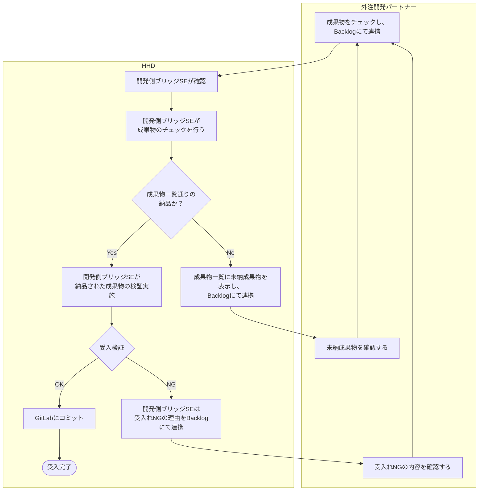
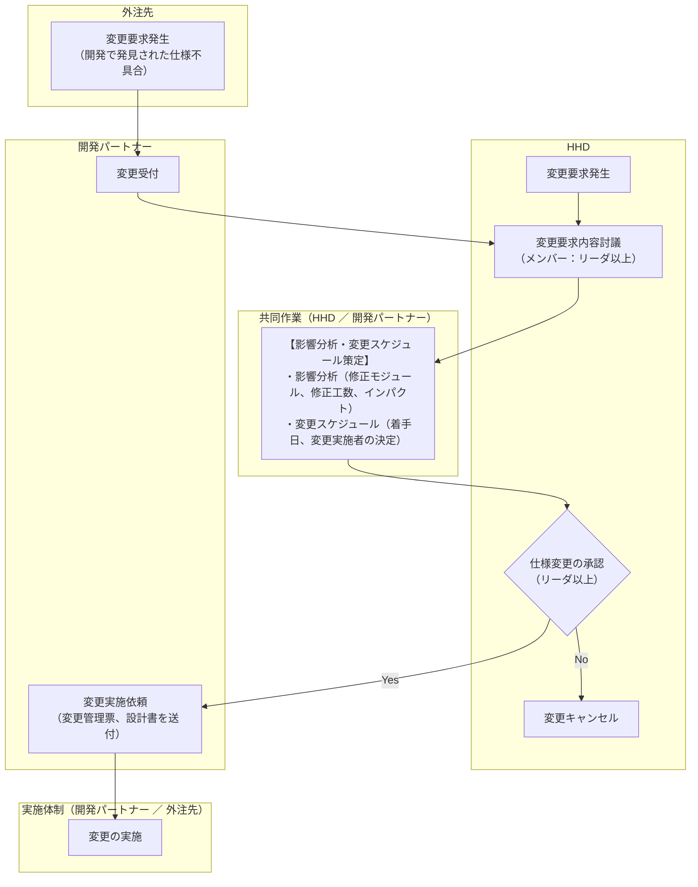
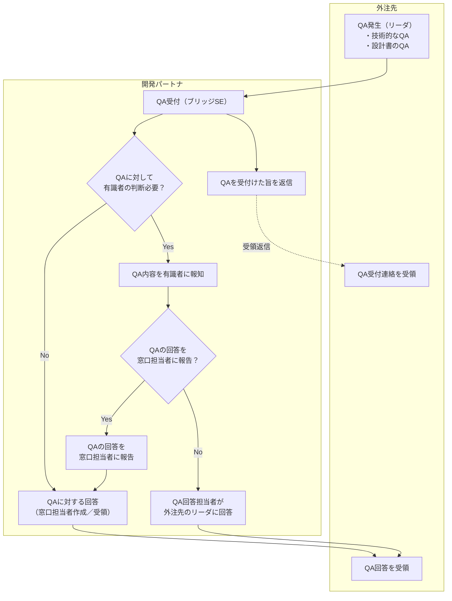
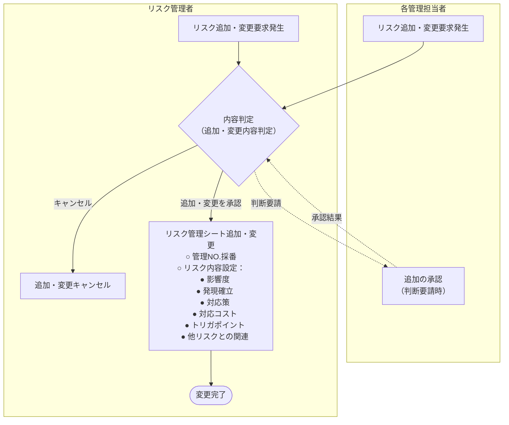
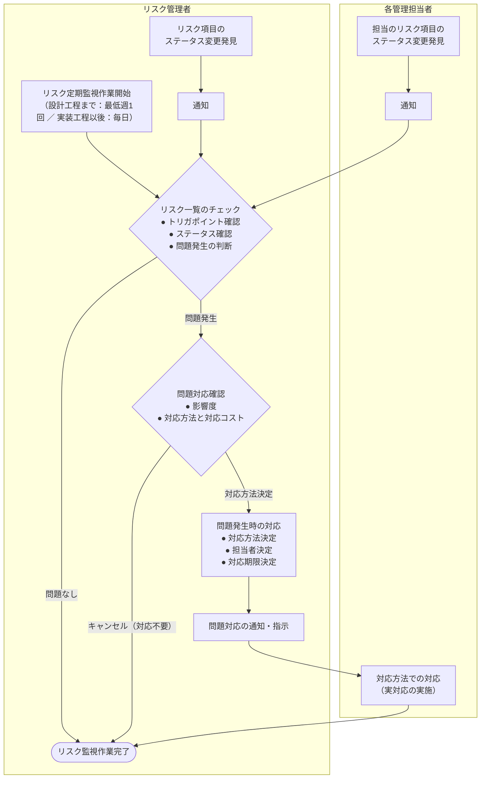

# プロジェクト作業標準

**システム開発部**  
**2025年12月**  
**Hash DasH Holdings株式会社**

---

# 進捗管理

## 方針

1. プロジェクトの開発スケジュールについて、進捗管理を行い、チーム内の作業状況、遅延状況、問題発生状況を管理する。
2. 進捗管理は、PMまたは、PMから任命された各対応案件責任者（以下、「管理責任者」という）および、PMOへの報告と、チーム内での進捗確認を週次で実施する。  
   なお、プロジェクトの規模、テスト工程、作業進捗遅延等、プロジェクトの状況によっては、週複数回実施する場合がある。
3. 進捗状況は、予め定義した客観的な進捗指標で計測し、管理する。

## 進捗会議

### プロジェクト進捗会議

以下の出席者により、週次にてプロジェクトの進捗会議を実施する。  
会議形態（対面会議、コミュニケーションツール（Meet/Slack/Zoom/Microsoft Teams）を利用したオンライン会議）はプロジェクト内で決定する。  
出席者は、管理責任者、PMO、主担当リーダクラス（以下、「リーダ」という）および、状況に応じて設計/テストのメイン担当者とする。

| 分類 | 運営方法 | 配布資料 |
| :--- | :--- | :--- |
| **週次進捗** | <ul><li>報告内容は、「工程別作業予定/実績」、「進捗状況」、「課題/問題点」、「レビュー依頼/予定」、「顕在化する可能性があるリスク」の5つとする。 - **実施した作業の報告**：「作業実績」、「進捗状況」、「課題/問題点」 - **実施予定作業の報告**：「作業予定」、「レビュー依頼/予定」 - **上記報告に伴う顕在化する可能性のあるリスク（※）**</li><li>報告資料は右記の通りとする。</li></ul> | ・進捗報告資料 ・Backlog課題一覧 |

> （※）進捗報告の作業実績、状況、課題/問題点により、リスクが顕在化する可能性が発生した段階で状況を注視するため報告対象にする。  
> なお、報告されたリスクについては、プロジェクト計画書のリスク管理の対応方針に従い対処する。

### チーム進捗会議

リーダを中心にリーダ配下のメンバーによる進捗会議を実施する。  
進捗会議は、チーム内の対応規模、参加人数、作業中の工程によっても異なるため、週次定例、日々の朝会/夕会、コミュニケーションツール（Meet/Slack/Zoom/Microsoft Teams）による各担当者毎に直接確認等、リーダの判断により会議方法を決定する。  
また、外注開発（オフショア/ニアショア）では、外注側リーダを中心に週次報告会議および、日々の朝会を実施する。

## 進捗指標

進捗管理指標は、各タスクの進捗状況を示す。  
進捗管理指標は、以下の基準で定義する。この基準に従って入力された値を全タスクについて集計し、全体の進捗率を算出する。以下の基準で管理できないもの、管理できない状況については、別途工程別の計画書の中で個別に基準値を定義する。

| 進捗指標 | 設計書/計画書/結果報告書等ドキュメント作成工程 | 製造工程（改修/不具合対応時も同様） | 結合/総合テストケース消化工程 |
| :---: | :--- | :--- | :--- |
| **0%** | 未着手 | 未着手 | 未着手 |
| **25%** | 作業着手 | ソース作成/修正中 | ― |
| **50%** | 作業中 | ソース作成/修正終了（ソースレビュー含む） | 仕掛中（再鑑前/NG） |
| **75%** | 作業完了（レビュー実施前） | 単体テスト中（テストケースレビュー含む） | ― |
| **100%** | 作業完了（レビュー終了） | 単体テスト終了 | 終了（再鑑終了） |

## 進捗評価方法

進捗の評価方法は、個別タスクの進捗率と全体の進捗率の2点について評価を行う。  
週次で個別のタスク毎に進捗報告を実施し、その情報を元に全体の進捗率を計算して進捗の評価を行う。

## 進捗遅延に対する対応

進捗遅延については、各タスクと全体で別の対応を行うものとする。  
全体の進捗が遅れた場合は、原因分析とその対応策を決定し、週次定例会にて協議する。各タスクの遅延については、原因分析と対応策を決定する。  
クリティカルパスとなっているもの、他の作業に影響を及ぼすものについてのみ週次定例会にて協議するものとし、それ以外のタスクの遅延については、個別に対応するものとする。

## Backlog（※）を活用した進捗管理方法

別紙「Backlogを活用した進捗管理方針」の第2章「進捗管理」に従い管理する。  
（※）プロジェクト管理・タスク管理ツールとしてBacklogを使用する。

---

# 品質管理

## 品質管理方針

プロジェクトの目的より外部品質目標を立てて、開発したシステムが品質目標を満たしたかどうか評価する。  
また、品質目標を満たすための欠陥除去の一環として、プロジェクトの中間成果物にも品質目標を設定して作業を進める。

## 品質管理体制

品質管理の体制はプロジェクトの体制図に準じる。

### 設計および、結合テスト、総合テストにおける品質管理体制

品質管理者（管理責任者）は、品質管理者とは別に品質保証者（リーダ）を設定することを前提にするが、開発規模によっては品質管理者の兼務を認める。  
品質保証者がレビューを行い、指摘事項の反映とレビュー実施記録表を確認する。  
品質管理者は、レビュー実施記録表から適切にレビューが実施されていることを確認する。

### 実装、単体テストにおける品質管理体制

品質保証者（実装担当リーダ）を設定する。  
品質保証者がチェック表「チェックリスト_製造」および、「チェックリスト_単体テスト」を基にレビューを行い確認する。  
その後、単体テスト結果の受入れ検証を行う開発側ブリッジSEが品質管理者として単体テスト結果をチェックする。

### 品質目標

品質目標を次のように決定する。

- 基本設計書および、詳細設計書については、プロジェクトチーム内および、Hash DasH Holdings（以降、HHDと表記）内でレビューを実施し、指摘数をゼロにすることとする。
- 実装については、単体テスト結果の受入レビューを実施し、受入基準を全て満たすこととする。
- 結合テストを実施し、障害をゼロにすることとする。

## 品質保証方針

以下の事項を実施し、品質の確保を図る。

### 実装方針の提供

1. **モジュール概念図**  
   モジュール概念図でモジュールの作成方針を指定し、画面制御部と業務ロジック部を分けて設計・実装させる。これにより、モジュールの役割が明確化され、メンテナンス性が向上する。  
   なお、アプリケーションが使用するフレームワークによって、ユニットテストが可能なものについては、ユニットテストを取り入れる。  
   また、共通機能を事前に考察し、実現・提供することで、ロジックの冗長性を防ぎ、変更・拡張性を向上させる。

2. **プロトタイプ　プログラム基準、サンプルソース**  
   必要に応じてプロトタイプを提供することにより、実装方針（モジュール概念図）を具体的にイメージさせる。  
   プロトタイプを基準に実装を行うことで、特異な機能実現方法（実装）を防ぐ。  
   技術調査を目的としたプロトタイプ作成については、作成後に評価を行い、実装ガイドラインに反映させる。

3. **実装ガイドライン**  
   共通機能の使用方法や、実現方法が類似する場合の実装方針などをドキュメントとして提示する。  
   これにより、プロトタイプの実装基準をより明確化する。  
   プロトタイプにおいては、性能面も意識した設計とする。

### 共通機能の提供

1. **アプリケーションフレームワーク**  
   各画面・機能を設計、実装する上での前提となるベース機能および、開発方法を提供する。
2. **共通機能（モジュールライブラリ）**  
   各画面・機能で共通的に使用できる機能を提供する。

### 詳細設計書の事前検証

成果物のレビューは、各設計工程、実装・単体工程で行う。  
実装工程への移行条件を詳細設計のレビュー完了とすることで、仕様の相違を実装作業開始前に無くす。

### テストの指定

1. **ユニットテスト**  
   ロジックレベル（ビジネスロジック）のテストを、実装段階で行う。これにより、ロジックレベルのバグを未然に防ぐ。
2. **単体テスト**  
   イベント毎の動作検証を、単体テストケース（詳細設計書）を基準に行う。

### 成果物検証

1. **ソースコードレビュー**  
   ソース実装者は、実装終了後（単体テスト実施前）に実装担当リーダとソースレビューを実施する。  
   レビューは、チェック表「チェックリスト_製造」を基に行い、チェック表は、その後のテスト工程（単体、結合、総合）で発生した不具合内容により随時見直しを行う。
2. **単体テストレビュー**  
   単体テスト実施者は、単体テスト実施前に実装担当リーダとテストケースレビュー、単体テスト実施後に実装担当リーダとテスト結果レビューを実施する。  
   レビューは、チェック表「チェックリスト_単体テスト」を基に行い、チェック表は、その後のテスト工程（単体、結合、総合）で発生した不具合内容により随時見直しを行う。
3. **その他**  
   新規プログラムおよび、大規模改修の入った既存プログラムについては、単体テストまたは、結合テストにおいて、パフォーマンス測定を行い、パフォーマンスに問題がないことを確認する。

## 外注製造を伴う開発における品質保証方針

外注開発では、通常の品質保証方針に加え、以下を実施して品質を確保する。

### オンサイトによる要件・開発方針キャッチアップ

基本設計時に詳細設計担当者も参画し、実際の開発作業を通して要件や開発方針のキャッチアップを行わせる。  
詳細設計担当者は、外注開発側とコミュニケーションを取るブリッジSEの役割も行い、設計側と外注の実装側で認識相違がないように開発を進める。  
また、開発作業時に発生した疑問点や要望などをヒアリングし、開発方針の見直しを行う。

### 先行開発、機能別開発による開発体系の最適化

機能（画面）単位で作業を依頼し、その単位で開発・成果物検証を行う。  
機能単位で期間をずらして開発を行うことにより、事前に設計書の不備・不足や開発の際の疑問など、Q&Aやり取りを行い、後の作業のボトルネックを先行して解消する。

## 外注開発での開発作業範囲

内製作業と外製作業の範囲を明確にし、開発時の混乱を防ぎ、品質の向上を目指す。

## 外注開発での受入・障害管理

外注開発における作業指示は、開発側ブリッジSEからBacklogを通じて行う。QA、受入れ検証および、障害調査を含む障害対応も同様とする。

### 受入・障害管理方針

外注開発での成果物は、受入時のテスト検証・チェックイン後、障害管理運用を行う。  
（受入時のテストで発生した障害に関しては、障害管理フロー対象外となる）

### 受入・障害管理運用

1. 受入管理は、Backlogで行う。
2. 障害管理は、障害管理票を起こし、Backlogにてやり取りを行う。
3. 受入検証は、外注開発されて納品された成果物のテスト結果報告内容を検証することで開発要件を充たしているか精査する。

### 受入・障害管理フロー

## 品質評価方針

- 品質保証の作業記録より、対象となった成果物が品質目標を満たしたかどうか評価する。
- 結合テストのテスト結果から障害密度を算出して評価する。
- 開発チーム内レビュー記録よりレビュー指摘数を算出して評価する。

## 品質対応方針

品質目標を満たさなかった場合、品質保証および、品質評価に間違いが無かったかを確認する。  
間違いがあれば再作業を指示し、間違いが無い場合は、早急に原因分析を行ってリスク管理者と対応策を検討し実施する。

## モジュールリリースに関するGit管理方針

リリース作業において、想定外のモジュールの入り込みを防止するため、ブランチ名の命名ルールおよび、リリース時のチェックについて、別紙「モジュールリリースに関するGit管理方針」に従い、リリース作業を実施する。

## 開発作業における不具合発生時の原因分析による今後の対策

品質向上を図るため、別紙「過去の開発で発生した問題に対する今後の開発作業における対策」に記載されている今後の対策を念頭に開発作業を進める。  
なお、今後の対策は、各プロジェクトの開発作業における不具合発生時の原因分析による今後の対策として、今後の開発作業において品質改善に取り入れるべき内容が発生した都度、対策を追記する。

---

# 仕様変更管理

## 方針

1. ベースライン確定後の変更要求は、原則としてプロダクトスコープに関するもののみ受領する。プロダクトスコープは、要件定義で規定したシステム開発の範囲とする。
2. 全ての変更は、変更管理プロセスに従わなければならない。このプロセスに従わず提出された変更要求は、検討しない。
3. 変更可否の決定は、管理責任者および、リーダが行う。
4. 要件確定後のシステム要件の変更要求は、原則受け付けない。確定時のシステム構築・検証が終了後、実施検討を行う。

## 変更管理対象

以下を変更管理の対象とする。

| 管理対象 | 管理範囲の説明 |
| :--- | :--- |
| **要件** | 要件の追加、削除、変更を管理する。 |
| **成果物** | 成果物に関する追加、削除、変更を管理する。 |
| **スケジュール** | スケジュールの変更を管理する。 |
| **コスト** | コストの変更を管理する。 |

## ベースライン

変更管理のベースラインの確定時期は以下の通りとする。レビューが実施され、承認されたものを、ベースラインが確定されたものと定義する。ベースライン確定後は、後述する変更管理プロセスに従うこととする。

| 管理対象 | 確定される内容 | 確定時期 |
| :--- | :--- | :--- |
| **要件** | 必要な作業、機能 | 要件定義終了 |
| **成果物** | 出すべき成果 | 要件定義終了 |
| **スケジュール** | 開発スケジュール | 要件定義終了 |
| **コスト** | システム開発にかける投資額 | 要件定義終了 |

## 変更管理プロセス

---

# 構成管理

## 構成管理の基本方針

本プロジェクトの構成管理は、以下のような方針に基づいて行う。

- プロジェクトの過程で作成された全成果物は、以下の二種類のいずれかの方法に従って管理を実施する。
  1. 構成管理ツールGitLab（以下Git）を使用する。
  2. Googleドライブ内のフォルダにてバージョンを管理する。
- (1)は各世代の成果物が随時取り出せるようになっていなくてはならない。
- (2)は(1)までは応答性を求めない想定とする。

## 構成管理の対象

本プロジェクトでは、以下の成果物に対し構成管理を適用する。また、各成果物の管理方法についても前項にならい以下のように定めるものとする。

| 管理カテゴリ | 管理対象 | Git管理 | フォルダ管理 | Backlog |
| :--- | :--- | :---: | :---: | :---: |
| **計画書** | プロジェクト計画書 | ― | ○ | ― |
| **計画書** | 各工程計画書 | ― | ○ | ― |
| **設計書** | 要件定義書 | ― | ○ | ― |
| **設計書** | 基本設計書 | ― | ○ | ― |
| **設計書** | 詳細設計書 | ○ | ― | ― |
| **ソースコード** | ソースコード | ○ | ― | ― |
| **テスト結果** | テストシナリオ／テストケース | ○ | ― | ― |
| **テスト結果** | テスト結果（エビデンス） | ― | ― | ○（※1） |
| **テスト結果** | テスト結果報告書 | ― | ○ | ― |
| **議事録** | 議事録 | ― | ○ | ― |
| **管理成果物** | 進捗資料など | ― | ○ | ― |
| **管理成果物** | WBS（ガントチャート） | ― | ○ | ○（※2） |
| **管理成果物** | 各工程タスク管理 | ― | ― | ○ |

> （※1）テスト結果のエビデンスは、Backlogのファイルに保存し確認するが、Backlogで使用するファイル容量を抑えるため、プロジェクト終了後はGoogleの共有フォルダに移動する。  
> （※2）成果物の管理はプロジェクトによっては、Backlogのガントチャートにて実施する。

## 構成管理の対象のベースライン

各成果物のベースラインは、以下のとおり定めるものとする。

| 管理対象 | ベースライン |
| :--- | :--- |
| **プロジェクト作業標準** | 本紙 |
| **各工程計画書** | HHDのリスク管理委員会承認完了時点 |
| **各仕様書** | 承認完了時点 |
| **ソースコード** | 単体テスト＋コードインスペクション完了時点 |
| **テストケース** | チーム内部レビュー完了時点（総合テストのみテスト完了の判定時） |
| **テスト結果** | チーム内部テスト結果再鑑完了時点 |
| **テスト結果報告書** | HHDのリスク管理委員会承認完了時点 |
| **議事録** | 内部レビュー完了時点 |
| **管理成果物** | 内部レビュー完了時点 |

## 構成管理フロー

- Git管理の成果物は、各自がGitを通してローカルにチェックアウトし、作業を行う。
- フォルダ管理の成果物は、直接作業を行う。

---

# 調達管理

## 調達に関する取扱方針

本プロジェクトにおける調達の取扱は、以下のように定める。

- 開発マシンは、特に指定がない場合、原則各協力会社内で調達する。なお、HHDに持込む場合は持込申請をして承認を得るものとする。
- オフショア側の製造、単体テストについては、オフショア側で管理する環境を利用する。
- 結合テスト以降の環境（結合テスト、総合テスト、UAT）はHHDで準備した環境を利用する。

---

# コミュニケーション管理 （作業状況管理）

## 方針

- メンバーの作業状況は、WBSを用いて管理する。
- メンバーが保有する問題は各リーダが把握し、必要があれば「ToDo（問題管理表）」へ記入を行う。
- 週次定例会による報告、認識共有を基本にするが、プロジェクトの状況により、管理責任者の判断により開催数を増やす。
- また、結合テストおよび、総合テスト期間においては、テストの進捗（当日/翌日の作業内容の確認含む）、問題点の解決状況を共有するため、日々の朝会または、夕会を実施する。なお、テスト規模にもよるため、朝会または、夕会の実施についても管理責任者の判断により開催を決定する。
- 有意義なミーティングを実施するため、定例会は報告内容を明確化し、1時間以内で終了できるミーティングとする。個別の議事については別途打合せを設定する。
- プロジェクトの規模に応じて、管理責任者の判断でPMOを設置する。

## コミュニケーション定義

| 名称 | 目的 | 主催者 | 頻度 | 手段 | 参加者（対象者） | 伝達／確認事項 |
| :--- | :--- | :--- | :--- | :--- | :--- | :--- |
| **朝会または、夕会** | テストの進捗（当日/翌日の作業内容の確認含む）、問題点の解決状況を共有する。 | テスト担当リーダ | 毎日（朝会または、夕会） | ミーティング | ・テスト担当リーダ ・テスト担当メンバー ※場合によっては各管理責任者/PMOも参加 | **テスト担当リーダ → テスト担当者**： ・作業状況 ・作業予定 ・問題点 |
| **週次定例会** | ・プロジェクトの開発に携わるリーダ以上のメンバーでプロジェクトの進捗状況と方向性を確認する。 ・プロジェクトの開発に関係する問題点の解決策を検討する。 ※プロジェクトの最高意思決定機関とする。 | 各管理責任者 | 週次 | ミーティング | ・管理責任者/PMO ・各リーダ | 1. **管理責任者 → 全員**： 　プロジェクトの現状と今後の方向性、および問題点（解決策検討） 2. **PMO → 全員**： 　Backlogタスク終了期限、テストケース消化状況 3. **各リーダ → 全員**： 　作業状況および問題点 |

## コミュニケーション問題に対する施策

- 管理責任者は、各リーダまたは、メンバーからの報告内容を把握し、プロジェクトの各タスク遂行に影響を与える課題、コミュニケーションに関する問題が報告された場合は直ちに対処する。
- 社内の各種ミーティングにおいて、プロジェクトの各タスク遂行に影響を与える課題、コミュニケーションに関する問題が発覚または、発生した場合、管理責任者は影響範囲を判断し、プロジェクト計画に影響する問題の場合は、直ちにリスク管理者に報告する。

## 会議運営方法

効率的会議運営のために以下の会議運営方法を定めることとする。

- 必ず会議におけるオーナー（管理責任者または、各リーダ）を定め、そのオーナーが進行・調整、議事録の最終承認を実施する。
- 会議への参加者を選別し、必要最低限のメンバーで行う。また、キーマンとなる参加必須者とは事前調整の上必ず出席させる。
- レビューや検討会等は必ず関係者へ資料の事前送付を行い、会議は読み合せの場ではなく課題・懸案を検討・協議する場であることを意識する。
- 原則リスナー側にて、会議終了後に速やかにレビュー記録表（定例の場合は議事録）を作成し参加者に展開する。参加者は展開された内容の確認を行う。

---

# 課題管理（外注開発でのQA管理）

## 方針

1. 設計、開発時に発生する質問（要件、仕様、技術、その他）は、可能な限りBacklogで行い記録に残す。
2. Backlogを活用した課題管理は、別紙「Backlogを活用した進捗管理方針」の第3章「課題管理」に従い管理する。
3. 軽微な質問はチャットで行い、迅速な問題解決を図る。

## QA管理フロー

---

# リスク管理

## リスク管理方針

- リスク管理は、管理責任者および、プロジェクト推進者（以下、リスク管理者）によって管理される。
- また、本プロジェクト内で認識されたリスクは全て「リスク一覧」によって管理され、プロジェクト遂行中はリスク管理者によって定期的に監視（モニタリング）されるものとする。

## リスク管理フロー

### リスク追加フロー

- 管理責任者は新たにリスク項目が発生した場合は、リスク一覧に記載すべき内容を速やかにリスク管理者に報告する。
- リスク管理者は、挙げられたリスク追加・変更要求に対し、その要求がリスク一覧に追加すべき内容かどうかの内容判定を行う。判定の際には必要に応じて各管理担当者にも判断を要請する。
- 判定の結果、追加すべきと判断された場合には、リスク一覧にその内容を追加する。

### リスク監視フロー

- リスク管理者は、リスク一覧に記載されている全てのリスクを定期的に監視し、以下のポイントを確認する。
  1. トリガポイント（問題として顕在化すると考えられる時期）に到達していないリスクは、トリガポイントに到達したかどうかのチェックを行う。
  2. トリガポイントに到達しているリスクが問題として顕在化していないかの判断を行う。
- また、管理担当者は管理作業において、各担当に関連するリスク項目のステータスをチェックし、ステータスが変更になったリスク項目があった場合は速やかにリスク管理者に報告を行う。
- 管理責任者は、リスク管理者によって問題発生と判断されたものに対して、その問題対応として適切な管理担当者に通知する。
- 通知された管理責任者および、関係する管理担当者は、リスク管理者と共に問題対応の確認を行い、対応が必要と判断された場合、対応を行う。
- 監視するタイミングは、以下を基準とする。
  - **設計工程まで**：最低週一回
  - **実装工程以後**：毎日

---

## 修正履歴

| 修正日 | 修正者 | 内容 |
| :--- | :--- | :--- |
| 2023/02/19 | HHD 和田 | 初版作成 |
| 2025/12/12 | HHD 土佐 | 体裁の変更 |
