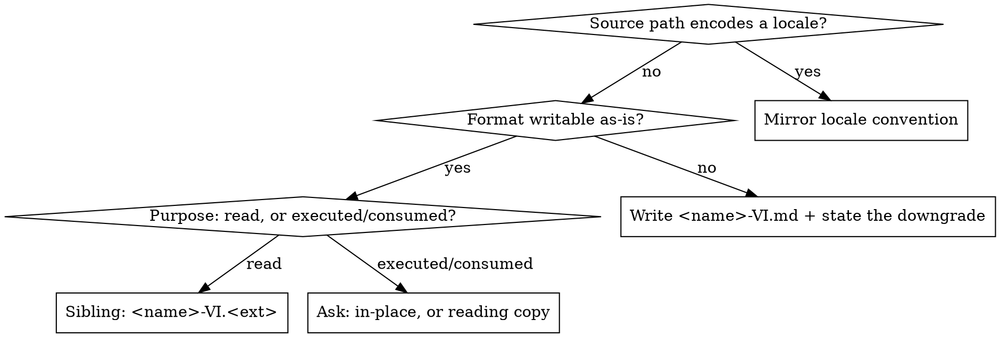

# Vietnamize

Translate any document into natural, engineering-grade Vietnamese **without changing what
the document is**. A translated document must stay the same format, stay valid, and stay
usable by whatever read it before.

## Core Principles

**Natural Technical Vietnamese.** Vietnamese engineers use a hybrid lexicon. Word-for-word
Vietnamese is unnatural and loses technical precision.
- Keep standard software engineering terms in English (see terminology tables below).
- Align domain terms with the project specification.
- Retain the original English or Japanese identifier in parentheses where traceability or
  precision matters: `Thao tác phê duyệt thủ công (Manual Approval / 手動承認)`, `trạng thái hoàn thành (status = COMPLETED / 完了)`.
- Never alter code, identifiers, paths, commit SHAs, ticket IDs, or URLs.

**Translate, never rewrite.** No summarizing, no reordering, no adding or dropping content,
no "improving" the source. Output is 1:1 with the input.

**Format is not yours to change.** The output format is the input format unless the input
format cannot be written (see Output Target).

---

## Step 1: Classify the Source

Answer two questions before translating anything.

### (a) Can it be read and written as text?

| Access class | Examples | What to do |
|---|---|---|
| **Plain text** | `.md` `.txt` `.html` `.json` `.csv` `.php` `.ts` `.tsx` `.py` `.go` `.yaml` `.xml` `.adoc` `.rst` `.po` | Read and write directly. |
| **Binary / packaged** | `.docx` `.pdf` `.xlsx` `.pptx`, images | Extract text first (`pandoc`, `pdftotext`, `unzip` for OOXML). Output format changes - see Output Target. |
| **Remote** | Confluence, Notion, GitHub wiki, issue body | Fetch to a local file first, then treat as plain text. Never edit the remote copy unless explicitly asked. |

### (b) Which content contract applies?

This decides what gets translated *inside* the file. Pick one, then follow its
translate/preserve contract exactly.

| Content class | Recognize it by | TRANSLATE | PRESERVE VERBATIM |
|---|---|---|---|
| **Prose document** | Body is written for humans to read: specs, PR notes, ADRs, release notes, README, wiki | All prose: headings, paragraphs, list items, table cells, blockquotes, image alt text, link label text | Markup and layout, code blocks, inline code, URLs and link targets, HTML tags/attributes/classes, template expressions (`{{ }}`, `<?= ?>`, `${}`), front matter keys and `slug`/`id` values, footnote ids |
| **Structured data / resource file** | Machine-consumed key-value or tabular data: i18n bundles, `.json` `.yaml` `.properties` `.strings` `.po` `.csv` | Only human-readable message values (and CSV header labels) | Every key, enum code, ID, boolean, number, placeholder (`%s`, `{count}`, `{{name}}`), and the file's syntax |
| **Source code / template** | Executable: `.php` `.ts` `.tsx` `.py` `.go` `.blade.php` `.vue` | Comments and doc-comments only. In templates, text nodes only | All code: identifiers, keywords, string literals, JSX/Blade/Twig expressions, tag names, attributes |
| **Mixed** | A prose doc with embedded resource/code samples | Apply the prose contract to prose, and the stricter contract to each embedded block | - |

**String literals in source code stay in the original language by default.** They are
matched by tests, logs, and grep. Translate one only if the user explicitly asks for
user-facing string localization.

---

## Step 2: Output Target



**Default rule:** insert `-VI` before the final extension, in the source's own directory.
`docs/spec.html` -> `docs/spec-VI.html`. Never flatten to the repo root, never change the
extension, never use `_vi`, `-vietnamese`, or `.vi.`.

**If the source path encodes a locale**, the `-VI` suffix is wrong - mirror the project's
existing convention instead:

| Source | Correct output | Not |
|---|---|---|
| `locales/en.json` | `locales/vi.json` | `locales/en-VI.json` |
| `locales/ja.json` | `locales/vi.json` | `locales/ja-VI.json` |
| `lang/en/messages.php` | `lang/vi/messages.php` | `lang/en/messages-VI.php` |
| `res/values/strings.xml` | `res/values-vi/strings.xml` | `res/values/strings-VI.xml` |
| `messages_en.properties` | `messages_vi.properties` | `messages_en-VI.properties` |

**If the format cannot be written faithfully** (`.docx`, `.pdf`, `.xlsx`), write
`<name>-VI.md` and **say in your reply that the format was downgraded and why**. A silent
format change is a failure even when the translation is good.

**If the file's purpose is to be executed or consumed** (source code, an active resource
file), a `-VI` sibling is usually wrong - it creates a broken duplicate. Ask whether to
translate comments in place or produce a separate reading copy, unless the request already
made that clear.

---

## Step 3: Technical Terminology & Domain Discovery

### Technical Terminology

| English / Original term | Preferred Vietnamese phrasing | Notes |
|---|---|---|
| Pull Request / PR | Pull Request / PR | Not "Yêu cầu kéo" |
| Branch | Branch | Not "Nhánh" |
| Commit | Commit | Keep in English |
| Merge / Merged | Merge / Merged (hoặc Đã merge) | Keep in English |
| Master / Main branch | Master / Main branch | Keep in English |
| Batch job / Batch execution | Batch job / Batch xử lý / Chạy batch | Keep "batch", "job" |
| Queue / Worker | Queue / Worker | Keep in English |
| Scheduled / Recurring run | Chạy theo schedule / Chạy định kỳ | Combine naturally |
| Rollback / Commit transaction | Rollback / Commit transaction | Keep DB terms in English |
| Exception handling | Xử lý Exception | Keep "Exception" |
| Audit record / Evidence | Audit record / Dữ liệu đối soát (evidence) | Keep context clear |
| Flash message / Notification | Flash message / Thông báo | Keep UI component types |
| Modal popup / Dialog | Modal popup / Dialog | Keep UI component types |
| Loading overlay / Spinner | Loading overlay / Loading spinner | Keep UI state names |
| Handler / Controller / Resolver | Handler / Controller / Resolver | Keep architectural roles |
| Source of truth | Source of truth / Nguồn dữ liệu chuẩn | Not "Nguồn chân lý" |
| Bug / Defect fix | Bug / Fix lỗi | Natural developer phrasing |
| Schema / Payload / Query / Mutation | Schema / Payload / Query / Mutation | Keep API/GraphQL terms |
| Deploy / Refactor / Cache | Deploy / Refactor / Cache | Keep in English |

### Domain Discovery & Project Glossary Workflow

Every software project maintains its own business domain models. Follow this workflow to
discover, align, and translate domain terms accurately:

1. **Locate Project Glossaries**:
   - Check if the repository has a glossary or architecture decision record defining domain
     concepts (e.g., `docs/glossary.md`, `docs/specs/`, `README.md`).
2. **Inspect Codebase & Bilingual History**:
   - Search the codebase, commit messages, and previous PR notes for how the team refers to
     key domain concepts:
     `grep -rn "..." docs/ src/ locales/`
3. **Traceability Annotation**:
   - When translating domain-specific business terms, retain the original identifier or
     source term in parentheses where ambiguity could occur:
     e.g., `Gửi thông báo theo lịch (Scheduled Notification / 予約配信)`.
4. **Clarify Unrecorded Terms**:
   - If a business concept is undocumented or ambiguous, confirm the preferred terminology
     with the project team or document the decision.

---

## Step 4: Never Translate Data Values

Header labels and prose describe data. The data itself is not prose.

**Never translate, transliterate, or romanize:**
- **People's names, company names, addresses.** `John Doe` stays `John Doe`.
- **Enum values and status codes consumed by code.** `COMPLETED` or `SUCCESS` in a data row
  stays `COMPLETED` or `SUCCESS`. Translating it silently corrupts data imports/exports.
- **IDs, timestamps, amounts, currency codes, file names.**

In a CSV or spreadsheet: translate the **header row only**. Every data cell is verbatim
unless the user explicitly asks for the cell contents to be localized. If a column holds
free-text human commentary and the user wants it translated, confirm that column by name
first.

---

## Step 5: Verify Before Reporting Done

**Every translation MUST clear all four checks.** Report the format-specific one by name.

1. **Valid** - format-specific, and actually run it:
   - JSON/YAML: `python3 -m json.tool file` / `yq`
   - HTML/XML: tags balanced, attributes intact
   - CSV: every row has the same column count as the source
   - Code: parses (`php -l`, `tsc --noEmit`, `python3 -m py_compile`, `go build`)
   - Markdown/prose: heading levels, list nesting, table pipes match the source
2. **1:1** - same count of headings, list items, rows, keys, and code blocks as the source.
3. **Untouched** - code, identifiers, URLs, placeholders, IDs byte-identical to the source.
4. **Terminology** - every technical term checked against the tables and project glossary.

---

## Red Flags - Stop and Re-check

| You are about to... | Instead |
|---|---|
| Write `-VI.md` for an `.html`, `.txt`, or `.json` source | Keep the extension. `spec.html` -> `spec-VI.html` |
| Turn `<h2>` into `##`, or an HTML table into pipes | Preserve the source markup exactly |
| Translate a JSON key, or a `%s` / `{count}` placeholder | Values only. Keys and placeholders verbatim |
| Translate a person's name or a code status in a data row | Data values are never translated |
| Translate a whole code file, or leave it entirely untouched | Comments and docstrings only |
| Translate a log or test-matched string literal | Leave it; ask before localizing strings |
| Append `-VI` inside `locales/en.json` | Mirror the locale convention: `locales/vi.json` |
| Report done without running the validity check | Run it, and name it in your reply |
| Downgrade `.docx` to `.md` without mentioning it | State the downgrade explicitly |

---

## Example: HTML template (prose contract, format preserved)

Input `views/notification-settings.html`:
```html
<h2>Scheduled Notification Settings</h2>
<p>If the delivery status is "completed", the next scheduled run will be skipped.</p>
<a href="https://example.com/help/notifications">View documentation</a>
```

Output `views/notification-settings-VI.html`:
```html
<h2>Thiết lập gửi thông báo theo lịch (Scheduled Notification Settings)</h2>
<p>Nếu trạng thái gửi (delivery status) là "completed", scheduled run tiếp theo sẽ được bỏ qua.</p>
<a href="https://example.com/help/notifications">Xem tài liệu hướng dẫn</a>
```

Tags, attributes, the `href`, and the `"completed"` literal are untouched; only text nodes and
the link label moved to Vietnamese.

## Example: resource file (values only, locale convention)

Input `locales/en.json` -> Output `locales/vi.json`:
```json
{
  "notifications": {
    "title": "Gửi thông báo định kỳ",
    "status": { "pending": "Chờ gửi", "done": "Hoàn thành" },
    "error_no_recipient": "Số đối tượng nhận là {count}.",
    "cta_send_now": "Gửi ngay bây giờ"
  }
}
```

Every key (`notifications`, `status`, `pending`, `error_no_recipient`) is byte-identical to the
source. Output verified with `python3 -m json.tool`.

## Example: source file (comments only)

```php
// Không đánh dấu hoàn thành nếu là tác vụ định kỳ (Scheduled Task), dù có 0 người nhận
if (count($recipients) == 0 && $scheduleType !== Schedule::PERIODIC) {
    $this->logger->info('zero recipients: marking task as completed');
    $task->setStatus(TaskStatus::COMPLETED); // Đã hoàn thành
}
```

The comment is Vietnamese; the condition, the method calls, and the log string literal are
byte-identical to the source.

---

## Common Mistakes

| Anti-pattern | Bad | Good |
|---|---|---|
| Over-translating standard tech words | "Yêu cầu kéo đã được hợp nhất vào nhánh chính" | "Pull Request đã được merged vào branch main" |
| Translating code identifiers | `đếm($người_dùng) == 0` | `count($recipients) == 0` |
| Omitting domain traceability | "Gửi định kỳ" | "Gửi định kỳ (Scheduled Task)" |
| Editing strings inside a code block | Rewriting a log line in a snippet | Code block byte-identical |
| Wrong suffix or moved directory | `file_vi.md`, `docs/../file-vietnamese.md` | `docs/feature-VI.md` |
| Rewriting link targets | `[Link](https://.../vi)` | `[Nhãn](https://...)` - label only |
| Silent format change | `.docx` in, `.md` out, unmentioned | `.md` out, downgrade stated in the reply |
| Summarizing while translating | Condensing three bullets into one | Same count, same order |
